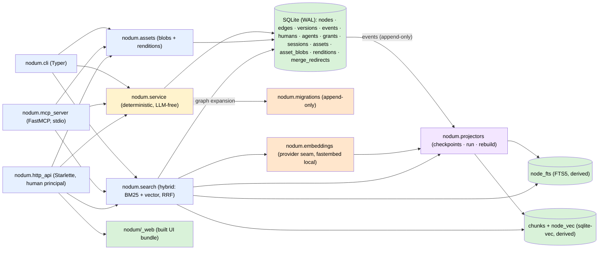

# Architecture

One SQLite file is the only source of truth and the only write path goes
through the service layer. The CLI, the MCP server, and the HTTP API are thin
adapters over it — each with its own identity rule and no logic of its own;
derived stores (FTS, chunk embeddings, renditions) are projectors fed by the
event log or lazily generated.



## Module map

| Module | Role |
|---|---|
| `nodum.db` | Connection management (WAL, foreign keys), `NODUM_DB` resolution, the migration runner over `schema_migrations`. `apply_migration` wraps each script **and** its `schema_migrations` row in one transaction (`BEGIN` inside the `executescript` payload, `foreign_key_check` then `COMMIT` around it, rollback on failure), so an interrupted upgrade is retried, not stranded half-applied. Foreign-key *enforcement* is off for the duration and the whole database is checked before the commit: this is SQLite's own recipe for the create-copy-drop-rename rebuild 0009 performs, and deferring instead is not equivalent — dropping a populated parent leaves a deferred-violation counter the rename never clears, which made 0009 fail on any database holding one node and its version row. The schema-consistency check (one per migration whose name implies a schema guarantee) runs **before** the apply loop, so a database that can only be deleted never has 0010's irreversible `DROP TABLE policies` committed onto it first. |
| `nodum.migrations` | The append-only migration list: `0001_core` (core DDL), `0002_seed_builtin_types` (the built-in type catalog), `0003_projector_checkpoints_and_fts` (`projector_checkpoints` + the derived `node_fts` FTS5 table), `0004_policies` (per-agent policy rulesets — dropped by 0010), `0005_proposed_versions` (`versions.state` — `applied`/`proposed`/`archived`), `0006_vectors` (the derived `chunks` + `node_vec` sqlite-vec tables), `0007_assets_and_renditions` (`assets` metadata + `asset_blobs` originals + `renditions`, all bytes in-database), `0008_version_proposed_fields` (`versions.proposed_fields` — which fields a proposed update names), `0009_spaces_and_type_nodes` (Q13: `graph_id` → `space_id` on nodes only, the type catalogs become type-nodes in the meta space, bootstrap seeds), `0010_principals` (`humans`/`agents`/`grants`/`sessions`, parity grants, the policies table dies), `0011_actor_strings` (the bare `human` becomes `human:owner`). Shipped entries are never edited; later phases append their own. |
| `nodum.service` | The only writer. Validation, the `proposed → active → archived` state machine, the event log, versions (incl. `proposed` updates: agent edits stage a version naming the fields they change; accept applies exactly those as an ordinary `node.update`, reject archives it), undo, wikilink materialization (edges land per the writer's grants — `proposed` on `suggest`), the review queue (proposal listing with reviewer context over nodes/edges/updates, batch accept/reject by id or filter), and the curated graph reads behind the MCP read tier (`get_neighborhood`, `traverse`, `find_path`, `get_schema`, `diff_versions`) plus `propose_edges` batch writes. Two further reads serve interactive clients rather than agents: `subgraph` (the filtered, node-capped neighborhood — see the decision log) and `suggest_links` (title-prefix lookup for a `[[` autocomplete, read straight off `nodes` so it needs no projector). **Every function takes a `Principal`; the scope-bound store (`nodum.store`) confines reads and writes by grant — `suggest` lands `proposed`, `edit` lands `active` and carries in-space `accept`/`reject`/`archive`; `undo` stays human-only.** Each public function opens a short-lived connection, applies pending migrations idempotently, and commits — adapters stay stateless. |
| `nodum.projectors` | Derived-index consumers of the event log. The `Projector` base class (`reset`/`apply`/`count`/`availability`), the `REGISTRY`, per-projector checkpoints (`projector_checkpoints.last_event_seq`), incremental `run_projectors`, `rebuild_projector` (reset + replay from event 0), and `projector_status` (with availability + reason). The `fts` projector maintains `node_fts`; the `vec` projector maintains `chunks` + `node_vec` — re-chunking and re-embedding nodes from event payloads, recording `model_id` per chunk. Deterministic and LLM-free; the service layer never calls in — the event log is the only coupling. An unavailable projector (`vec` without a provider) no-ops and keeps its backlog. |
| `nodum.embeddings` | The embedding provider seam (design D10) + chunking (design D6). Provider interface: `model_id`, `dimensions`, `embed(texts)`. The default `FastembedProvider` runs `sentence-transformers/paraphrase-multilingual-MiniLM-L12-v2` (384-dim, multilingual) in-process via ONNX — behind the optional `embeddings` extra, resolved from the local HF cache only (downloads need `NODUM_EMBED_DOWNLOAD=1`; model override via `NODUM_EMBED_MODEL`). Chunking is a fixed 512-word window with ~15% overlap (words approximate tokens — dependency-free). `set_provider`/`reset_provider` are the test seam (a deterministic hashing fake lives in `tests/conftest.py`). |
| `nodum.search` | The query path (design §7). `search()` catches the `fts` and `vec` projectors up with the log, runs BM25 (title boosted 5×) and — when a provider is available — a sqlite-vec KNN over chunk embeddings (closest chunk per node wins), fuses both lists by reciprocal rank fusion (K=60), then optionally expands the fused hits one hop along `active` edges (type weight × confidence). Hits carry the fused `score` plus a per-signal `signals` breakdown (`bm25`/`vector` RRF contributions summing to `score`, `graph` edge weight). Without a provider the vector signal is skipped — graceful degradation to BM25 + graph. |
| `nodum.assets` | Content-addressed binaries + derived image renditions (design §5.5/§5.7). `register_asset` streams a local file into `asset_blobs` through `Connection.blobopen` (hash pass, then a chunked copy into a `zeroblob` — a large file is never held in memory) and inserts the `assets` metadata row in the same transaction, so a failed copy rolls back whole — idempotent sha256 dedup, deliberately no event-log entry (nothing to undo; ingestion-time asset events are Phase 4). The copy pass re-hashes what it writes and refuses a mismatch (`AssetSourceChanged`): a source that shrank between the passes would otherwise commit with a zero-filled tail under a key its bytes do not match. A file over `SQLITE_LIMIT_LENGTH` (1 GB, read from the connection) is refused up front (`AssetTooLarge`) rather than as a bare `DataError: string or blob too big`. `get_rendition` lazily generates `thumb`/`preview` WebP images with Pillow (downscale-only, EXIF-transposed, 300 KB quality-stepping target on `preview`), stores them in `renditions` keyed by `sha256(asset_hash + ':' + profile)`, and serves cache hits from the stored row thereafter — the rendition's `data` column is read **only** when the caller asks for the bytes, which the MCP `get_asset` path always does (`include_data=True`) and the CLI does only for `asset rendition --out`; `purge_renditions` deletes the rows (all regenerable). Pillow reads originals through `_BlobReader`, a file-like adapter that restores the tolerant out-of-range seeks `sqlite3.Blob` refuses and Pillow's format probing depends on. Non-image assets and unknown profiles are rejected cleanly; `page:<n>` rasters are Phase 4. Two helpers exist for callers that take bytes from a stranger rather than a local file the operator chose: `sniff_image_mime` identifies a format from its magic bytes (registration records what `mimetypes.guess_type` derives from the *name*, which is fine for the CLI and useless over HTTP), and `check_image_pixel_budget` reads dimensions from the image header and refuses anything over `MAX_IMAGE_PIXELS` (40 MP) as `ImageTooLarge` — the same ceiling `_prepare_image` applies before decoding a stored original, since Pillow's own bomb detection *warns* between 1× and 2× its threshold and decodes anyway. |
| `nodum.mcp_server` | The MCP adapter: a FastMCP (official Python SDK) server over stdio, launched by `nodum mcp serve`. This is the **external-agent** surface, so it registers the additive half of the tool contract and nothing else: the design §8.1 read tier (`get_node`, `get_children`, `search`, `traverse`, `list_types`, `get_schema`, `find_path`, `history`, `diff`, `get_asset`) and additive tier (`create_node`, `update_node`, `link`, `propose_edges`) — every tool a thin delegate to one service/search/assets function, annotated `readOnlyHint` for reads, `destructiveHint=False` for the additive writes (they only ever add state, whatever grant the caller holds) and `destructiveHint=True` for `update_node`, which under an `edit` grant overwrites the node in place — hosts auto-approve on that flag, so it states the tool's worst case rather than its usual one. Each write tool's description says what an `edit` grant changes instead of promising `proposed`. `get_asset` enforces the §5.7 binary policy structurally: metadata + a `preview`/`thumb` WebP image block, originals never served. The review tools (`accept`/`reject`, §8.1 "write (human)") and the curative tools (§8.2) are **never registered**. Auth is the agent token in `NODUM_AGENT_TOKEN` (minted by `nodum agent create`/`token-rotate`, shown once, stored hashed; carried in the environment because a flag would leak into `ps`): at startup it is verified against the `agents` table — an unknown or disabled agent is a startup error — and the verified agent's principal is loaded with its grant set, so every read and write is confined to those grants. |
| `nodum.models` | The pydantic I/O schema shared by every surface (`NodeOut`, `EdgeOut`, `VersionOut`, `EventOut`, `TypeOut`/`EdgeTypeOut`/`TypesOut`, `UndoResult`, `InitResult`, `ProjectorStatus`/`ProjectorRun`, `SearchHit`/`SearchResult`, `ProposalOut`, `BatchTransitionOut`/`TransitionFailure`, `SubgraphOut`, `PathOut`, `DiffOut`, `ProposeEdgesOut`/`ItemFailure`, `AssetOut`, `RenditionOut`, `PurgeResult`, `HumanOut`, `AgentOut`/`AgentCreatedOut`, `GrantOut`). Every adapter serialises `model_dump(mode="json")`. |
| `nodum.cli` | Typer adapter. Each command calls one service function and prints exactly one JSON object on stdout — a list-returning command always as `{"<plural>": [...], "count": n}`; errors go to stderr with exit code 1 — including the ones that are not service errors at all: `OSError` (a missing file for `asset register`) and `sqlite3.Error` (chiefly "database is locked", SQLite having one writer) are mapped to a message rather than escaping as a traceback. No `--json` flag — JSON is the only format. Adds `search`, `traverse`, `subgraph`, `suggest-links`, `find-path`, `diff`, `schema`, `edge create-batch`, the `projector run/status/rebuild` group, the `review queue/accept/reject/accept-all/reject-all` group, the `asset register/get/list/rendition/purge` group, `mcp serve`, and `serve` (the HTTP server, port 8600 — every command across the CLI that touches the graph takes a required `--as <human>` — reads included, since reads are grant-scoped like writes; `serve` prints the database path on stderr and converts uvicorn's own startup failure into the contract's exit 1 rather than letting uvicorn's exit 3 escape). |
| `nodum.http_api` | The HTTP adapter (design §9): a Starlette app (`create_app`) serving the JSON API under `/api` plus the built web UI at `/`, launched by `nodum serve`. This is the **human** surface and the exact inverse of the MCP server: every write is attributed to the session's human principal and **no request field, header, or query parameter can set an identity** — every `principal=` binding in the module is `_session_principal(request)`, reading only what the session middleware verified into the scope, and route handlers never name the concept, so absence is structural rather than a filter each new endpoint must remember. The service's grant enforcement still applies underneath; nothing is re-implemented here. One `EXCEPTION_STATUS` table (every class `cli._run` catches — `sqlite3.Error` and `OSError` by base class — plus `sqlite3.OperationalError` → 503, `OverflowError` → 400, `PayloadTooLarge` → 413, `ClientDisconnect` → 499) becomes Starlette exception handlers returning `{"error": {"type", "message"}}` with the CLI's own one-line message; anything unmapped is a generic 500 whose traceback goes to the server log, never the body. `RequestGuardMiddleware` is the origin control: `Host` validated against the names the server answers to (DNS rebinding), a same-origin proof required on every state-changing request (`Sec-Fetch-Site`, `Origin`, or the explicit `X-Nodum-Client` header for a non-browser client), `Content-Type: application/json` required on every JSON write so that no CORS-simple request can reach one, and a request-body cap enforced in the wrapped `receive` before anything buffers. Auth is password login: `POST /api/login` verifies an argon2id hash (constant-time on failure), creates a server-side session row (30-day sliding expiry) and sets an `HttpOnly; SameSite=Strict` cookie; `SessionMiddleware` resolves it to the human's principal on every `/api` request — reads included — with only `/healthz` (liveness alone), `/api/login` and the static UI open. Account and grant administration is part of the API: `GET /api/me` plus `/api/humans`, `/api/agents` and `/api/grants` are thin delegates over the service's human-only admin surface (agent creation is external-kind, owned by the session's human; the show-once token rides the create/token-rotate response body). No CORS, because the UI is same-origin — and origin control keeps *browsers* out, while the password is what keeps other local *processes* out. A non-loopback bind is allowed (login, not the bind, is the boundary) and marks the cookie `Secure` there. Static hosting serves `nodum/_web/` with unknown non-API paths falling through to its `index.html` (client-side routing) and to the tracked `nodum/_web_placeholder.html` when no bundle is built; `/favicon.ico` is routed ahead of that catch-all and answers with the bundle's icon or a 204, never an HTML document. |
| `nodum.envelope` | The JSON envelope both the CLI and the HTTP API emit: `envelope()` (one `model_dump(mode="json")`), `list_envelope()` (the `{"<plural>": [...], "count": n}` convention), `render_json()` (indented, `ensure_ascii=False`). Extracted so the two surfaces cannot drift — `GET /api/nodes/{id}` and `nodum node get <id>` are byte-identical, and a test asserts exactly that. |
| `web/` (built into `nodum/_web/`) | The human web UI (design §9): React 19 + TypeScript, Vite, no CSS framework, no runtime network dependency. Nine routes over eight views — login (`/login`), editor (`/editor`, `/editor/:nodeId`), search (`/search`), review (`/review`), graph (`/graph`, `/graph/:rootId`), assets (`/assets`), admin (`/admin` — accounts and grants), history (`/history/:nodeId`) — each lazily loaded, so CodeMirror, Mermaid, and Cytoscape stay out of the initial bundle. `src/api/client.ts` is the only `fetch` in the app and has **no actor parameter anywhere**, mirroring the server's structural rule in the client; auth is the `HttpOnly` session cookie the browser attaches to every same-origin request (no token client-side), a 401 from any route but login is broadcast through `src/lib/session.ts` so the app shell can redirect to `/login`, and it sends `Content-Type: application/json` on every non-GET request because the server requires it. `src/lib/` holds the two things every view must get identically right: `time.ts` (SQLite's zone-less UTC timestamps, which a bare `new Date()` reads as local) and `failure.ts` (the API-refused versus nothing-listening split, including the dev proxy's 502). Views never import each other — they link by URL, and `src/router.tsx` is where those paths are defined. Two gates, both in CI: `tsc --noEmit` over the tree, and Vitest (`make web-test`) over the pure modules — a unit harness with no DOM environment, pinned to a non-UTC `TZ` so the timestamp bug stays visible. Conventions: [`web/README.md`](https://github.com/vcoeur/nodum/blob/main/web/README.md). |

## Design-doc mapping

The system design lives in the project's design document; this maps its
sections to the code:

| Design section | Where it lands |
|---|---|
| §2.3 constraints (single write path, Markdown truth, LLM-free core) | `nodum.service` is the only mutation entry point; `content` is canonical Markdown; no LLM calls anywhere in the package — projectors included (Constraint 4). |
| §4 architecture (service layer, event log, projectors) | `nodum.service` + the `events` table; `nodum.projectors` implements the derived-index consumers with checkpoint/rebuild mechanics. Internal agents are a later phase. |
| §5.1 everything-is-a-node, structure vs. meaning | One `nodes` table with `parent_id` + fractional `position`; typed `edges` for meaning. |
| §5.2 schema (as amended by Q13) | `nodum.migrations` `0001_core` — Phase-1 subset (`types`, `nodes`, `edge_types`, `edges`, `versions`, `events`, `merge_redirects`), all with reserved `graph_id DEFAULT 'main'` — **superseded by `0009`**: `graph_id` became `space_id` on `nodes` only, the `types`/`edge_types` tables were dropped and their rows became type-nodes in the meta space (ids preserved), and `0009`–`0011` added `humans`/`agents`/`grants`/`sessions` and structured actor strings; `0003_projector_checkpoints_and_fts` adds `projector_checkpoints` and `node_fts` (with the design's `extracted_text` column, empty until asset extraction lands in Phase 4); `0006_vectors` adds `chunks` + `node_vec` (`chunks.id` is an integer rowid for vec0 keying, and deliberately carries no FK to `nodes` — replaying the log must tolerate nodes whose create was undone); `0007_assets_and_renditions` adds `assets` (metadata), `asset_blobs` (original bytes), and `renditions` (derived rows carrying their WebP `data`, plus `width`/`height`/`size_bytes` beyond the design's columns) — binaries live in the one file from the moment assets exist, with no `path` column anywhere; `0008_version_proposed_fields` adds `versions.proposed_fields`. |
| §5.3 built-in types | `nodum.migrations` `0002_seed_builtin_types` (11 node types, 17 edge types with inverses). |
| §5.4 wikilink sugar | `service._materialize_mentions` — parse on write, resolve by id or exact title, create/archive `mentions` edges, skip unresolvable targets. A materialized edge inherits the *writer's* landing state, so an agent's wikilink is a `proposed` edge, not live structure attached to someone else's node; `service._activate_pending_mentions` brings those edges to `active` when a human accepts the proposing node. |
| §5.5/§5.7 assets + rendition policy | `nodum.assets` + `get_asset` in `nodum.mcp_server`. Asset reads take a principal and resolve through the graph: an asset is readable iff an active `asset_ref` node carrying its hash is (Phase 4). Global sha256 dedup is why the space lives on the describing node rather than on the asset row — 0009's unique index is already `(asset_hash, space_id)` over `asset_ref` nodes. `get_asset(id_or_hash, rendition)` accepts an asset hash or an asset-reference node id (resolved via the `asset_hash` prop) and returns metadata + a `preview`/`thumb` WebP image block — MCP never serves originals, and non-image assets get metadata only. `page:<n>` rasters, `get_download_url`/`request_upload_url`, and ingestion are Phase 4. |
| §6 state machine + provenance | `service.transition` (`accept`/`reject`/`archive` over nodes, edges, and proposed versions — an id that resolves to none of the three raises the shared `RecordNotFound` base, since the id alone never says which kind was meant), actor column on every row, event per transition (a reject's `reason` among the payload). Every transition is gated at the single choke point each passes through (`Store.require_review`): a human, or `edit` on the item's space; `undo` requires a human outright. Versions carry their own `state` (migration `0005`): `applied` snapshots, `proposed` agent updates, `archived` rejects; `proposed_fields` (migration `0008`) records what a proposal asked to change. |
| §7 retrieval (hybrid fusion) | `nodum.search` — BM25 via FTS5 and vector ANN via sqlite-vec (the `vec` projector, migration `0006`), fused by reciprocal rank fusion (K=60) with per-signal `signals`; one-hop graph expansion over `active` edges (type weight × confidence) applies post-fusion as the `graph` signal. The vector signal degrades gracefully when no embedding provider is available. |
| §15.1 D6 embedding lifecycle | `nodum.embeddings` chunking (512-word window, ~15% overlap — words approximate tokens) + `chunks.model_id` per embedding (migration `0006`) + `projector rebuild vec` as the full-rebuild-on-model-change path (reset + replay re-embeds everything with the new model). |
| §15.1 D10 provider abstraction | `nodum.embeddings.EmbeddingProvider` — `model_id` / `dimensions` / `embed(texts)`. The default is local in-process fastembed (no daemon, no API key, no `agedum` dependency); an API-key provider slots in behind the same interface. |
| §8.1 review/accept API — the "write (human)" tier | `service.list_proposals` (filterable by actor, type, kind, age; reviewer context: edge endpoints, node parent, update target) + `accept_proposals`/`reject_proposals` (by id, reject carries a `reason` into each event payload) + `accept_matching`/`reject_matching` (batch by filter — resolves to concrete ids, then one event per id). Reviewing needs a human or `edit` on the item's space (`GrantNotPermitted` otherwise); `undo` stays human-only. `transition` takes the same `reason` and writes it to the same place, so the single-item CLI `reject <id> --reason` is audited exactly like the batch one — the two spellings of a reject differ only in cardinality. CLI: the `review` group (and top-level `accept`/`reject`/`archive`/`undo`). **Not** an MCP tool. |
| §8.1 tool contract (read + additive tiers) | `nodum.mcp_server` over stdio: read tier `get_node`/`get_children`/`search`/`traverse`/`list_types`/`get_schema`/`find_path`/`history`/`diff`/`get_asset`, additive tier `create_node`/`update_node`/`link`/`propose_edges`. That is the whole registry — the review tier is a *different* tier and is not exposed here. All delegate to `nodum.service` / `nodum.search` / `nodum.assets` with tool annotations (`readOnlyHint`, `destructiveHint`). Not yet: `ingest_*`, `get_download_url`, `request_upload_url`, `get_context`, `export`, `schema_propose` (later phases). |
| §8.2 additive vs. curative | Structural: `nodum.mcp_server` never registers the curative tools (`merge_nodes`, `retype`, `supersede_edge`, `bulk_relink`, `consolidate`) nor the review tools (`accept`, `reject`) — they don't exist on the MCP surface at all; tests assert the registry stays disjoint from both `CURATIVE_TOOLS` and `REVIEW_TOOLS`. |
| §8.3 learned trust (Q13 — policies died) | There is no policy table and no rule engine. Two grant levels with agent self-governance: `suggest` queues everything, `edit` writes `active` and the agent self-governs with its own confidence (indicative data, triggering nothing hardcoded). The graduated middle gear — queue curation — is the Phase-5 gardener's learned behaviour, not this phase's. Structural rails stay hardcoded: merges always human-approved (D9), no curative tools over MCP. |

## Key decisions (Phase 1)

- **Built-in type ids equal their names** (`page`, `supports`, …) — stable,
  readable, and directly referenceable in wikilinks. Custom types (a later
  runtime feature) get uuid ids like everything else.
- **A migration and its bookkeeping row are one transaction.** `init_db`
  applies each script through `db.apply_migration`, which wraps the script
  *and* the `INSERT INTO schema_migrations` in `BEGIN … COMMIT` and rolls back
  on failure. Applied in autocommit — the original shape — an interruption
  partway through left the statements that had already run in place with no
  record of the migration, so every later run re-ran the script and died on
  "table … already exists" with no way forward. Since `executescript` takes no
  parameters, the name is inlined and therefore validated against
  `MIGRATION_NAME_RE` first.
- **Op names record the landing state**: a human create logs `node.create`, an
  agent create logs `node.propose` (same for edges).
- **Undo restores the `before` payload exactly.** Reversing a create deletes
  the row — for nodes, along with their versions and incident edges (all
  recorded in the undo event's payload). A node restore re-runs wikilink
  materialization so edges stay consistent with the restored content. Undo
  events are themselves logged and are not reversible; an already-undone event
  cannot be undone twice.
- **Undo reverses one event; it never cascades or pretends.** Rows the event
  did not create are not collateral: undoing the create of a node that has
  since gained children is refused (`UndoNotPossible`) rather than deleting
  those children through the `nodes.parent_id` FK — which used to surface as a
  raw `sqlite3.IntegrityError`. A restore that matches no row (the row was
  deleted by a later undo) is refused for the same reason: reporting
  `restored` and marking the event reversed would bury a real failure behind a
  success. Both leave the log untouched — no `undo` event is written.
- **Version snapshots** are written for every node mutation (create, update,
  transition, undo-restore) and point at the causing event's `seq`.
- **`props` is not yet validated against `types.schema_json`** — the column and
  catalog field exist, but JSON-Schema enforcement is deferred until a schema
  engine is actually needed.

## Key decisions (Phase 2, so far)

- **Projectors are pure event-log consumers.** The `fts` projector indexes
  from event payloads (`after` rows, `restored`/`deleted` on `undo` events),
  never from the live `nodes` table, so a rebuild from event 0 is exactly an
  incremental replay. All node states are indexed; search filters by state
  (default `active`) at query time.
- **Checkpoints are one row per projector** (`name`, `last_event_seq`,
  `updated_at`). A run applies all events past the checkpoint in one
  transaction — a failure rolls the batch back and replay is deterministic.
- **`node_fts` is a plain FTS5 table** (not external-content/contentless):
  `node_id UNINDEXED` plus `title`, `content`, `extracted_text` per the design
  schema. Updates are delete + re-insert by `node_id`; storage overhead is
  irrelevant at personal-KM scale and correctness rules are trivial.
- **Free-text queries are compiled to safe MATCH expressions**: each
  whitespace-separated token becomes one double-quoted term, ANDed — FTS5
  operators in user input can never break or hijack the query.
- **Scores are higher-is-better RRF contributions.** Raw signal scores
  (`bm25()`'s more-negative-is-better rank, sqlite-vec distances) only order
  their lists; the fused `score` and every `signals` entry are RRF
  contributions (`1/(60 + rank)`), which are comparable across signals by
  construction.
- **Search catches the projector up** before querying, so results always
  reflect the latest committed writes without a manual `projector run`. The
  write path stays free of projector work.
- **Grants are one row per (agent, space)** at three hierarchical levels —
  `read` ⊂ `suggest` ⊂ `edit` (migration `0010`) — per-agent only, no
  class-defaults layer. Creation-time templates copy a standard row set;
  administration is owner-only and event-logged.
- **Policies died with Q13 (§8.3 learned trust).** No policy table, no rule
  engine, no auto-accept on the write path. Landing state is a function of the
  grant on the target space alone: `suggest` → `proposed`, `edit` → `active`.
  Confidence is indicative data for reviewers and the Phase-5 gardener — it
  triggers nothing hardcoded. The graduated middle gear (queue curation) is
  the gardener's *learned* behaviour, cycle-checkpointed and journal-reported,
  not this phase's machinery.
- **An `edit` grant carries in-space state-machine authority** (Q13 note 03
  Q1): accept/reject/archive within the granted space, delegated explicitly
  and revocably. `undo` is not grantable — restoring an event's payload
  verbatim (`state = 'active'` included) across spaces is exactly the
  live-state back door the grant model must not open.
- **Batch review never aborts on a bad id.** `accept_proposals` /
  `reject_proposals` (and the `*_matching` filter variants, which resolve the
  filter to concrete ids first) transition what they can — one event per id,
  actor and reject `reason` on every event — and report the rest in
  `failed`. A batch is a convenience over single transitions, never a silent
  bulk update.
- **Live state is gated at the choke point, per item.** `accept`, `reject`,
  and `archive` require a human or `edit` on the item's space (both endpoint
  spaces for an edge); `undo` requires a human outright. The check lives in
  `Store.require_review` / `Store.require_human`, called from
  `_transition_row` — the single function every transition passes through —
  and refusals land per item in a batch's `failed` (grants are per-item, so
  a batch may be partially applied). This holds
  whoever filed the proposal: an agent may neither accept its own work nor
  reject a rival's. `archive` and `undo` are gated for a different reason than
  review: they are how an agent could otherwise *write live state*. Undo in
  particular restores an event's `before` payload verbatim, `state = 'active'`
  included, so an agent allowed to undo could put back exactly what the
  propose-only rule forbids it to write. Neither is reachable over MCP either,
  but structural safety does not rest on which adapter happens to exist.
- **A review `type` filter narrows the kind.** A name known only as a node
  type excludes edges (and vice versa) rather than leaving the other kind
  unfiltered.
- **Agent updates stage as `proposed` versions** (design §8.1, migration
  `0005`). `update_node` from a `suggest`-grant agent inserts a `versions` row in
  state `proposed` (carrying the full would-be title/content/props — unset
  fields copy the current values) and emits `version.propose`; the node
  itself is untouched. Accepting applies the staged fields to the node as an
  ordinary `node.update` event (payload records `applied_version_id`,
  `applied_fields`, and `proposed_event_seq`) — so the FTS projector
  re-indexes and undo works unchanged — and wikilinks re-materialize **as the
  accepting actor** when the content was among the applied fields: the
  reviewer owns every state change the accept causes (edges going live, edges
  the rewrite dropped being archived), because those are the reviewer's
  decision, not the proposer's. Rejecting flips the version to `archived`
  (`version.reject`, reason in the payload). Human updates keep applying in
  place; their snapshots are `applied`. Review ids are unified:
  `accept`/`reject` resolve a numeric id against `versions` after nodes and
  edges, so the same batch APIs serve all three proposal kinds.
- **An accepted update applies the proposed *fields*, not the proposed
  snapshot** (migration `0008`, `versions.proposed_fields`). The version row
  stores all three fields because a reviewer needs to see the whole would-be
  node, but the fields the agent never named are context, not intent: writing
  them back at accept time would silently revert every edit landed while the
  proposal waited (agent proposes content, human fixes the title, accept
  restores the old title) and would make two queued proposals against one node
  clobber each other. `proposed_fields` is the JSON list of what the call
  named; accept builds its `UPDATE` from exactly that list against the node's
  *current* row, and records it as `applied_fields` on the event. `NULL` means
  the row predates the column and is read as all three fields — the semantics
  it was staged with. This is what makes the documented contract ("only the
  given fields change") true on the agent path as well as the human one.
- **Materialized wikilink edges inherit the writer's landing state**:
  `active` for the human, `proposed` for an agent. An agent writing
  `[[Someone's Concept]]` therefore *proposes* an edge instead of attaching
  itself to live structure. Accepting the proposing node sweeps its own
  pending `mentions` edges to `active` (`_activate_pending_mentions`, matched
  on `created_by` so another agent's pending edge out of the same node stays
  in the queue), each as its own `edge.accept` event attributed to the
  reviewer. Materialization treats `proposed` edges as already present, so a
  later human rewrite re-resolves rather than duplicating them; a dropped
  wikilink archives a pending edge as `edge.reject` (`proposed → archived`)
  and a live one as `edge.archive`.
- **Graph traversals follow `active` edges only** (`get_neighborhood`,
  `traverse`, `find_path`, search expansion), so proposed *structure* never
  extends a walk. Proposed *rows* are not hidden, though: `get_node`,
  `get_children`, `list_nodes`, `history`, and `search` with
  `state: "any"`/`--state` all return them, a walk reports a proposed node it
  reached as an endpoint of an active edge, and the review queue exists to
  show them. "Proposed is invisible until accepted" would be the wrong summary
  — proposed structure is *inert*, not concealed. `subgraph` is the one walk
  that can be pointed elsewhere, and only when asked: `edge_states` defaults
  to `("active",)` like every other traversal, and a reviewer who passes
  `--edge-state proposed` is deliberately looking at what is pending.
- **The MCP server authenticates exactly one agent per process.** The token
  comes from `NODUM_AGENT_TOKEN` — the environment, never a flag, because a
  flag leaks into `ps` and shell history — and is verified against the
  `agents` table at startup; an unknown or disabled agent is a startup
  error. The verified agent's principal is loaded with its grant set, and
  every read and write the tools make is confined by the store to those
  grants. An earlier interim took a configured `--actor` flag instead:
  `--actor human` would have turned the whole server into a direct writer
  into the live graph (and, while the review tools were registered, into a
  self-approving one), and an empty or unprefixed actor was silently accepted
  — the token closes both, since it can only ever name one enabled agent.
  There is still no per-connection handshake identity — one stdio process,
  one agent.
- **`accept`/`reject` are not MCP tools.** Registering them handed the review
  tier to the agent being reviewed: an agent could accept its own proposals
  and reject another agent's, and the tool was annotated
  `destructiveHint=False` while accept archives active edges. The fix is
  structural on both sides — the tools are absent from the registry (so there
  is nothing to argue around) *and* the service layer refuses a non-human
  reviewer on every path, so no future adapter can re-open the hole. A human
  works the queue through `nodum review …`.
- **Search `expand` is the interim graph signal**: one hop along `active`
  edges from the BM25 hits, scored `type weight × confidence` (`supports`
  1.0, `relates_to` 0.5, others 0.5; design §7), deduped against direct hits
  and capped at `k`. It ships as the `graph` entry in `signals` so RRF
  fusion replaces it without reshaping the API.
- **Embeddings are local and in-process** (fastembed, ONNX Runtime on CPU):
  no Ollama, no daemon, no API key. The default model is
  `sentence-transformers/paraphrase-multilingual-MiniLM-L12-v2` — 384
  dimensions, multilingual, ~0.22 GB, Apache-2.0, and in fastembed's
  built-in registry (no custom registration). It lives behind the optional
  `embeddings` extra so the core install stays lean, and behind the
  `EmbeddingProvider` interface (`model_id` / `dimensions` / `embed`) so an
  API-key provider can replace it per design D10.
- **Downloads are never implicit.** The default provider resolves only from
  the local Hugging Face cache (`HF_HUB_OFFLINE` during construction);
  fetching the model needs `NODUM_EMBED_DOWNLOAD=1` once. Anything less
  gives a clean *unavailable* state with the reason in `projector status`,
  and search silently falls back to BM25 + graph — CI and fresh machines
  never touch the network.
- **Chunking approximates tokens with words** (design D6's 512-token window,
  ~15% overlap): whitespace-splitting needs no tokenizer download and is
  close enough for ranking at personal-KM scale. Chunks are cut from
  `title + content`; `chunks.model_id` records the producing model per
  chunk, and `projector rebuild vec` (reset + replay) is the
  full-rebuild-on-model-change path.
- **`chunks` has an integer rowid and no FK to `nodes`.** vec0 rows key on
  integer rowids, so each vector shares its chunk's rowid (the design's TEXT
  chunk id doesn't apply); and the projector replays the *event log*, which
  still contains events for nodes whose create was later undone — a foreign
  key to the live `nodes` table would make that replay fail.
- **Fusion is plain RRF (K=60) over ranked lists.** Each signal contributes
  `1/(60 + rank)`; `signals` carries the per-signal contributions and they
  sum to `score` exactly, so the breakdown explains the ranking. The vector
  ANN list is k-deep with no similarity threshold (RRF wants ranks, not
  cutoffs); chunks aggregate to nodes by closest chunk. Graph expansion runs
  on the fused list, after fusion.
- **Projector availability is first-class.** `Projector.availability()`
  gates runs (an unavailable projector no-ops and keeps its checkpoint — the
  backlog waits) and surfaces in `projector status` as
  `available`/`detail`. Rebuilding an unavailable projector is refused —
  it would empty the store without being able to refill it.
- **Asset bytes live in the database, not on the filesystem.** Originals go
  in `asset_blobs` and renditions in `renditions`, both keyed off the same
  sha256 as the `assets` metadata row, so disaster recovery is
  `DB = everything` — one file to back up, copy, and restore, with no second
  artefact that can drift or be restored inconsistently. Bytes sit in their
  own table rather than a column on `assets` so metadata queries and FTS
  never scan blob overflow pages, and so the table could be `ATTACH`ed out to
  a second file if scale ever demanded it. `db.connect` sets
  `PRAGMA page_size=8192` before enabling WAL (sqlite.org's blob benchmarks
  peak at 8-16 KiB pages, and the page size cannot change once WAL is on).
  Registration is idempotent sha256 dedup with **no event-log entry**:
  content-addressed rows are immutable, so there is no state to transition
  or undo, and re-registering the same bytes returns the existing row.
  Ingestion-time asset events land with the Phase-4 pipeline and must record
  `hash`/`mime`/`size`/`original_name` only — **never inline blob bytes into
  an event payload**, or every undoable asset write would copy megabytes of
  base64 into the log.
- **A migration may not move stored bytes.** Byte storage arrives with the
  table that owns it (`asset_blobs` is part of `0007`, the same migration that
  creates `assets`), because a migration that relocates already-written bytes
  has to copy them — and one that forgets, as an earlier split of this schema
  did, strands every asset written under the old layout permanently, with
  dedup refusing to repair them since the metadata row still exists. No table
  here has a filesystem `path` column, so there is nothing to relocate.
- **Registration is verified content addressing, not hopeful content
  addressing.** The hash pass and the copy pass read the file separately, so
  the copy re-hashes what it writes: a source that shrank in between (a
  rotating log, a partial download) would otherwise commit a `zeroblob` with a
  zero-filled tail under a key its bytes do not match — silently and
  permanently, since dedup then treats the row as already correct. A grown
  source already failed safely (the write runs past the end of the blob).
  Size is checked against `SQLITE_LIMIT_LENGTH` up front so a >1 GB file gets
  a sentence instead of `DataError: string or blob too big`. **Known
  limitation:** the streamed copy holds SQLite's single write lock for its
  whole duration, so registering a very large asset can block other writers
  for about the busy timeout.
- **Renditions are lazily generated, not projected.** Unlike FTS/vectors
  there is no event to consume — a rendition derives from stored bytes, not
  from graph events — so `get_rendition` builds on first request and stores
  the WebP in `renditions`, keyed by
  `sha256(asset_hash + ':' + profile)` (§5.7). Everything is
  regenerable; `asset purge` is the eviction hatch (freed pages return to the
  filesystem on `VACUUM`). Downscaling uses
  `Image.thumbnail` (never upscales), EXIF orientation is applied, and every
  encode starts at the profile's own nominal quality: `thumb` has no size
  target, so its q75 encode is the only one that runs, while `preview`'s
  ≤300 KB target is met by stepping quality down from its q80 (the smallest
  encode wins if no step fits). Originals in modes WebP cannot take (palette,
  grayscale, CMYK) are converted first — to RGBA when the source carries
  alpha, whether in its bands or in a palette's `transparency` entry.
- **`get_asset` over MCP enforces the §5.7 binary policy structurally.** The
  rendition argument is validated against the `thumb`/`preview` profiles
  before anything is read — `full`/`page:<n>`/anything else is a tool
  error, so no code path can return original bytes. Non-image assets return
  the metadata block alone (`rendition: null`), matching §5.7's
  per-media-type rule (extracted text arrives with Phase-4 ingestion).

## Key decisions (Phase 3, so far)

- **A capped read caps the walk, not the result.** `service.subgraph` exists
  because `traverse` filters by edge type alone and has no ceiling — fine for
  a CLI, wrong for a client that renders whatever it is handed. Its filters
  (edge type, edge state, confidence floor, edge author, node type) compose as
  one SQL conjunction, and its `limit` is checked **before the far side of an
  edge is read**, so the walk both stops growing at the cap and stops *paying*
  at it — the graph beyond the cap is never read, let alone materialized and
  sliced. The node cap alone is not enough: it bounds nodes, and one pair of
  nodes can carry any number of edges, so the edge list has a second cap at
  `limit * SUBGRAPH_EDGE_FACTOR` and `limit` itself has a server ceiling
  (`MAX_SUBGRAPH_LIMIT`) that the HTTP layer's pass-through cannot exceed.
  `truncated` reports whichever cap bit, conservatively — a walk that stopped
  early says "partial" rather than checking whether it would have found more.
  `limit` is rejected below 1 rather than passed to SQL, where `LIMIT -1` means
  *unbounded* — the exact hole the cap exists to close. An edge whose far node
  the node-type filter or the cap excludes is dropped with it, so the result
  never carries an edge pointing outside its own node list; the root is exempt
  from the node-type filter, being what was asked for rather than something
  the walk found. `SubgraphOut.truncated` reports whichever cap bit and
  defaults to false, so the uncapped walks sharing the model are unchanged. A
  `min_confidence` floor drops edges with no stated confidence: unstated is
  not "meets the bar".

  **The result is closed over its own node set.** A breadth-first walk only
  ever selects edges incident to its frontier, so at the outermost ring two
  returned nodes can be connected by an edge the walk never touched — the B–C
  edge of a triangle read at depth 1. `traverse` lives with that; `subgraph`
  does not, because a renderer showing two nodes with no line between them is
  asserting something false. One extra query, bounded by the node cap that
  already exists and costing no node reads, adds the edges whose endpoints
  were both admitted.
- **Autocomplete must not depend on a projector.** `service.suggest_links`
  matches a title prefix against the `nodes` table itself, never `node_fts`,
  so an editor's `[[` popup works on a database whose projectors have never
  run — an empty list means "no such title", not "the index is cold". Case is
  folded in Python (`str.casefold`) rather than by SQL `LIKE`/`lower()`, which
  fold ASCII only while the graph's titles are multilingual (`STRASSE` matches
  `Straße`). Folding is not enough on its own: both sides are NFC-normalised
  around the fold (UAX #15's caseless match), because the same title arrives
  NFD from macOS paths and some input methods and NFC from a browser, and
  comparing code points loses the match entirely. Note that `_resolve_wikilink`
  still matches titles by exact SQL comparison and therefore does **not** share
  this tolerance — a hand-typed NFC `[[…]]` against an NFD-stored title does
  not resolve. Only the `limit` survivors are then read in full, so titles are
  scanned but content is not. Archived nodes are excluded — a retired node is
  not a link target — while `proposed` ones are kept, matching how every other
  node read treats state.
- **The HTTP surface is the human's, and says so structurally.** `nodum serve`
  is the inverse of `mcp serve`: the MCP adapter authenticates exactly one
  agent by token, while `nodum.http_api` never
  reads an identity from a request at all. The temptation on an HTTP surface is a filter — "strip
  `actor` from the body before forwarding it" — which is one forgotten endpoint
  away from failing. Instead the module binds `principal` in exactly one
  expression (`_write`, to `_session_principal(request)` — what the session
  middleware verified into the scope), handlers name
  the fields they forward one by one rather than splatting request data, and
  `_write` refuses a caller-supplied principal outright, so a future `**body`
  forward would raise rather than write as an agent.
- **A structural claim needs a test that can falsify it.** The first cut said
  the boundary held because three AST/source properties enforced it: no route
  handler may mention an actor, exactly one `actor=` binding may exist, and no
  actor-taking service function may be called outside `_write`. All three were
  evadable, and a reviewer landed a handler that passed every one of them while
  writing `created_by: "agent:evil"` —

  ```python
  from nodum.service import create_node as _service_create_node
  async def quick_create(request):
      body = await _json_body(request)
      return EnvelopeResponse(envelope(_service_create_node(**body, path=db_path)))
  ```

  — because the handler never spells "actor" (the source scan looks for the
  literal), a `**` unpack is an `ast.keyword` with `arg=None` (the binding count
  looks for `arg == "actor"`), and an aliased bare-name import is not an
  `ast.Attribute` on the name `service` (the direct-call scan looks for exactly
  that). The load-bearing test is now a **runtime sweep** over the live route
  table: every state-changing method of every route is driven with
  actor-carrying bodies, query strings and headers, and the assertion is made
  against the database — nothing written during the sweep may name anything but
  `human`. It knows no endpoint, no helper and no mechanism, so it covers a
  rogue handler however that handler reaches the service. The AST properties
  remain as a belt, each widened to the spelling that evaded it: the import ban
  (which catches every alias, since an alias renames only the local name), a
  ban on `getattr` over an adapter module, and an allowlist of the `**` unpack
  sources a call may use.
- **An adapter may not invent a field the domain cannot express.** The first
  cut of the (since-deleted) policies API accepted `{rules, enabled}`, mapping
  `enabled: false` onto the service's "an empty ruleset disables the policy".
  It was removed: the model had no `enabled` field to echo back, so the flag
  existed only in the adapter, and its effect was to *delete* the caller's
  rules — a user toggling a policy off and later on would find the ruleset
  gone, unrecoverably. The general rule (recorded in `AGENTS.md`): a request key
  with no counterpart in `nodum.models`/`nodum.service` does not belong on an
  adapter, least of all when its convenience is spent destroying state.
- **One envelope, one renderer, two surfaces.** The list convention
  (`{"<plural>": [...], "count": n}`) and the JSON rendering moved out of
  `cli.py` into `nodum.envelope`, which both adapters call. The HTTP response
  class renders through the same function (plus the newline `print` adds), so
  `GET /api/nodes/{id}` is *byte-identical* to `nodum node get <id>` on
  stdout — a parity a test asserts literally, multibyte content included,
  rather than after re-parsing both sides. The alternative (two independently
  correct serialisers) drifts the first time one of them is touched.
- **Errors are the CLI's, translated to status codes.** `EXCEPTION_STATUS`
  maps every exception class `cli._run` catches, so a failure reads the same on
  both surfaces: not-found ids are 404, bad values and impossible transitions
  400, `GrantNotPermitted` 403, `UndoNotPossible` 409, and
  `sqlite3.OperationalError` — "database is locked", which a large asset
  registration really can cause, since it holds SQLite's single writer for the
  whole streamed copy — a **retryable 503** rather than a server error.
  The table's `sqlite3.Error` and `OSError` rows are **base** classes: the first
  cut listed `sqlite3.OperationalError` alone while claiming to hold "exactly
  the ones `cli._run` catches", so a `--db` pointing at a non-SQLite file was a
  generic 500 where the CLI prints `database error: file is not a database`,
  and `IntegrityError`, `ProgrammingError`, `DataError` and every `OSError` were
  the same. `OSError`'s message is the one deliberate divergence — the CLI
  appends the filename, this surface must not, because over a socket that path
  is a stranger's. `OverflowError` → 400 (a caller's `?limit=` bignum, which
  reached the sqlite3 driver as a 500 before `_int_param` bounded it),
  `PayloadTooLarge` → 413 and `ClientDisconnect` → 499 complete it.
  The table-driven test that used to cover this was tautological: parametrised
  over `EXCEPTION_STATUS` itself with a monkeypatched read endpoint, it could
  only confirm that what was in the table was in the table, and all four 500s
  above were invisible to it. It is replaced by provocations through real
  endpoints plus one test that reads `cli._run`'s own `except` clauses and
  asserts each class is mapped — so the claim is checked rather than restated.
- **Loopback is not an origin boundary.** `nodum serve` binds `127.0.0.1`,
  and every page the user visits can reach `127.0.0.1`: a form with
  `enctype="text/plain"` posting to `/api/review/accept` is a CORS-*simple*
  request, so there is no preflight, and the absence of CORS response headers
  stops the attacker *reading the reply* — not the write landing. That is worse
  than an unauthorized write, because the accept is stamped `human` and the
  event log then says a human reviewed agent output when none did.
  `RequestGuardMiddleware` answers it in layers rather than with one trick:
  every JSON route requires `Content-Type: application/json` (not CORS-simple,
  so a cross-origin page needs a preflight this app never answers — bodyless
  writes included, which is where it is the only content-type signal there is);
  every state-changing request must additionally *prove* it is same-origin via
  `Sec-Fetch-Site`, `Origin`, or an explicit non-browser header, which is what
  covers `POST /api/assets`, whose multipart content type is simple and cannot
  be gated the first way; and the `Host` header is validated against the names
  the server answers to, which is the only check that survives DNS rebinding —
  after a rebind the attacker's page *is* same-origin by every other measure.
  Host names are compared without ports, deliberately: the `make web-dev` proxy
  forwards the browser's own `Host: localhost:5700`, and a port is no part of
  the rebinding defence. What none of it does is authenticate — any local
  process satisfies every check with three curl headers — so every `/api` route
  sits behind the password-login session gate, and `nodum serve` says in its
  banner that the password is the whole defence there.
- **A limit that fires after the bytes are on disk is not a limit.**
  `POST /api/assets` was bounded only by `assets.AssetTooLarge` at SQLite's 1 GB
  blob ceiling, checked inside `register_asset` — after Starlette's parser had
  spooled the whole part to disk and the handler had copied it to a second temp
  file. A 400 MB upload measured 839 MB of `/tmp` (2.1× amplification) and
  tripping the real limit needed >2 GB first, which makes it a disk-exhaustion
  primitive rather than a guard. The cap now lives in the middleware's wrapped
  `receive`: `Content-Length` is refused up front where a client offers one, and
  the stream is cut mid-read regardless, because that header is client-supplied.
  Type is decided by sniffing the bytes, not by `mimetypes.guess_type(name)` —
  the name is chosen by whoever sent the file, so `.exe` renamed `.png` used to
  be stored as `image/png`. And size in bytes says nothing about cost to decode:
  a 612 KB PNG at 14000×14000 raised `DecompressionBombError` as a 500, while a
  375 KB one at 121 MP sat *below* Pillow's threshold and simply decoded, at
  +185 MB RSS on the event loop — so `assets.MAX_IMAGE_PIXELS` is checked from
  the image header, at upload and again before any stored original is rendered.
  There is deliberately **no delete route**: reclaiming asset bytes is a design
  decision (event log, undo semantics, rendition eviction) rather than a fix, so
  the gap is recorded instead of closed.
- **An unbuilt UI is a page, not a crash.** `nodum/_web/` is gitignored whole
  (Vite's `emptyOutDir` wipes it on every build, so nothing tracked can live
  there) and may be missing entirely in a source checkout. The static handler
  therefore resolves the entry point per request: the bundle's `index.html`
  when it exists, the tracked `nodum/_web_placeholder.html` otherwise — which
  also means `make web-build` takes effect without restarting the server.
  Unknown non-`/api` paths fall through to whichever entry point is live, so a
  reload on `/graph/:id` works; unknown `/api` paths stay JSON 404s rather than
  silently returning the SPA shell to a fetch.
- **The SPA catch-all gets an exemption list, starting with `/favicon.ico`.**
  The catch-all's premise is "an unknown non-API path is a client route", and
  that is true of everything a *user* can type. It is false of the paths a
  browser requests on its own: `/favicon.ico` was answered with `index.html`
  under a 200 and `text/html`, which a client asking for an image cannot detect
  as a non-answer. It is now routed ahead of the catch-all and serves the
  bundle's icon if one exists, **204 otherwise** — the page declares its icon as
  an inline SVG data URI, so normally there is no file and "nothing here" is the
  true answer. A 404 would be equally honest; 204 was chosen because it is not
  an error and produces no console noise. The general rule the entry records: a
  path the browser invents belongs in the exemption list, not in the catch-all.
- **The stored timestamp is UTC and does not say so.** Every `created_at` /
  `updated_at` is SQLite's `datetime('now')` — `YYYY-MM-DD HH:MM:SS`, UTC, with
  no zone marker — and `new Date("2026-07-24 21:49:13")` parses that as *local*
  time. Every view printing a timestamp was therefore wrong by the reader's UTC
  offset, silently and identically. The fix is one parser
  (`web/src/lib/time.ts`), which normalises a zone-less stored string to UTC
  before constructing the `Date`; every formatter in the app goes through it,
  and `new Date()` on a server string is banned by convention. The alternative —
  writing offsets into the column — would be a migration over every row and a
  change to what the CLI prints, to fix a bug that only ever existed in one
  client.
- **One classifier for "the API refused" versus "nothing was listening".**
  These are the same event with two spellings: same-origin (the packaged app) an
  unreachable server rejects `fetch` with a `TypeError` and there is no status
  to read, while behind the Vite dev proxy it arrives as a **502** — a real HTTP
  response from a gateway whose upstream is dead. Three views independently
  wrote the first test and got the second one wrong in different ways, which
  reads on screen as "the server refused your request" for a server that never
  saw it. `web/src/lib/failure.ts` is now the only place that decides; views map
  its `kind` onto their own panels and copy, and derive nothing themselves.
- **A node's `type` is fixed at creation, and the editor says so.**
  `service.update_node` takes `title`/`content`/`props` and no `type`, so
  `PATCH /api/nodes/{id}` cannot retype a node. That is the design, not a gap:
  retyping is a **curative** operation (§8.2, `retype`), which is deliberately
  unbuilt and would need the same review machinery as a merge. The editor's
  slash palette therefore offers the node types only while the document is
  unsaved and renders the type as a read-only badge afterwards — an affordance
  that silently did nothing would be worse than its absence.
- **The frontend harness is unit-only, and it pins its own timezone.** Vitest
  over the pure modules in `web/src`, with no DOM environment and no
  component-testing stack: the alternative is a much larger dependency set to
  assert things `tsc` and a browser pass already cover, and it would not have
  caught any bug this phase actually had. The bugs it *does* catch all live in
  plain functions — the zone-less timestamp parser, the refused-versus-
  unreachable classifier, the graph URL codec, the diff zipper, the RRF signal
  reader, and the batch clustering.
  The timezone pin is the load-bearing part. `web/src/lib/time.ts` exists
  because a zone-less UTC string read as local time is wrong by the reader's
  offset — and **in UTC the bug and the fix produce the same instant**, so on a
  UTC machine the test is a tautology. Every CI runner is UTC. `TZ` is therefore
  set to `Asia/Kathmandu` in `web/vitest.config.ts` (UTC+05:45, no DST: a
  non-integer offset catches an hours-only assumption too), and `time.test.ts`
  asserts the pin took effect, so removing it fails the suite instead of quietly
  disarming it. Measured with the normalisation removed from `parseTimestamp`:
  12 of 20 timestamp tests fail under the pin, 4 under UTC.
