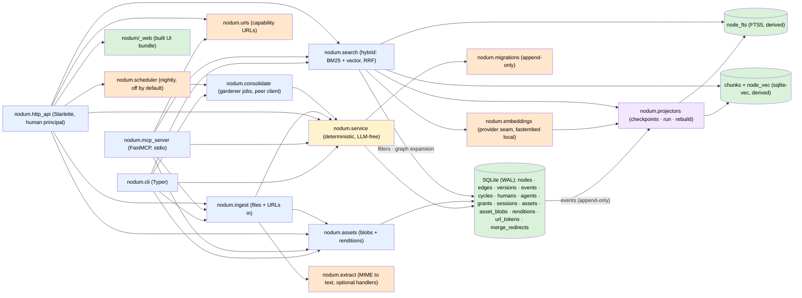

# Architecture

One SQLite file is the only source of truth and the only write path goes
through the service layer. The CLI, the MCP server, and the HTTP API are thin
adapters over it — each with its own identity rule and no logic of its own;
derived stores (FTS, chunk embeddings, renditions) are projectors fed by the
event log or lazily generated.



## Module map

| Module | Role |
|---|---|
| `nodum.db` | Connection management (WAL, foreign keys), `NODUM_DB` resolution, the migration runner over `schema_migrations`. `apply_migration` wraps each script **and** its `schema_migrations` row in one transaction (`BEGIN` inside the `executescript` payload, `foreign_key_check` then `COMMIT` around it, rollback on failure), so an interrupted upgrade is retried, not stranded half-applied. Foreign-key *enforcement* is off for the duration and the whole database is checked before the commit: this is SQLite's own recipe for the create-copy-drop-rename rebuild 0009 performs, and deferring instead is not equivalent — dropping a populated parent leaves a deferred-violation counter the rename never clears, which made 0009 fail on any database holding one node and its version row. The schema-consistency check (one per migration whose name implies a schema guarantee) runs **before** the apply loop, so a database that can only be deleted never has 0010's irreversible `DROP TABLE policies` committed onto it first. |
| `nodum.migrations` | The append-only migration list: `0001_core` (core DDL), `0002_seed_builtin_types` (the built-in type catalog), `0003_projector_checkpoints_and_fts` (`projector_checkpoints` + the derived `node_fts` FTS5 table), `0004_policies` (per-agent policy rulesets — dropped by 0010), `0005_proposed_versions` (`versions.state` — `applied`/`proposed`/`archived`), `0006_vectors` (the derived `chunks` + `node_vec` sqlite-vec tables), `0007_assets_and_renditions` (`assets` metadata + `asset_blobs` originals + `renditions`, all bytes in-database), `0008_version_proposed_fields` (`versions.proposed_fields` — which fields a proposed update names), `0009_spaces_and_type_nodes` (Q13: `graph_id` → `space_id` on nodes only, the type catalogs become type-nodes in the meta space, bootstrap seeds), `0010_principals` (`humans`/`agents`/`grants`/`sessions`, parity grants, the policies table dies), `0011_actor_strings` (the bare `human` becomes `human:owner`), `0012_url_tokens` (capability-URL rows: a random secret's sha-256, its kind, its expiry, and a `used_at` single-use latch — deliberately no foreign keys, since an upload's declared `asset_hash` has no `assets` row yet and a FK on `space_id` would let an expiring capability block a graph write), `0013_unique_space_titles` (one space per title, in any state: a unique index over `nodes(title)` where `type_id = 'space'`, with no state predicate — a space title is reserved forever, archived ones included, because `undo` restores an archived row past `TRANSITIONS` and a name freed by an archive and re-taken since made that undo die on a bare `UNIQUE constraint failed`; the comparison is BINARY like the lookup's, so `Research` and `research` remain two names; duplicates are **renamed** before the index is created, because an index that cannot be built rolls the whole upgrade back — the `active` row wins the tie-break over every non-active state, so what `--space research` resolves to does not move across the upgrade; the replacement name is *searched* (`<title> (<id>)`, then ` 1`, ` 2`, …) rather than assumed, since a database can already hold a space literally titled `research (sp-b)`; and a title equal to another space's **id** is deduped too, being the same ambiguity by a route no index can express), `0014_cycles_and_gardener` (the `cycles` table that `events.cycle_id` has pointed at since `0001` with nothing on the other end — it stores what ran, who *asked* (`triggered_by`: a `human:<id>`, or the literal `scheduler`), over what scope, and how it ended, and deliberately **no diff**, since the diff is `list_events(cycle_id=…)` and a journal keeping its own copy could disagree with the log; `scope` takes no foreign key for the reason `url_tokens` takes none — a reference from history into the live graph would let an old journal entry block an ordinary write — while `rolled_back_by` does point at `cycles(id)`, which is one journal entry naming another rather than history reaching forward. It also seeds the `builtin-gardener` internal agent (`kind = 'internal'`, `credential_hash` NULL: it authenticates by being in-process) with `read` on `meta` and `edit` on `main` as **ordinary grant rows** — visible in `space-list`, removable by `nodum revoke`, with no gardener-shaped exception anywhere in the grant model — because D7 is auto-apply by default and seeding the identity without its authority would ship a phase that silently no-ops. A database already holding an agent id under the reserved `builtin-` prefix **refuses the upgrade** rather than resolving the collision: taking the id would attribute that agent's whole history to the gardener and renaming it would detach that history from the account it names, since actor strings are immutable log entries and not references anything can follow. `RAISE()` is trigger-only in SQLite, so the abort is a `CHECK` constraint whose *name* is the message, over a scratch table that gets a row only when something under the prefix exists — `LIKE 'builtin-%'` and not the single id, because `0010` back-fills an `agents` row from every actor string in the log, so a pre-0010 file merely mentioning `agent:builtin-librarian` upgraded clean and left a live token-bearing account under the reserved prefix), `0015_cycle_stop_switch` (the kill switch's row: `cycles.stop_requested_at` + `cycles.stop_requested_by`, **two columns and no boolean flag** — `cycles` already writes every fact that arrives after the INSERT as a nullable column whose presence is the flag (`finished_at`, `report`, `rolled_back_by`) and carries a boolean only for `dry_run`, which is fixed at insert and never transitions, so a third representation of one event would be state a later reader has to reconcile with the record beside it, and `ALTER TABLE` cannot add the table-level CHECK that would forbid `stop_requested = 1` with no requester; `CycleOut.stop_requested` is `stop_requested_at IS NOT NULL`, computed on every read. The one disagreement two columns can still have is closed by a **cross-column CHECK, which `ADD COLUMN` does accept**, named so SQLite prints the name as the message — 0014's device, since `RAISE()` is trigger-only. Both columns are pure additions with no back-fill: a row that predates them is a cycle nobody asked to stop, which is what two NULLs say. `db._cycle_stop_problems` asserts both exist on any file recording `0015` — `init_db` skips a migration whose name it holds, and nothing in the runtime can catch the drift first, since `LLMReport.stop_switch` reports the posture a *run* had rather than what the file can store — and the refusal prints the `ALTER TABLE` for each column it **found missing**, in dependency order, since `ADD COLUMN` has no `IF NOT EXISTS`), `0016_conventions_and_annotations` (the write seam's schema half: the `conventions` space node in meta with the gardener's `edit` on it as an **ordinary, revocable grant row** — restoring `edit` on `meta` was rejected because 5a's live pass proved it buys renaming `main` and archiving the `note` type, after which a human cannot write a note; a node id or space title `conventions` already existing **refuses the upgrade** by 0014's named-CHECK device, since 0013's unique index would otherwise surface the collision as a bare `UNIQUE constraint failed`; and the `annotations` table, one row per queue item saying what a proposer's acceptance signal judged and at what rate — an **exclusive arc**: three typed nullable target columns with real `ON DELETE CASCADE` foreign keys and a CHECK that exactly one is non-null, three partial unique indexes holding one-annotation-per-target, and `cycle_id` pointing at the cycle that wrote them so they roll back with it — a stated deferral, since nothing writes annotations yet in this release and 5a's atomic rollback still has to learn this table. It has **no direct read surface**: written only by the learned-curation cycle, read only attached to a `ProposalOut` the store has already grant-filtered. `db._write_seam_problems` asserts the table, the space node and the grant on any file recording `0016`, printing the migration's own statements that put each back). Shipped entries are never edited; later phases append their own. |
| `nodum.service` | The only writer. Validation, the `proposed → active → archived` state machine, the event log, versions (incl. `proposed` updates: agent edits stage a version naming the fields they change; accept applies exactly those as an ordinary `node.update`, reject archives it), undo, wikilink materialization (edges land per the writer's grants — `proposed` on `suggest`), the review queue (proposal listing with reviewer context over nodes/edges/updates — every referenced node reported as `{id, title, space_id}`, so the queue can group by space without the client chasing ids — batch accept/reject by id or filter, and `annotate`, the annotation write path: the exclusive-arc row, gated like a review, replacing rather than accumulating per target), and the curated graph reads behind the MCP read tier (`get_neighborhood`, `traverse`, `find_path`, `get_schema`, `diff_versions`) plus `propose_edges` batch writes. Two further reads serve interactive clients rather than agents: `subgraph` (the filtered, node-capped neighborhood — see the decision log) and `suggest_links` (title-prefix lookup for a `[[` autocomplete, read straight off `nodes` so it needs no projector). **Every function takes a `Principal`; the scope-bound store (`nodum.store`) confines reads and writes by grant — `suggest` lands `proposed`, `edit` lands `active` and carries in-space `accept`/`reject`/`archive`; `undo` stays human-only.** Spaces are here as well: `list_nodes` takes an optional `space` **filter** (resolved by the same rule as any other space reference, so one the principal holds no grant on does not resolve, and the principal's scope clause is still ANDed underneath it — the filter narrows, it can never widen), and `create_space`/`rename_space`/`archive_space`/`list_spaces` own the space lifecycle as thin delegates to `create_node`/`update_node`/`transition` — a space is a node of builtin type `space` in the meta space, so there is no separate write path for one, and that fact lives here rather than in each adapter. `list_spaces` adds the two facts the `/spaces` screen needs (live node count, grant holders) and is human-only, exactly as `list_grants` is. Two space rules live here rather than in a screen, so the CLI and the API inherit them: `main` and `meta` are refused by *any* archive (`STRUCTURAL_SPACE_IDS`, checked in `_transition_row` so `archive <id>` cannot route around `archive_space`), while a rename of either stays allowed since it is the id everything depends on; and no two spaces may answer to one name (`_require_space_name_free` over the resolver's own `id = ? OR title = ?`, in every state — a space keeps its name when archived, so restoring it can never collide — with migration `0013`'s unique index under it for the paths no Python guard sees; the refusal is `SpaceNameTaken`, a 409, and it says when the holder is archived because nothing lists those). Two further rules close what those two left open. **A space lives in meta and `create_node` enforces it** (`_require_space_lives_in_meta`): the generic path could otherwise put a `space`-typed node in ordinary territory, where it was listed and resolved as real territory while the grants governing it were the *host* space's — and since a rename is authorised by a grant on that host, it turned the deliberately-unscoped name check into an existence oracle over every space in the file. `update_node` requires READ on meta before that check for the same reason, so a legacy or raw-SQL row cannot reopen it; migration `0013`'s index stays unscoped to meta on purpose, as the backstop for writers that never reach the service. **Archiving a space makes every grant on it inert** (`auth._grant_set` filters the grant set at mint time, so every downstream check inherits it): cutting an agent off is why a human archives a space, and it previously held only for calls that spelled the space's name — anything reaching a node by id kept full live authority, invisibly, since `list_spaces` no longer showed the space or its grants. The grant rows survive so `list_grants` shows them and `revoke` removes them (`_resolve_space_for_admin`, human-only, resolves any state), and undoing the archive restores the delegation. **Consolidation cycles, the curative tier and rollback are here too** (design §8.2/§8.4). `open_cycle`/`close_cycle`/`get_cycle`/`list_cycles` own the `cycles` row (the two reads human-only, for the reason `list_events` and `list_spaces` are: a journal entry says what the gardener did across every space in the file); the kill switch is `request_stop` (human-only; stamps migration `0015`'s two columns on a `running` cycle and does nothing else — the row stays `running`, no event, no write touched, and the run closes its own entry when it notices; refuses a cycle that is not `running`; asking twice keeps the first asker, because a switch that raised while the run was already stopping would make a human hitting it twice doubt it worked) and `stop_requested` (the read a runner obeys, **deliberately not** human-only — one boolean about a run discloses no territory, and a runner that cannot ask whether it was told to stop cannot obey — scoped instead by the identical `require_review`/`_cycle_authority_spaces` check `open_cycle` and `close_cycle` ask against the cycle's *recorded* scope, since obeying a stop is closing the cycle); it is **not** a reuse of `abandon_cycle`, which is a repair closing somebody else's dead process from outside; `in_cycle` is a `ContextVar` that `_emit` reads, so a cycle's writes go through the *ordinary* public functions and are stamped without any call site naming a cycle — per-task rather than a module global, so a concurrent HTTP request cannot be stamped by it, and reset in a `finally`, because a leaked id would make ordinary later edits un-undoable. **`undo` refuses a cycle-stamped event and points at rollback**, which is what makes rollback safe: a curative operation writes several rows from one decision while `undo` reverses one row from one payload. The tier is `merge_nodes` (soft, D9 — tombstone plus `props.merged_into`, a `merge_redirects` row, incident edges repointed keeping `props.merged_from`, or archived with a reason when repointing would self-loop or duplicate; the read path is unchanged on purpose), `retype` (the one sanctioned exception to an immutable field, transforming **no** props, since what a property means after a retype is judgement and judgement is 5b), `supersede_edge` (`valid_to` closed *and* `archived` — two facts, both recorded; a replacement inherits every field it does not name, and the seeded `supersedes`/`superseded_by` pair is carried in props because one edge cannot reference another) and `bulk_relink` (empty selector refused, `MAX_RELINK_EDGES` ceiling, a dry run that opens no cycle and emits no event). Every one of them runs **inside** a cycle — `_curative_cycle` joins the ambient one or opens a one-op `trigger='curative'` cycle — so rollback is the single reverse for the whole tier. The op names live in the `node.`/`edge.` namespaces `nodum.projectors` dispatches on, one event per node, because an op outside them would silently desynchronise FTS and the embeddings. `rollback_cycle` is human-only, atomic, and **refuses rather than clobbers** — `RollbackConflict` names the rows and both ends of each collision — and is itself a cycle, so rolling *it* back re-applies the original. `Store.cap_landing` plus a keyword-only `landing=` on `create_edge`/`propose_edges`/`create_node` is §8.3's ceiling-not-mandate seam: a writer may file below its own grant, and asking to land above it is refused rather than quietly downgraded. Each public function opens a short-lived connection, applies pending migrations idempotently, and commits — adapters stay stateless. |
| `nodum.projectors` | Derived-index consumers of the event log. The `Projector` base class (`reset`/`apply`/`count`/`availability`), the `REGISTRY`, per-projector checkpoints (`projector_checkpoints.last_event_seq`), incremental `run_projectors`, `rebuild_projector` (reset + replay from event 0), and `projector_status` (with availability + reason). The `fts` projector maintains `node_fts`, joining an ingested asset's `extracted_text` into the index row of the `asset_ref` node that stands for its bytes — **that node type only**, since the `source` node and every per-page `block` also carry the `asset_hash` prop but already hold their own text (a prop-only join gave every page of a document the whole document's text and double-weighted the `source` node's, destroying per-page precision). The `vec` projector maintains `chunks` + `node_vec` — re-chunking and re-embedding nodes from event payloads, recording `model_id` per chunk. Deterministic and LLM-free; the service layer never calls in — the event log is the only coupling. An unavailable projector (`vec` without a provider) no-ops and keeps its backlog. |
| `nodum.embeddings` | The embedding provider seam (design D10) + chunking (design D6). Provider interface: `model_id`, `dimensions`, `embed(texts)`. The default `FastembedProvider` runs `sentence-transformers/paraphrase-multilingual-MiniLM-L12-v2` (384-dim, multilingual) in-process via ONNX — behind the optional `embeddings` extra, resolved from nodum's own model cache only (`~/.local/share/nodum/models` by default, overridable via `NODUM_EMBED_CACHE` and always passed to fastembed explicitly, since fastembed's default is a temp directory a reboot can clear; downloads need `NODUM_EMBED_DOWNLOAD=1`; model override via `NODUM_EMBED_MODEL`). Chunking is a fixed 512-word window with ~15% overlap (words approximate tokens — dependency-free). `set_provider`/`reset_provider` are the test seam (a deterministic hashing fake lives in `tests/conftest.py`). |
| `nodum.llm` | The LLM provider seam (Phase 5b, design P1), shaped like `nodum.embeddings` — a `Protocol`, a cached `get_provider()` → provider or `None`, `unavailable_reason()`, `set_provider()` — because that is the seam every adapter here already knows how to be absent through. **One class covers both halves**: ollama serves an OpenAI-compatible `/v1/chat/completions` honouring `response_format: {type: json_schema}` and returning `usage` + `finish_reason` (verified by driving it), so the local default (`http://localhost:11434/v1`, no key) and a remote API are the same wire; ollama's richer native `/api/chat` was rejected as a second code path only the local half can exercise. It abstracts over nothing else — no streaming, tool calling, embeddings, retries, prompt templates, or sampling (`TEMPERATURE` pinned at 0; the determinism that produced locally is a property of that backend and nothing may depend on it) — and offers **no module-level `chat`**, because every call goes through `nodum.agent`. **An over-long prompt is refused before the call.** Measured on `llama3.2:1b`: 16 000 characters cost 2 932 prompt tokens while 64 000 and 70 000 both report **4 096** — the window filled and the rest was dropped with nothing in the response saying so, since `finish_reason` describes the *output* only. So `chat` counts first (`PromptTooLong`, nothing sent). **`NODUM_LLM_CONTEXT_TOKENS` is the window the *server* serves, not the one the model has**: ollama applies `num_ctx` (4 096 unless `OLLAMA_CONTEXT_LENGTH` raises it) to every model, while `llama3.2:1b` really has 128 k — so set to the model card it re-opens the hole. Measured at 32 768 against that server: a 30 000-character prompt is not refused, `prompt_tokens` comes back 4 096, `finish_reason` is `stop`, and a whole answer arrives from a prefix. The after-the-fact defence is therefore **two** signals: `Completion.context_filled` (the report reached the *configured* ceiling — blind to the case above, since 4 096 is nowhere near 32 768) and `Completion.prompt_truncated` (the report is below `prompt_estimate / MAX_BYTES_PER_TOKEN`, the fewest tokens those bytes can cost). The pre-send estimate rides back on the completion as `prompt_estimate`, recorded by the provider because it is the only thing that has it. `MAX_BYTES_PER_TOKEN` is 6 against a measured worst case of 4.55 (Arabic), so the check catches a truncation that lost about a quarter of an English prompt or more and cannot see a narrower one — one-sided on purpose, like the estimate itself. Either signal is a charged `ContextOverflow` in `nodum.agent`. The estimate is **UTF-8 bytes**: a byte-level BPE token decodes to at least one byte, which makes it a bound rather than a heuristic, where `chars/4` under-counts emoji twelvefold and accented Latin fourfold. A `finish_reason: "length"` body is cut mid-token and does not parse — no result, not a short one — and a JSON schema fixes the envelope and *nothing else* (under a schema the model answered an unanswerable question with `{"answer": "n0", "cited_ids": ["n0"], "answered": false}`). **Every way a provider can die here is an `LLMError`**, including the one that had to be added by hand: `IncompleteRead` (a body that stops short of its `Content-Length` — a killed provider, a proxy timeout, a dropped load balancer) derives from `http.client.HTTPException`, *not* `OSError`, so it escaped to a CLI traceback and an HTTP 500 until `_post` caught that base class — and the second one found the same way: `urllib.request.Request` parses the URL **in its constructor**, so a scheme-less `api.deepseek.com/v1` (`ValueError: unknown url type`) and a malformed `http://[bad/v1` (`ValueError: Invalid IPv6 URL`) escaped too, until that construction moved *inside* the `try`. Resolution reads configuration and makes no network call, and it now has an opinion about the URL: one `urllib` cannot POST to is **no provider with a reason** (`base_url_problem`), like an unparseable window, rather than a provider that fails later. A scheme is never guessed back in, because choosing `http` or `https` decides whether the API key crosses the network in clear text. **The key itself travels only to an endpoint somebody named** — `NODUM_LLM_BASE_URL`, or a model id a shipped profile serves. A hosted model id nobody profiled falls back to `DEFAULT_BASE_URL` and used to take the vendor's bearer token with it: driven, the prompt correctly stayed local and the credential arrived at a throwaway listener as `Authorization: Bearer …`. It is now dropped at resolution time and `key_withheld_reason()` names the endpoint it would have gone to, in `nodum llm status`; withheld rather than refused, since the local default needs no key and a self-hosted gateway that does keeps its own by naming itself. **Two parts of that "one wire" turned out not to be universal, each found by a live 400.** `response_format: {type: json_schema}` is honoured by ollama and refused by `deepseek-v4-flash` (`HTTP 400 "This response_format type is unavailable now"`, which takes `{type: json_object}` instead); and `reasoning_effort` takes a graded level on DeepSeek but **only `none` on ollama**, which answers `HTTP 400 "llama3.2:1b" does not support thinking` and `HTTP 400 think value "low" is not supported for this model` — the latter on `qwen3:8b`, which does think — so a graded level sent unconditionally is a 400 on every local call. Both are handled by **capability negotiation rather than retry**: the strongest believed form goes out, a **400** naming the field downgrades that belief on the instance, and the call is re-sent once inside the *same* per-call timeout. Bounded at three downgrades, only a 400 counts (a 5xx or a timeout says nothing about capabilities), and message matching is brittle **one-sidedly** — a false positive is a weaker request every endpoint accepts and reports, a false negative is exactly today's `ProviderUnavailable`. The one place that matching is *sharpened* is reason words, not the punctuation that used to stand in for them: `Invalid schema for` means the server parsed the field and is validating what is inside it — proof it serves the field and that the fault is nodum's own schema, so it never downgrades — while `is unavailable` / `not supported` naming `response_format` mean a genuine capability rejection, which does downgrade. A dotted or bracketed field path alone decides neither way, and a message naming both a schema fault and a rejection word is read as a validation error: a false negative is exactly today's `ProviderUnavailable`, a false positive weakens every request for the life of the process. The reasoning field is a three-rung ladder (`graded` → `off-only` → `absent`) walked one rung at a time: a server that rejects unknown fields refuses `none` too, and collapsing the rungs would give up the one setting that cures `qwen3:8b`'s empty body. **The `json_object` fallback is never silent**, because it is a real reduction: the schema becomes a *sentence in the prompt*, so a `pattern` inside it stops being enforced by constrained decoding and becomes advice. The mode rides on `Completion.structured_mode`, `AgentRun.structured_mode`, `LLMReport` and `nodum llm status`. The injected instruction must contain the word "json" (the endpoint 400s without it), is placed after the caller's leading system messages, and renders the schema with sorted keys — both for prefix caching — and `estimate_prompt_tokens` takes the schema, since under the fallback it costs prompt tokens an estimate may not under-count. **The output reservation is a share of the window, not a flat subtraction** (`OUTPUT_RESERVATION_FRACTION` = 0.5): an absolute ceiling cannot suit both a 4 096-token shared ollama window and a 1 000 000-token remote one, and the clamped number is also what is **sent** as `max_tokens`, since reserving less than the server may generate is the overrun the reservation exists to stop. `AgentRun.output_reservation` is the single place that arithmetic lives. **`prompt_truncated` weighs only the bytes really sent** (`estimate_content_tokens`), not the ~52 tokens of template overhead the refusal's estimate adds — on a 33-byte prompt that overhead was 60 % of the estimate and the check fired on a completion the server read whole, making `llm status` report a failed call on a healthy install. Config: `NODUM_LLM_MODEL` (unset = no provider, no guessed default), `NODUM_LLM_BASE_URL`, `NODUM_LLM_API_KEY`, `NODUM_LLM_CONTEXT_TOKENS`, and `NODUM_LLM_THINKING` (`none`/`low`/`medium`/`high`, default `high`; anything else is **no provider with a reason**, because a level is a name the API validates strictly rather than a number that can fall back). The level names are **not ordered by cost** — measured, `low` reached 2 177 reasoning tokens where `high` spent 60 on the same prompt, and `high` was also the fastest — so nothing may size an output ceiling from the configured level, and only `none` is predictable (exactly 0, every time). **`profile_for` makes a recognised endpoint need only a key**: an **exact** hosted model id supplies the base URL, the served window, the structured mode and whether graded thinking is accepted, so `NODUM_LLM_MODEL=deepseek-v4-flash` plus a key is a working install. Exact, and only when no `NODUM_LLM_BASE_URL` is set, because both looser rules had teeth. A `deepseek-` **prefix** captured `deepseek-r1`, `deepseek-coder`, `deepseek-v3` and the rest of the ollama library, so `NODUM_LLM_MODEL=deepseek-r1:8b` with nothing else set resolved to `https://api.deepseek.com/v1` — a configuration meaning "run locally" POSTing private graph text to a vendor whenever a key happened to be set, and 401ing against an unconfigured host when it was not. And a set base URL used to win the URL while the profile still supplied `context_tokens`, carrying a 1 000 000-token belief against a server serving 4 096, which is the silent truncation the table exists to prevent. So a named endpoint takes the whole decision, and host matching is a **parsed hostname** rather than `key in url` (a proxy at `deepseek-gw.lan` is not DeepSeek). Every field is a default an explicit variable overrides, and a profile is an optimisation, never a gate — an unprofiled provider starts optimistic and negotiates down, which costs one 400, where a wrong guess costs egress. Design Constraint 4 is structural: `tests/test_llm.py` walks the package's import graph and proves `nodum.service`/`projectors`/`store`/`migrations` cannot reach this module under any spelling or any number of hops, and that `nodum.agent` is its only importer. |
| `nodum.agent` | The internal agent's runtime and the **one door to the model** (design P3, A1–A3, B1–B4, K1–K3) — a peer client that opens no connection and mints no principal. `AgentRun.chat` meters, bounds and attributes every provider call. **Accounting**: `GeneratedBy` = `{provider, model_id, prompt_version}` rides the **event** (the log is already the answer to "who is answerable for this write"; `actor` stays `agent:builtin-gardener`, since the gardener made the write and the model is *how*), cost rides the **cycle report** under `report["llm"]`, and nothing decision-bearing rides the node. **A reasoning model's thinking is metered beside the spend and never inside it**: `reasoning_tokens` is a *share* of `completion_tokens` on the wire (`total_tokens` is `prompt + completion` on every call measured), so adding it would report a night as costing twice the bill, while omitting it hides that a job spent 1 420 of its 1 520 output tokens thinking — one sample from a `length` finish, which here is no result. It rides on `Completion`, `Generation`, `JobCost` and `LLMReport`, beside `cache_hit_tokens`/`cache_miss_tokens`, since the prefix cache is priced ~50x below a miss and a token total is not a cost without them. At `reasoning_effort: "none"` the whole `completion_tokens_details` block is **absent** from `usage` rather than zero, so those three are read leniently while `prompt_tokens`/`completion_tokens` stay strict — the first three are decompositions of numbers already read, and losing one loses detail rather than money. Deliberately not `chunks.model_id`'s mechanism: embeddings are derived and rebuildable, generated text is not. `prompt_version` is a hash of the prompt template, so a journal reporting acceptance rates by model is not reporting a mixture. **Budgets** nest per-call ⊂ per-job ⊂ per-cycle, metered in tokens from `usage`, with an **independent wall-clock ceiling** beside them because tokens do not bound a night (2 395 prompt tokens = 47 s locally). `NODUM_LLM_CYCLE_BUDGET` is **0 by default — the LLM jobs do not run**; `NODUM_LLM_REQUEST_BUDGET` defaults on, because a human pressing a button is not an unattended process. The **wall clock starts at the first provider call**, not at construction (a cycle run is built when the cycle opens and the LLM jobs run last, so a constructor-started clock charged the deterministic jobs' minutes to the model's ceiling), and the **per-call timeout is clamped to what is left of it** — checked once before a call and never again, a 2 s ceiling with the shipped 120 s call timeout measured `elapsed 3.0`. **Every share of a budget is measured against the same ceiling across `split` calls** (three jobs at 0.6 each reported 180 % of the cycle in `per_job`), and a **repeated job name is refused** rather than replacing the first and taking its recorded spend out of the report. **At a ceiling: refuse and itemise, never truncate** — the call's worst case is checked before anything is sent, and the skip names the item; the refusal names the variable that funds *this* run (`NODUM_LLM_REQUEST_BUDGET` for a request, not the cycle one), or the job's share when the run itself is funded. Exhaustion is deliberately a *different report shape* from a degraded path: an absent provider is `available: false` + `unavailable_reason` (a stable fact about the install), exhaustion is `exhausted: true` + an itemised `skipped` (a fact about one run) — and `LLMReport` has no `notes` field, so the two can never be printed in one voice. A failed call is still charged, and `failed_calls` means **calls that produced no usable result** — a discarded `length` finish or truncated prompt counts, or three thrown-away answers read as three successes. A `PromptTooLong` costs nothing and is no call at all, but it **records a skip**: an item was left unexamined. **The provider object is private** (`_provider`): P3's rail checks imports and a module holding `run.provider` imports nothing, so a call through it was unmetered, unstoppable and unattributed; what a caller gets instead is `context_tokens` and `estimate_prompt_tokens(messages)`. **The kill switch** is a `cycles` row rather than a reuse of `abandon_cycle` (a repair and an instruction are different facts a journal must keep apart), read fresh before every call. Its row and its service read landed in migration `0015`, so `cycle_stop_check` calls `service.stop_requested` directly and a cycle's report says `armed`; a *request* run has no cycle row for anybody to stamp and says `none: …` instead, because "no stop was requested" and "there was no stop to request" are different facts. The gate that used to sit under it — and the `pending…` string naming a column that was never called that — is gone: it keyed on the service function, so it answered a question about the *module* while the question with two answers is whether the **database** can store a stop, which is `db._cycle_stop_problems`'s at `init_db`. The human end is `nodum cycle-stop <id>` / `POST /api/cycles/{id}/stop` / the journal entry's confirm; what obeys it today is this module, before a provider call, and the deterministic jobs make none. Config: `NODUM_LLM_CYCLE_BUDGET`, `NODUM_LLM_CYCLE_SECONDS`, `NODUM_LLM_REQUEST_BUDGET`, `NODUM_LLM_REQUEST_SECONDS`, `NODUM_LLM_CALL_TIMEOUT`, `NODUM_LLM_MAX_OUTPUT_TOKENS` — an unparseable *or out-of-range* value falls back rather than refusing to boot, and the cycle fallback is 0. **`NODUM_LLM_MAX_OUTPUT_TOKENS` defaults to 4 096, sized for a reasoning model.** 512 was measured *below the floor at which anything works*: a ceiling sweep against `deepseek-v4-flash` was perfectly bimodal — 300/400/500 gave `length` and an unparseable body every run, 650 and up parsed every run — so the shipped default made every call on that provider a B3 failure. 4 096 is not "the floor plus margin": thinking comes out of the same ceiling and cannot be predicted from anything configured (worst cases measured 2 177, 1 174 and 1 277 output tokens, with a 26x spread on repeats). It costs nothing where the window is large, and the proportional reservation lands it at 2 048 against ollama's shared 4 096 — the number already recorded as the cure for `qwen3:8b`. `AgentRun.chat` also takes a per-call `thinking=`, because the call sites do not want the same level — and a per-call `max_output_tokens=`, for the same reason: `/ask` reserves `ASK_OUTPUT_TOKENS` (2 048, against a worst case of 528 output tokens over 24 measured samples), the probe 32, the rewrite a 2 048 *floor*, and `/summarize` keeps the blanket 4 096 it was sized against. **What a call is charged is the provider's own pair of numbers**: the estimate *with the schema the call will send* (330 prompt tokens for `ASK_SCHEMA` under `json_object`, invisible to a bare estimate — `/ask` fitted a prompt at 4 068 against a 4 096 ceiling and then refused the same prompt at 4 398), and `output_reservation(ceiling)` rather than the ceiling, since the clamp is what will really be sent as `max_tokens` and charging the uncapped number refused calls up to 2 048 tokens early. A `usage` block that contradicts itself is clamped and **logged** rather than believed: `reasoning_tokens` above `completion_tokens` (a share cannot exceed its whole, and `content_tokens` is the difference) and a `usage.total_tokens` that disagrees with `prompt + completion` — overriding the provider's total is right, never reading it meant a provider that bills differently could not be noticed. In `LLMReport` and `JobCost`, a default belongs on a field whose zero means *unknown* (`reasoning_tokens`, the cache counters — absent at `reasoning_effort: "none"`) and nowhere else: `elapsed_seconds`, `exhausted`, `stopped`, `stop_switch` and `Generation.latency_ms` are required, because `STOP_SWITCH_NONE` in particular is an affirmative claim and a construction site that omitted it on a cycle run would report the opposite of the truth. Where the range starts separates a decision from a misconfiguration: 0 on a budget is *off*, while `NODUM_LLM_MAX_OUTPUT_TOKENS=0` reached the provider as a `ValueError` and became a **400** on every `POST /api/ask`. A ceiling in seconds must also be **finite** — `float()` reads `inf`, `Infinity` and `1e999`, and `json.dumps` writes a bare `Infinity` that no `JSON.parse` accepts (measured on the wire). |
| `nodum.search` | The query path (design §7). `search()` catches the `fts` and `vec` projectors up with the log, runs BM25 (title boosted 5×) and — when a provider is available — a sqlite-vec KNN over chunk embeddings (closest chunk per node wins), fuses both lists by reciprocal rank fusion (K=60), then optionally expands the fused hits one hop along `active` edges (type weight × confidence). Hits carry the fused `score` plus a per-signal `signals` breakdown (`bm25`/`vector` RRF contributions summing to `score`, `graph` edge weight) and the `space_id` the node lives in — a result list spans every space in scope unless `space` narrowed it, so a hit that did not name its own would be unplaceable in the one surface a human scans. Without a provider the vector signal is skipped — graceful degradation to BM25 + graph. The filters (`state`/`type`/`created_by`/dates/`include_meta`/`space`) are built once in `_node_filters` and shared by both ranked lists *and* by graph expansion, so a filtered-out node cannot fuse its way back in, and a search narrowed to one space does not reach back out of it one hop later. `space` composes with the principal's scope rather than replacing it, and resolves by the same non-leaking rule as everywhere else. |
| `nodum.answers` | The read-only smart surface (Phase 5b-i, design E1–E3): `ask`, `summarize`, `natural_search` and `provider_status`, behind `POST /api/ask`, `POST /api/summarize`, `GET /api/search?nl=1` and `nodum llm status`. **Nothing here writes.** A peer client like the runner — it reads through the ordinary public `nodum.service`/`nodum.search` calls, reaches the model only through `nodum.agent`, opens no connection and mints no principal — and its result models live beside the code that produces them rather than in `nodum.models`, following `nodum.agent`'s own precedent this phase. **`answered` is computed, never read from the model** (E2), and it is exactly four deterministic checks: at least one cited id resolves to a note *this request* retrieved (ids outside that set land in `unresolved`, and zero survivors means the answer text is withheld); the model did not *also* name a note that does not exist while offering only one that does — the live `AWS` answer cited a 28 100-character Kafka textbook **and** marker `2` when one note had been sent, which is proof it was not reading the context; every number in the answer appears in the text that was really sent or in the question (`unsupported_numbers`), the live case being a source saying *fourteen minutes*, sent as a 1 213-character prefix that stopped short of it, answered "…is 24 hours"; and there is answer text. **It does not mean the answer is true** — citation resolvability is not groundedness, a model inventing content while citing a real id passes all four, and no check available here catches that. So the envelope is built to be read rather than trusted: `considered` is what reached the model and is empty whenever no call was made (`used.calls` corroborates it), `truncated_notes` and `Citation.truncated` say which notes reached it **in part**, `dropped` says which did not reach it at all, and every note carries its `state`. Graph text cannot forge a note boundary either: `[n]` at the start of any line of a title or excerpt is neutralised to `(n)`, because `_context_block` writes exactly that shape and a `source` node carrying `[1] Retention window` moved its own sentence inside note 1 — both local models answered 9999 days from it, and the 8B cited only the honest notes, which say thirty. **A line start is whatever a reader takes for one**, which `re.MULTILINE` and a `[ \t]` indent were not: 16 of 21 candidate line-starts went undefused, and one zero-width space in front of a forged `[9]` took `llama3.2:1b` to `cited: ["1","2","9"]` 3 of 3 at temperature 0 — `answered: true`, citations pointing at two notes that say thirty days — through the very ingest path the rule was written for, since `extract` unescapes `&#8203;` and passes it through verbatim. The line is now `str.splitlines`'s and the indent is anything glyphless (Unicode whitespace plus `Cc`/`Cf`), the markers are **defused in place and never deleted** because width is what `excerpt` and the truncation bound are measured in, and the defusing runs **last**, on the string that goes into the message: `_excerpt`'s own Unicode-aware `strip` used to remove the NBSP that had shielded a marker from a `[ \t]` indent, promoting a bare `[9]` to column 0 of every `/summarize` prompt after the defence had run. Confusable renderings (`［9］`, `[٣]`) are deliberately *not* rewritten — they cannot resolve, since `resolve_citation` takes ASCII digits only — and the suite's audit matches them anyway, so one reaching a prompt is visible rather than re-reasoned. The same defusing runs on the **question**, because `ASK_TEMPLATE` prints it underneath the notes and a question carrying a line `[3] …` opened one more note than the retrieval offered — measured, the 1B then cited `2` and `3` on a one-note graph. The rule is a property of the prompt's grammar, so every string interpolated into that grammar is subject to it; `question` in the envelope is still what was typed. **The question is defused as grammar and counted as evidence for `unsupported_numbers` in the same call, deliberately**: the grammar belongs to this module whoever writes into it, while a number the human typed is a number they are asking about — measured, `ledger retention window` refuses on `9999` and `ledger retention window 9999` answers. That rests on `ask` being reachable only from `nodum ask` and from `POST /api/ask` behind a session resolved to an enabled human — no MCP tool, no job — which a test pins over the package's AST, because a caller that *composes* a question would make the question stop being evidence. `/summarize` sends a **narrower** set than it may read: archived, proposed and meta-space nodes the walk returned are reported in `withheld` and never sent, since `/ask` cannot reach them at any `k` and two endpoints on one install must not disagree about what leaves the machine. The schema carries no `answered` field at all, because the measured failure is a schema-valid `{"answer": "false", …, "answered": true}` and a field nobody may read is one the next reader wires up. **Every provider failure is an outcome, not an error**: no provider, an unreachable one, a `length` finish, a filled context, an exhausted budget — all `answered: false` plus a `refusal`, at HTTP 200 and CLI exit 0, with a malformed *request* still the ordinary 400/404 and exit 1. `used` is `agent.LLMReport`, so a request's cost and a night's cost are one shape. The prompt is **fitted to the context window before the call**, narrowing excerpts before dropping the worst-ranked note, and `considered`/`dropped` say what reached the model — E1's stated bound, not B3's forbidden budget truncation. **Three prompt findings, measured**: the first version scored 1/6 on a six-question battery against `llama3.2:1b` with every failure an unparseable citation (`"]"`, `"/1"`, `"space main"`, a chat template's `<|start_header_id|>`), and three changes took it to 6/6 — the citation format became a `pattern` on the schema (enforced by the server's constrained decoding, so bad strings are unrepresentable), a note is identified by a small integer and nothing else (with the 32-hex id beside the marker the model cited `"116"` and `"749"`, mining it for digits), and the instructions carry no number the model can copy (a worked example `["1", "3"]` came back as `"3"` on every call — scoring *better*, 5/6, and still wrong, since on a graph returning three hits that copied number resolves to a real note). The rule to keep: **every number in the prompt is a candidate citation.** `qwen3:8b` makes the identical format errors under the first prompt and costs 65–113 s a question against the 1B's 3–8 s, so the model was never the binding constraint here; on the fixed prompt both score 6/6, with the 8B's citations cleaner (0 unresolved against 3 correctly-dropped spurious markers). **A reasoning model spends its thinking tokens out of `max_output_tokens`** — ollama charges `<think>` to `completion_tokens` and strips it from `content` — so `qwen3:8b` answers a rewrite with an empty body at `finish_reason: "length"`, B3 correctly discards it, and the feature is off on that model with a message about a ceiling nobody chose. The rewrite therefore takes a **floor and never a cap**: `REWRITE_OUTPUT_TOKENS` (2 048, the verified cure — the 8B rewrite then returns `["compaction", "topic", "state store"]`), capped at half the window so a raise can never leave a prompt no room, and never below the human's own `NODUM_LLM_MAX_OUTPUT_TOKENS`. A per-call number *below* the run's would be the model-compatibility setting in disguise this call site already refused once; the floor exists because leaving the shipped 512 in place turned `search --nl` off out of the box on that model. It is set per purpose rather than as a new default because the rewrite's prompt is one template and one question — reserving half the window costs it nothing, while doing the same to `/ask` would halve the context every answer is built from. Without it the degradation was still graceful: `rewrite.applied: false` with the reason, and the search runs the human's own words. **Each call site now sets its own reasoning level over the global default**, because they do not want the same thing. `/ask` and `/summarize` take the human's level — deciding whether the retrieved context answers the question is where a confident wrong answer is the recorded danger. The **query rewrite is pinned to `none`**: over twelve live samples at the default it spent 44–1 174 reasoning tokens (57 % of its own ceiling, a 26x spread) for terms that did not change, while `none` was byte-identical per question and 3.4x faster — and determinism is the right property for a *search*. The **reachability probe is pinned to `none`** for a blunter reason: at any graded level it returns an **empty body**, every output token going to thinking. Its prompt is bounded too (`"Reply with exactly one word: pong"`, 2 output tokens, `stop`, six times out of six) because `"ping"` is answered here with a paragraph in Chinese, so the probe hit its own ceiling every call and reported `failed_calls: 1` on a healthy install; `PROBE_OUTPUT_TOKENS` rose from 8 to 32 for the same reason. `llm status` is on the same seam: it waits the run's own `NODUM_LLM_CALL_TIMEOUT` rather than a 30-second constant of its own (which printed `did not answer within 30s` three lines under `"call_timeout": 600.0`), reports its cost in `used` like every other provider call (34 tokens, measured), and reads a `ProviderTimeout` as `reachable: null` rather than `false` — it subclasses `ProviderUnavailable`, but a refused connection is a server that is not running while no answer yet is very often a live server loading a model. It is also **where a downgrade becomes visible**: `structured_output` (`json_schema` or `json_object`), `thinking` with `thinking_applied` beside it (`false` is a knob doing nothing — the ollama case), and `effective_max_output_tokens`, the configured ceiling as capped by the window's share. It re-reads **both** negotiated beliefs after the probe: `thinking_applied`, since the probe *sends* `reasoning_effort` and is the one call that can discover a refusal; and `structured_output`, which used to be left stale on the argument that the probe sends no schema and so could never provoke the `response_format` 400. That argument is about the **request** and `_negotiate` decides on the **response** — it never asks whether a schema was sent, so any 400 whose body names `response_format` demotes the provider for the life of the process, and one status payload then reported `structured_output: "json_schema"` over a `used.structured_mode` of `"json_object"` while every later `/ask` ran on the weaker envelope. |
| `nodum.assets` | Content-addressed binaries + derived image renditions (design §5.5/§5.7). `register_asset` streams a local file into `asset_blobs` through `Connection.blobopen` (hash pass, then a chunked copy into a `zeroblob` — a large file is never held in memory) and inserts the `assets` metadata row in the same transaction, so a failed copy rolls back whole — idempotent sha256 dedup, deliberately no event-log entry (nothing to undo — the one `asset.ingest` event covering a whole ingestion run is written by `nodum.ingest`, and `set_extracted_text` writes none either, for the same reason: content-addressed base state, not graph state). The copy pass re-hashes what it writes and refuses a mismatch (`AssetSourceChanged`): a source that shrank between the passes would otherwise commit with a zero-filled tail under a key its bytes do not match. A file over `SQLITE_LIMIT_LENGTH` (1 GB, read from the connection) is refused up front (`AssetTooLarge`) rather than as a bare `DataError: string or blob too big`. `get_rendition` lazily generates `thumb`/`preview` WebP images with Pillow (downscale-only, EXIF-transposed, 300 KB quality-stepping target on `preview`), stores them in `renditions` keyed by `sha256(asset_hash + ':' + profile)`, and serves cache hits from the stored row thereafter — the rendition's `data` column is read **only** when the caller asks for the bytes, which the MCP `get_asset` path always does (`include_data=True`) and the CLI does only for `asset rendition --out`; `purge_renditions` deletes the rows (all regenerable). Pillow reads originals through `_BlobReader`, a file-like adapter that restores the tolerant out-of-range seeks `sqlite3.Blob` refuses and Pillow's format probing depends on. Non-image assets and unknown profiles are rejected cleanly. `resolve_profile` also resolves `page:<n>` — a 1-based page of a PDF, rasterised by `pypdfium2` at `PAGE_DPI` (144, exactly 2× the PDF's own 1/72-inch canvas unit, so a text page is legible with no resample) and then encoded down the *same* WebP path, so a page raster is an ordinary rendition row: same id scheme, same lazy generation, same cache, same eviction. `pypdfium2` was chosen over PyMuPDF on licence alone — PDFium ships permissively licensed wheels with no system package to install, while AGPL would reach anything embedding nodum — and its import is lazy behind the `pdf` extra, so an install without it answers a page request with an `UnsupportedRendition` naming the extra rather than failing at startup. A raster has no image header to check, so its pixel budget is arithmetic instead (page geometry × the DPI scale): PDF permits a 200×200 inch page, which is 829 MP at 144 DPI. `set_extracted_text` stores what a handler pulled out of an asset, taking no principal and writing no event. There is **one sniffer**, `sniff_mime`, and it names a type from the *bytes* over `RECOGNISED_MIMES` — the rasters this Pillow build reads (PNG, JPEG, GIF, WebP, BMP, TIFF including BigTIFF, JPEG 2000, AVIF, ICO), `application/pdf`, the common audio containers (ID3, RIFF/WAVE, Ogg, FLAC, and the audio-only ISO-BMFF brands `M4A `/`M4B ` — never an `mp4` brand *prefix*, which claimed ordinary video as `audio/mp4`), and `text/plain`. That vocabulary is derived from the two places that already decide what this system can act on, the rendition path and `nodum.extract`'s registry — a test asserts every member of it resolves to a handler — and `http_api` derives its widest admitted upload set straight from it rather than copying a list that can drift. **Evidence has two strengths.** A leading signature is definite and may overrule a filename from another family; the text heuristic is a window test and may only *fill in* where the name guessed nothing (`_stored_mime`, Phase 4 note 01 D3 as revised by review F3). So PDF bytes called `scan.txt` are stored as `application/pdf`, which is what `page:<n>` rasters and extraction dispatch on, while an *uncompressed* PDF whose `%PDF-` sits one byte in — text to the heuristic, and read fine by both `pypdf` and `pypdfium2` — keeps `application/pdf` from its name, and `notes.md`, `data.json`, `page.xhtml` and `logo.svg` all keep their own names with no list of exceptions to maintain. A **displaced `%PDF-` header is definite evidence** in its own right (`_sniff_displaced_pdf`), because the readers scan for the marker instead of requiring it at offset 0: a real PDF carries compressed streams, so it is not text either, and without this it matched nothing at all and the upload route refused a document the system can act on. The scan is reached **only** for bytes the text test rejected, which is what makes it safe rather than merely unlikely to misfire — prose quoting `%PDF-1.4` (as this page does) is text and never gets there. The tolerance is not uniform and was measured rather than assumed: `pypdf` finds a header at any offset, PDFium stops looking at 1 KiB, and the scan stops at the head window — so a prefix under 1 KiB is whole, one between 1 KiB and the window extracts and paginates while its `page:<n>` rasters answer a clean 400, and one past the window is refused at the door. Text itself is decided **git's way and documented as a heuristic, not a guarantee** (`_sniff_text`): a NUL or any other C0 control byte means binary, over a 4 KiB window at *each* end of the file (the tail is what catches a zip behind 4 KiB of ASCII, whose central directory is at the end); a UTF-16/UTF-32 BOM exempts a file from the NUL rule *only*, and the window is then decoded in that encoding and still has to be control-free; a UTF-8 BOM is not honoured at all, since UTF-8 text passes the byte test unaided and honouring the mark only bought a bypass; and an empty file is not text. The stated cost is that a NUL-free binary format is admitted as text, which is benign in every direction: extraction yields junk text rather than a refusal, renditions still refuse it on the stored MIME, and an original is only ever served back as `application/octet-stream` with `nosniff` and `attachment`. New registrations decide their own MIME; a **dedup hit** keeps the stored one unless a definite signature contradicts its family, which is repaired with an `UPDATE` (`_repaired_mime`) — `assets` is content-addressed base state, maintained exactly that way by `set_extracted_text` already, and a row registered under an older rule otherwise reaches the wrong handler forever. Registration still refuses nothing on type: it takes no principal, and the CLI's tolerance for arbitrary operator-owned files is deliberate. Beside it, `check_image_pixel_budget` reads dimensions from the image header and takes its ceiling as an argument, because the bomb guard and the 40 MP ceiling answer different questions: what Pillow itself calls a decompression bomb — plus bytes Pillow cannot read at all, which is `OSError` and not merely its `UnidentifiedImageError` subclass — is about danger and applies wherever an image arrives, while `MAX_IMAGE_PIXELS` (40 MP) is about what can be *rendered* and gates admission only on the route whose purpose is a rendition. It is the same ceiling `_prepare_image` applies before decoding a stored original, since Pillow's own bomb detection *warns* between 1× and 2× its threshold and decodes anyway. |
| `nodum.extract` | MIME → text, through handlers that degrade instead of failing. A registry of **optional** handlers shaped exactly like the embedding provider seam: each declares the MIME families it claims and whether it can run, and an absent dependency is a *returned* `Extraction`, never an exception — so `extract()` on a machine with no OCR still returns a result, ingestion still registers the asset and writes its describing node, and `detail` says plainly that no text came out. A corrupt input is treated the same way: a `detail` string, not a traceback climbing out of the pipeline. Registry order is `text`, `html`, `pdf`, `image`, `audio` and the first handler claiming the MIME wins; `text` claims `text/*` plus JSON but stands aside for the two HTML types, which `html` parses properly (otherwise markup would land in the graph as literal tags, and `<script>`/`<style>` bodies would put minified JavaScript into search results). `text` and `html` are stdlib-only and therefore always available — that is what makes the pipeline end-to-end on a bare install — while `pdf` (`pypdf`), `image` (`pytesseract` **and** the `tesseract` binary, probed separately because "install the extra" is the wrong advice for a missing binary) and `audio` (`faster-whisper`) sit behind the `pdf`/`ocr`/`audio` extras. `NODUM_AUDIO_MODEL`/`NODUM_AUDIO_DOWNLOAD` mirror the embedding model's posture: without the flag, faster-whisper is confined to its local cache, so an uncached model is an unavailable handler rather than a few hundred megabytes fetched because someone ingested an `.mp3`. `video/*` is deliberately unclaimed (it would mean demuxing with ffmpeg, a non-Python binary this project does not otherwise need, to transcribe a file whose visual content is usually the point). Every result is capped at `MAX_TEXT_CHARS` (2 M — roughly a 600-page book) because it becomes a database row, and a cap that bit is always reported; paginated formats also return per-page text, capped page-wise so a caller writing one block per page is never handed text the joined `text` dropped. `availability()` is what `nodum ingest handlers` prints. |
| `nodum.ingest` | The ingestion pipeline (design §5.5–§5.7): bytes in, reviewable subgraph out. `ingest_file`, `ingest_url` and `ingest_upload` converge on one path — register the asset, extract, then write an `asset_ref` node (the description that makes those bytes reachable *in one space*), a `source` node whose content is the extracted text, a `derived_from` edge from source to bytes, and one `block` child per page that carries text. **Every graph write goes through the public `nodum.service` API**, so the landing state, grant checks, event log and wikilink materialisation stay the service's business: a `suggest` grant gets the whole subgraph `proposed`, an `edit` grant gets it live. Ingestion is a composition, not a second writer. Extracted text is stored **twice on purpose**: in full on `assets.extracted_text`, where the `fts` projector joins it so BM25 reaches every word of a long document, and capped (`SOURCE_CONTENT_CHARS`, with a marker when cut) as the `source` node's content, which is what the `vec` projector chunks and embeds — semantic search only ever sees node text, so one store would have cost one of the two signals. **Idempotent per `(hash, space)`**: registration is content-addressed and `0009`'s unique index allows one live `asset_ref` per pair, so a re-run finds the existing description rather than tripping the index, and a run interrupted between the two node writes is repaired by running it again. That branch answers the same question as the first: `pages` is the source's non-archived `block` children rather than every child it happens to carry (a `source` is an ordinary node, so anything can be written under it), and `pages_truncated` is inferred from whether the count reached `MAX_PAGE_BLOCKS` rather than reported as false. The target space is resolved **before** the asset is registered, since registration is the irreversible half and there is no delete route: a grant minted against a space archived inside its five-minute TTL used to store the bytes anyway, with no describing node and no way to reclaim them. Blank pages are skipped (a scanned PDF with no OCR handler would otherwise propose a hundred empty nodes) with the page number kept in props, so the numbering is honestly sparse rather than quietly renumbered, and `MAX_PAGE_BLOCKS` (100) stops a 900-page scan from becoming a 900-item review queue — the overflow is reported as `pages_truncated`, never dropped silently. `ingest_url` fetches `http`/`https` only, once, with a timeout and a size ceiling, and refuses a redirect leaving those two schemes (urllib's own handler would follow one to `ftp:`); it does **not** block loopback or private ranges, because this is itself a loopback service whose test fixture is one — granting ingestion grants the server's network position, stated rather than half-defended. `ingest_upload` re-mints the principal from the upload token row's `created_by`, which is why it lives in the domain: the HTTP adapter is structurally forbidden from minting an identity, and a since-disabled account fails here, so a capability cannot outlive its principal's revocation. **Claim extraction is deliberately not here** — deciding a sentence *is* a claim is a judgement call for the design §3 research agent (Phase 5); sentence-splitting prose would fill the review queue with noise rather than knowledge. |
| `nodum.urls` | Short-lived, single-use capability URLs (design §5.7 rule 4). `mint_download` hands out a URL for an asset's original, `mint_upload` a place to PUT bytes exactly once, and `consume` redeems either. They are escape hatches, so both ends of both are event-logged (`asset.download_url`/`asset.upload_url` on the mint, `asset.download`/`asset.upload` on the redemption) — audit records only, which `service.undo` refuses by name — and **no payload ever carries bytes or the secret**, only the token's public id. A token is a **capability, not a signature**: 256 bits from `secrets`, with only its sha-256 stored, exactly as `nodum.auth` treats an agent token. An HMAC-signed URL would move the authority into a key to generate, store, rotate and keep out of every backup, and would still need a table the moment anyone wanted a URL spent or revoked — a signature is valid until it expires and not one moment less. Here the row *is* the authority, so expiry, single use and revocation are one `UPDATE`. Single use is enforced by **rowcount, not by reading first**: redemption is one `UPDATE … WHERE used_at IS NULL AND expires_at > datetime('now')` and the token is spent iff that matched a row, so two concurrent redemptions cannot both succeed. **No Python clock is involved anywhere in the module** — every timestamp is SQLite's `datetime('now')`, because the stored strings carry no zone marker and a naive `datetime.now()` comparison would honour expired tokens for the length of the host's UTC offset while passing every test run in UTC. The TTL is five minutes by default, bounded at one hour, and checked when the request *starts*, so a slow transfer is never cut off by it. `MAX_UPLOAD_BYTES` is deliberately equal to `http_api.MAX_REQUEST_BYTES` and must never exceed it, duplicated rather than imported because a domain module has no business importing an adapter — and for the same reason `PayloadTooLarge` is defined *here* and imported by the adapter, which maps it to 413: both ends of that ceiling are in this module, a declared size above it is exactly a payload too large rather than a bare `ValueError` rendered at a human, and it subclasses `ValueError` so the CLI still reports it as one line (a negative size stays an ordinary `ValueError` — malformed, not oversized). `TokenInvalid` is one class with one message for unknown, expired, spent and wrong-kind alike — distinguishing them is free intelligence for whoever is guessing. Both mints resolve through `assets.get_asset`, so an asset the caller cannot read mints nothing, and the upload dedup shortcut is scoped the same way rather than becoming an existence oracle over every byte in the file. |
| `nodum.consolidate` | The consolidation runner (design §8.4/§8.5) — everything on the near side of the LLM line: five deterministic jobs, five coherence metrics, and the abstraction job — the deliberate exception, described at the end of this cell. The deterministic five carry no provider, no generation and no judgement, and run on a machine with no model present (Constraint 4). **It is a peer client, not an insider** (§8.4 rule 1): every read and write goes through a public `nodum.service` function exactly as the MCP server's do — no connection, no service private, no table touched — which is what makes the gardener an agent with grants rather than a back door with a name, and `tests/test_consolidate.py` asserts it over the module's **AST** so a refactor cannot quietly forget it. `consolidate(scope=, dry_run=, jobs=, triggered_by=)` opens the cycle, runs the selected jobs inside `service.in_cycle`, and closes it with the report. **The gardener acts, the human asks**: writes are attributed to `agent:builtin-gardener` because the gardener made them, while `cycles.triggered_by` records the human who asked or the literal `scheduler` — collapsing the two would either credit a human with edits they never chose or hide that a human asked for the run. The jobs: `duplicate_candidates` (normalised-title equality, near-equality at `DUPLICATE_TITLE_RATIO` 0.95 — set by the false positives just below it, since `Meeting 2026-07-01` vs `…-02` scores 0.944 and dated siblings are the commonest titles in a personal graph — and embedding cosine where a provider exists; it writes a `proposed` `duplicate_of` edge and **never merges**, because D9 says a merge is always human-approved and a proposed edge is already a queue item with a diff and an accept button), `link_maintenance` (exactly two prunings a machine can be right about — an exact duplicate edge and an edge incident to an archived node, both on `active` edges only, since retiring a `proposed` edge is a review decision belonging to the human — then `relates_to` inference from embedding proximity and co-citation with hubs excluded, pruning first so co-citation counts are not inflated by duplicates), `curation` (§L1–§L4: proposers' acceptance rates from row state — never the event log — filed as convention notes in the `conventions` space and one `annotations` row per queue item via `service.annotate`; statistics and the record, never the judgement: nothing auto-accepts and nothing gates a write on the proposer's own `confidence`), `housekeeping` (D3's rebalance as a **correct no-op** — `create_node` is the only writer of `position` and writes `max + 1.0`, and no move or reorder operation exists on any surface, so no sibling set can converge on float precision; the gap check is live, and the day a reorder lands this job starts reporting real work — plus D6 embedding catch-up by running the existing `vec` projector rather than growing a second embedding path that could disagree with search) and `neglect_report` (names active nodes untouched past `NEGLECT_DAYS` and writes nothing, because age is arithmetic while *stale* is judgement). Every edge a job suggests goes through one door (`_write_edges`) that files it `proposed` **whatever the gardener's grant allows** — the inferences are the uncertain half by construction, and the grant is left untouched because it is what lets the pruning half archive an edge outright. A **dry run opens a cycle flagged `dry_run` and emits zero events**, so `list_events(cycle_id=…)` on it is empty, which is the checkable form of "it changed nothing" — deliberately unlike `bulk_relink`'s dry run, which opens no cycle at all because it is a diff a human is reading now rather than a rehearsal of the nightly run. One job's failure never loses the others: its outcome carries the error, the rest still run, the after-metrics are still computed, and the cycle closes `failed` with all of it; a failure *outside* a job closes the cycle `failed` and re-raises, being a caller error rather than a job result. The metrics are five of Q12's six — orphan rate, duplicate candidates, queue age, link density, neglect rate — as an **object rather than columns**, so unresolved contradictions and stale syntheses can join them when 5b makes them computable, with no migration. Determinism is a rule: no randomness, one clock captured when the cycle opens, every pair, group and list ordered before it is written. An edge scan that returns the full `MAX_SCAN_EDGES` (20 000) cap reports truncation rather than pretending to be complete: `list_edges` orders oldest-first, so an over-cap graph drops the *newest* rows — exactly the freshly rejected edges a suppression read exists to see — and the jobs' outcomes and the cycle report carry the flag and a note when it happens. **`abstraction` is 5b-ii's first LLM job and the one deliberate exception to the no-model rule, cut to the same discipline the deterministic five run under: the model never decides *whether* to synthesize, only what the text says.** The selection is deterministic arithmetic over data the file already holds — connected components of the active `relates_to` graph, gated on size (`MIN_CLUSTER_MEMBERS` 3 to `MAX_CLUSTER_MEMBERS` 10), density (at least as many internal edges as members — one cycle, not a chain), freshness (no member carries `props.synthesized`, and no member is the target of a non-archived `derived_from` edge from a node that does — a *pending* synthesis protects its members too, and only a rejected one frees them), and cohesion (mean pairwise cosine at or above the **reused** link bar — the calibrated same-area bar *is* the cohesion bar), capped at `MAX_CLUSTERS_PER_CYCLE` with overflow reported — all before any model call, which is the whole point of the separation. The call goes through `nodum.agent.for_cycle` (gated first on `NODUM_LLM_CYCLE_BUDGET`, off by default, and on a configured provider), the model's `{title, content}` is the only thing the gates did not decide, and the write files a `concept` node `proposed` with `props.synthesized` — the freshness gate's own record, which the review queue's badge reads — plus `props.members` and the `generated_by` provenance, and one `derived_from` edge per member, all through the same landing seam and in the cycle's scope when there is one — the concept belongs with its members, and the whole unit waits in review together — landing in `main` (the default write target) on an unscoped cycle. A synthesis is **decided together with its members**: the concept and its `derived_from` edges are one unit, so accepting the concept activates the edges (`service._settle_synthesis_edges`, the `derived_from` parallel of the wikilink sweep) and rejecting it archives them — an accepted synthesis protects its members, a rejected one frees them, and a pending one protects them too. A dry run still pays for the model calls (B4) and writes nothing; a malformed body is a job error, never a write; a stop recorded against the run is obeyed at the next `AgentRun.chat` (the per-call check); and the run's cost rides the cycle report under `report["llm"]`, which the dream journal's Cost section renders. D8's follow-up — detecting that a synthesis has gone stale and superseding it — is deliberately not built: deciding that a concept no longer represents its members is judgement of the same kind the neglect job refuses, and it is cycle-5-adjacent. |
| `nodum.scheduler` | The nightly schedule (design decision J1): one asyncio task in `nodum serve`'s lifespan — pushing it onto `cron` would leave the phase's exit criterion depending on a file this repo does not ship, so it lives where the server already is, with no second process and no new dependency. Six properties, each a decision. **It cannot overlap itself** — the loop is sequential, the next wait computed only after the run it follows has returned, so no timer can fire into a cycle still in progress; two cycles at once against a single-writer database is a lock fight at 3am nobody is awake to read. **A crash neither takes the server down nor stops the schedule**: the runner already closes a failing cycle `failed` and leaves it in the journal, anything escaping is logged here and the loop waits for the next occurrence. **A night the runner refused is a skip, not a failure**: cycles are serialised and a second caller is refused (`CycleInProgress`) rather than queued, so a human running one across the fire time makes the timer bounce off it — increasingly likely now that `POST /api/cycles` runs off the event loop and a human-triggered cycle may take minutes. `CycleInProgress` is a `ValueError`, so it landed on the generic handler and the night was reported as `scheduled consolidation cycle failed` at ERROR with a traceback, for a night on which the graph was being consolidated exactly as intended; it is caught ahead of that handler and logged at WARNING with the runner's reason and no traceback. A skipped night is visible in the **server log and nowhere else** — a journal row for a non-event would carry no events, which is precisely a dry run's shape, and writing it would mean opening a cycle while the guard it bounced off is still held; the journal already shows the cycle that *did* run that night and who triggered it. **It is off unless configured** — `NODUM_CONSOLIDATE_AT` (`HH:MM`, local wall clock) is unset by default and unset means no task is created at all, because a background process that writes to the human's graph unasked is not something to enable by surprise, and the on-demand halves (the CLI and `POST /api/cycles`) need no scheduler; a value that is set but unparseable is **announced and ignored**, since a server refusing to boot over a stray character in an optional setting is worse than one that says what it skipped. **Shutdown does not wait for it**: `stop()` cancels the task and gives it `SHUTDOWN_GRACE_SECONDS` to unwind, then returns regardless — a sleeping task unwinds in microseconds, and the budget exists for the one mid-cycle. The cycle runs through `asyncio.to_thread`: most request handlers on this surface call the service inline, but this is a call nobody is waiting for, and running it in the event loop would stall every request for the length of the cycle (`POST /api/cycles` makes the same move for the same reason, through `run_in_threadpool`). **"One cycle a night" holds across daylight saving**: `NODUM_CONSOLIDATE_AT` is a wall-clock time and a wall clock does not advance uniformly, so `seconds_until` works in aware local time — naive subtraction measures the calendar, and over a real `Europe/Paris` timeline it ran the schedule twice on the autumn fall-back and an hour late on the spring-forward. The fast harness could not have caught it: a naive clock whose sleep advances it by the delay asked for cannot *represent* an hour that repeats or never happens, so the DST tests hold an aware UTC instant and set `TZ` for real — a fixture that cannot express the failure is not coverage of it. The clock, the sleep and the runner are all injectable, which is what lets the tests drive a year of nights without sleeping through one. |
| `nodum.mcp_server` | The MCP adapter: a FastMCP (official Python SDK) server over stdio, launched by `nodum mcp serve`. This is the **external-agent** surface, so it registers the additive half of the tool contract and nothing else: the design §8.1 read tier (`get_node`, `get_children`, `search`, `traverse`, `list_types`, `get_schema`, `find_path`, `history`, `diff`, `get_asset`, `get_download_url`) and additive tier (`create_node`, `update_node`, `link`, `propose_edges`, `ingest_file`, `ingest_url`, `request_upload_url`) — every tool a thin delegate to one service/search/assets/ingest/urls function, annotated `readOnlyHint` for reads, `destructiveHint=False` for the additive writes (they only ever add state, whatever grant the caller holds) and `destructiveHint=True` for `update_node`, which under an `edit` grant overwrites the node in place — hosts auto-approve on that flag, so it states the tool's worst case rather than its usual one. Each write tool's description says what an `edit` grant changes instead of promising `proposed`. `get_asset` enforces the §5.7 binary policy structurally: metadata (now carrying the asset's extracted text, capped, with its real length and a `text_truncated` flag) plus a `preview`/`thumb`/`page:<n>` WebP image block — originals never served. Ingestion is **by reference** (§5.7 rule 2): the tool takes a path the server can read or a URL it can fetch, and no base64 ever crosses this surface; a host with no filesystem in common asks `request_upload_url` instead. `get_download_url` is the design's one documented exception to "LLMs never receive original binaries" (§5.7 rule 4) — a single-use, minutes-long URL whose mint and redemption are both event-logged — and it is annotated `readOnlyHint` because it writes an expiring capability row and an audit entry, but no node, edge, or version. Three tiers are **never registered**, each a named absence: the review tools (`accept`/`reject`, §8.1 "write (human)" — `REVIEW_TOOLS`), the curative tools (`merge_nodes`, `retype`, `supersede_edge`, `bulk_relink`, `consolidate` — §8.2, `CURATIVE_TOOLS`), and reversal with the journal that records it (`undo`, `rollback`, `abandon_cycle`, `get_cycle`, `list_cycles` — `HUMAN_ONLY_TOOLS`). That third list closed a real hole: `rollback_cycle`, the most destructive operation in the system, was in no absence list at all, so the disjointness assertions would have watched a future tool expose it without a word. Phase 5a built the whole curative tier and changed nothing here, so that absence is a decision about a surface that exists rather than a description of code that does not: one call there could merge two nodes or rewrite five hundred edges, and the only thing that takes those back is a human's rollback. Adding an operation to any of those tiers means adding its name to one of the lists (`UNREGISTERED_TOOLS` is the union the tests assert against), never to the registry. `create_node` takes a `space` like the ingestion tools do: the SDK drops an undeclared keyword instead of refusing it, so an agent asking for `research` used to get a 200-shaped response describing a node in `main` — anything an agent has to be able to say is a real parameter here. Auth is the agent token in `NODUM_AGENT_TOKEN` (minted by `nodum agent create`/`token-rotate`, shown once, stored hashed; carried in the environment because a flag would leak into `ps`): at startup it is verified against the `agents` table — an unknown or disabled agent is a startup error — and the verified agent's principal is loaded with its grant set, so every read and write is confined to those grants. |
| `nodum.models` | The pydantic I/O schema shared by every surface (`NodeOut`, `EdgeOut`, `VersionOut`, `EventOut`, `TypeOut`/`EdgeTypeOut`/`TypesOut`, `UndoResult`, `InitResult`, `ProjectorStatus`/`ProjectorRun`, `SearchHit`/`SearchResult`, `ProposalOut`, `BatchTransitionOut`/`TransitionFailure`, `SubgraphOut`, `PathOut`, `DiffOut`, `ProposeEdgesOut`/`ItemFailure`, `AssetOut`, `RenditionOut`, `PurgeResult`, `HumanOut`, `AgentOut`/`AgentCreatedOut`, `GrantOut`). Every adapter serialises `model_dump(mode="json")`. |
| `nodum.cli` | Typer adapter. Each command calls one service function and prints exactly one JSON object on stdout — a list-returning command always as `{"<plural>": [...], "count": n}`; errors go to stderr with exit code 1 — including the ones that are not service errors at all: `OSError` (a missing file for `asset register`) and `sqlite3.Error` (chiefly "database is locked", SQLite having one writer) are mapped to a message rather than escaping as a traceback. No `--json` flag — JSON is the only format. Adds `search`, `traverse`, `subgraph`, `suggest-links`, `find-path`, `diff`, `schema`, `edge create-batch`, the `projector run/status/rebuild` group, the `review queue/accept/reject/accept-all/reject-all` group, the `asset register/get/list/rendition/purge` group, `mcp serve`, and `serve` (the HTTP server, port 8600 — every command across the CLI that touches the graph takes a required `--as <human>` — reads included, since reads are grant-scoped like writes; `serve` prints the database path on stderr and converts uvicorn's own startup failure into the contract's exit 1 rather than letting uvicorn's exit 3 escape). |
| `nodum.http_api` | The HTTP adapter (design §9): a Starlette app (`create_app`) serving the JSON API under `/api` plus the built web UI at `/`, launched by `nodum serve`. This is the **human** surface and the exact inverse of the MCP server: every write is attributed to the session's human principal and **no request field, header, or query parameter can set an identity** — every `principal=` binding in the module is `_session_principal(request)`, reading only what the session middleware verified into the scope, and route handlers never name the concept, so absence is structural rather than a filter each new endpoint must remember. The service's grant enforcement still applies underneath; nothing is re-implemented here. One `EXCEPTION_STATUS` table (every class `cli._run` catches — `sqlite3.Error` and `OSError` by base class — plus `sqlite3.OperationalError` → 503, `OverflowError` → 400, `urls.PayloadTooLarge` → 413, `ClientDisconnect` → 499, and the three of this package's own exceptions that sit in the `OSError` subtree because `PermissionError` does — `InvalidCredentials` → 401, `PrincipalDisabled` → 403, `GrantNotPermitted` → 403, each of which would otherwise inherit that 500) becomes Starlette exception handlers returning `{"error": {"type", "message"}}` with the CLI's own one-line message; anything unmapped is a generic 500 whose traceback goes to the server log, never the body. The message itself is rendered by `_failure_message`, which rewrites an `OSError` as `storage error: …` so a stranger is never shown the operator's database path — **scoped to exceptions this package did not define**, after a hand-maintained exemption tuple got it wrong twice: `PrincipalDisabled` reached a browser as `storage error: PrincipalDisabled`, and `GrantNotPermitted` turned the gardener's "no grant on space 'research', run `nodum grant …`" into `storage error: GrantNotPermitted` on the one click that produces it. The rule now asks where the class was defined, and a test walks the package for the subtree rather than restating a list. `RequestGuardMiddleware` is the origin control: `Host` validated against the names the server answers to (DNS rebinding), a same-origin proof required on every state-changing request (`Sec-Fetch-Site`, `Origin`, or the explicit `X-Nodum-Client` header for a non-browser client), `Content-Type: application/json` required on every JSON write so that no CORS-simple request can reach one, and a request-body cap enforced in the wrapped `receive` before anything buffers. Auth is password login: `POST /api/login` verifies an argon2id hash (constant-time on failure), creates a server-side session row (30-day sliding expiry) and sets an `HttpOnly; SameSite=Strict` cookie; `SessionMiddleware` resolves it to the human's principal on every `/api` request — reads included — with only `/healthz` (liveness alone), `/api/login` and the static UI open. Account and grant administration is part of the API: `GET /api/me` plus `/api/humans`, `/api/agents` and `/api/grants` are thin delegates over the service's human-only admin surface (agent creation is external-kind, owned by the session's human; the show-once token rides the create/token-rotate response body). Spaces are on the API as both of their controls: `?space=` and `?include_meta=` on `GET /api/nodes` and `GET /api/search` (the read filter and the meta toggle, both off by default), `space` in the `POST /api/nodes` body (the write target, `main` when absent — a place, never an identity), and the lifecycle as `POST /api/spaces`, `POST /api/spaces/{id}/rename` and `POST /api/spaces/{id}/archive`, whose `{id}` resolves as a *space* so neither route can reach a node that is not one. `GET /api/spaces` returns each active space with its live node count and grant holders — byte-identical to `nodum space-list`, like every other list endpoint. The consolidation journal is six routes: `GET /api/cycles`, `POST /api/cycles` (run one now, **off the event loop** through `run_in_threadpool` — every other handler here calls the service inline, which is right for a read of a row and wrong for a cycle that is minutes of work on a real graph and would freeze `/healthz` and the SPA for all of it; what goes to the thread is `_write`, so the principal boundary is unchanged — and the caveat is measured rather than assumed: the loop is free, but SQLite has one writer and a `GET /api/nodes` issued during a cycle waited **1168 ms** against **5 ms** idle, so the thread turned a total freeze into a slow read and not into a free cycle — `scope` and `dry_run` are the runner's own parameters, and this is the on-demand half of "on demand and on a schedule", without which a journal on an install that never opted into overnight would show an empty table forever), `GET /api/cycles/{id}` (the row plus `list_events(cycle_id=…)` composed into one round trip, bounded by `?limit=` with `events_truncated` — deliberately unlike `nodum cycle-get`, which returns the row alone and leaves the diff to `nodum events --cycle`, because a browser paints one screen from one request), `POST /api/cycles/{id}/abandon` (close a run a crash left `running`, which is what makes its writes rollback-able at all), `POST /api/cycles/{id}/stop` (the kill switch: stamp who asked and when on a `running` cycle and close nothing — the row comes back still `running` and the run closes its own entry when it notices; **200** on a second stop, keeping the first asker, because a switch that refused the second press would make a human doubt the first) and `POST /api/cycles/{id}/rollback`. The runner is the one domain entry point this surface reaches that takes *who asked* as a **string** rather than a `Principal` — the scheduler calls the same function with no principal at all, because nobody asked, the clock did — and nothing about that weakens the boundary: the string comes from the principal `SessionMiddleware` verified into the scope, and the runner re-mints it from *stored* state, so a session whose account was disabled since login cannot start a cycle. Three error rows arrived with them: `RollbackConflict` → **409** with the conflicts in the body (the graph moved on, which is a conflict with current state and not a bad request — `_rollback_conflict_handler` replaces the rendering while the status stays the table's, the one failure here whose body says more than `type` and `message`), `consolidate.CycleInProgress` → **409** for the same reason rather than the 400 it inherited from `ValueError` (the request was well formed and the graph was busy, which is what a client retries on), and `auth.UnknownPrincipal` → **404**, a `LookupError` that inherited neither the `RecordNotFound` nor the `ValueError` row and used to escape as a traceback and a generic 500. The nightly scheduler is owned by the app's lifespan and is `None` unless configured, so an ordinary `nodum serve` creates no background writer at all; shutdown is bounded by `ConsolidationScheduler.stop` rather than by the cycle. The curative tier is deliberately not on this surface — it is the CLI's — and `PATCH /api/nodes/{id}` still cannot retype a node. No CORS, because the UI is same-origin — and origin control keeps *browsers* out, while the password is what keeps other local *processes* out. A non-loopback bind is allowed (login, not the bind, is the boundary) and marks the cookie `Secure` there. Static hosting serves `nodum/_web/` with unknown non-API paths falling through to its `index.html` (client-side routing) and to the tracked `nodum/_web_placeholder.html` when no bundle is built; `/favicon.ico` is routed ahead of that catch-all and answers with the bundle's icon or a 204, never an HTML document. |
| `nodum.envelope` | The JSON envelope both the CLI and the HTTP API emit: `envelope()` (one `model_dump(mode="json")`), `list_envelope()` (the `{"<plural>": [...], "count": n}` convention), `render_json()` (indented, `ensure_ascii=False`). Extracted so the two surfaces cannot drift — `GET /api/nodes/{id}` and `nodum node get <id>` are byte-identical, and a test asserts exactly that. |
| `web/` (built into `nodum/_web/`) | The human web UI (design §9): React 19 + TypeScript, Vite, no CSS framework, no runtime network dependency. Ten views — login (`/login`), editor (`/editor`, `/editor/:nodeId`), search (`/search`), review (`/review`), graph (`/graph`, `/graph/:rootId`), assets (`/assets`), spaces (`/spaces` — the space lifecycle, with each space's live node count and grant holders), admin (`/admin` — accounts and grants), history (`/history/:nodeId`), and the Phase-5a **dream journal** (the cycle list over `GET /api/cycles`, one entry with its metrics and the events it wrote over `GET /api/cycles/{id}`, a run-and-rehearse button on `POST /api/cycles`, the abandon and **stop** confirms, and the rollback confirm) — each lazily loaded, so CodeMirror, Mermaid, and Cytoscape stay out of the initial bundle. The journal renders the cycle report and the event list **apart**: they are two records on purpose, and one folded into the other could disagree with the log. Its three actions are three different situations and the copy keeps them apart: **stop** asks a live run to wind down (the entry stays `running`, and who asked and when is rendered on it), **abandon** closes the entry of a run nothing will finish, and **rollback** is the only one of the three that reverses a write — a stopped run and a crashed one both close `failed`, so the record rather than the status is what tells them apart. A dry-run entry has a report and no events at all, which is the point rather than an empty state to apologise for, and a rollback refused with a 409 renders **both** ends of every conflict — the cycle's event and the later one that moved the row — because a count tells a human something is in the way without telling them what. `src/api/client.ts` is the only `fetch` in the app and has **no actor parameter anywhere**, mirroring the server's structural rule in the client; auth is the `HttpOnly` session cookie the browser attaches to every same-origin request (no token client-side), a 401 from any route but login is broadcast through `src/lib/session.ts` so the app shell can redirect to `/login`, and it sends `Content-Type: application/json` on every non-GET request because the server requires it. `src/lib/` holds the two things every view must get identically right: `time.ts` (SQLite's zone-less UTC timestamps, which a bare `new Date()` reads as local) and `failure.ts` (the API-refused versus nothing-listening split, including the dev proxy's 502). **Spaces reach the human here as design decision D1's two independent controls, never as a mode**: a per-view read *filter* defaulting to every space in scope (`src/components/SpaceFilter.tsx` over the one shared `GET /api/spaces` read in `src/components/useSpaces.ts`), and one app-wide sticky write *target* in `src/lib/writeTarget.ts` — persisted in `localStorage`, synchronised across tabs through the `storage` event, and required by D1a to be *rendered* on every surface that creates a node, since a target the human cannot see files work into a space nobody chose. The graph styles cross-space edges and dims the far endpoint rather than hiding it (a hidden endpoint would assert the connection ends there), and the review queue groups by space then agent so that an `edit`-granted space — whose agents write `active` and therefore never queue — renders as *self-governing* instead of as silence. Every surface a human reads names the space of what is on it: the editor's meta bar, the graph's inspector, and each **search result** under an unnarrowed filter (a result row states the space only when the filter has not already determined it — the same rule the state badge follows). The queue does the same for the two facts its grouping simplifies: a **cross-space edge** proposal is filed under its source's space and marked as a crossing, with both endpoint spaces named on the card, because accepting one needs authority on both; and a section for a space **archived while its proposals waited** is named and marked rather than degrading to a hex id, resolved through a review-local read of archived space nodes so that `GET /api/spaces` — the vocabulary behind every picker — stays active-only. One rule binds all of it: **no user-facing copy may say a space does not exist.** The server answers a nonexistent space and an ungranted one with identical words on purpose, so the client normalises every space refusal into one `UnknownSpaceError` and the views describe what changed (archived, renamed) rather than resolving the ambiguity into an existence oracle. Views never import each other — they link by URL, and `src/router.tsx` is where those paths are defined. Two gates, both in CI: `tsc --noEmit` over the tree, and Vitest (`make web-test`) over the pure modules — a unit harness with no DOM environment, pinned to a non-UTC `TZ` so the timestamp bug stays visible. Conventions: [`web/README.md`](https://github.com/vcoeur/nodum/blob/main/web/README.md). |

## Design-doc mapping

The system design lives in the project's design document; this maps its
sections to the code:

| Design section | Where it lands |
|---|---|
| §2.3 constraints (single write path, Markdown truth, LLM-free core) | `nodum.service` is the only mutation entry point; `content` is canonical Markdown; the **core** is LLM-free and structurally so — `tests/test_llm.py` walks the package's import graph and proves `nodum.service`, `nodum.projectors`, `nodum.store` and `nodum.migrations` cannot reach `nodum.llm` under any spelling or number of hops, and that `nodum.agent` is its only importer (Constraint 4). Phase 5b adds a model to the package; it does not add one to the core, and the rail is what makes that a fact rather than a habit. |
| §4 architecture (service layer, event log, projectors) | `nodum.service` + the `events` table; `nodum.projectors` implements the derived-index consumers with checkpoint/rebuild mechanics. The internal-agent runtime is `nodum.consolidate` over `auth.internal_principal` and migration `0014`'s `builtin-gardener` — a peer client of the service, not a privileged path inside it. |
| §5.1 everything-is-a-node, structure vs. meaning | One `nodes` table with `parent_id` + fractional `position`; typed `edges` for meaning. |
| §5.2 schema (as amended by Q13) | `nodum.migrations` `0001_core` — Phase-1 subset (`types`, `nodes`, `edge_types`, `edges`, `versions`, `events`, `merge_redirects`), all with reserved `graph_id DEFAULT 'main'` — **superseded by `0009`**: `graph_id` became `space_id` on `nodes` only, the `types`/`edge_types` tables were dropped and their rows became type-nodes in the meta space (ids preserved), and `0009`–`0011` added `humans`/`agents`/`grants`/`sessions` and structured actor strings; `0003_projector_checkpoints_and_fts` adds `projector_checkpoints` and `node_fts` (whose `extracted_text` column the `fts` projector now fills for `asset_ref` nodes); `0006_vectors` adds `chunks` + `node_vec` (`chunks.id` is an integer rowid for vec0 keying, and deliberately carries no FK to `nodes` — replaying the log must tolerate nodes whose create was undone); `0007_assets_and_renditions` adds `assets` (metadata), `asset_blobs` (original bytes), and `renditions` (derived rows carrying their WebP `data`, plus `width`/`height`/`size_bytes` beyond the design's columns) — binaries live in the one file from the moment assets exist, with no `path` column anywhere; `0008_version_proposed_fields` adds `versions.proposed_fields`; `0012_url_tokens` adds the capability-URL rows behind the two §5.7 escape hatches; `0013_unique_space_titles` adds the unique index that stops two spaces answering to one name, in any state — a space title is reserved for good; `0014_cycles_and_gardener` adds `cycles` (the table `events.cycle_id` has referenced since `0001` with nothing on the other end) and seeds the internal agent with its two grants; `0015_cycle_stop_switch` adds the kill switch's `cycles.stop_requested_at` + `cycles.stop_requested_by` under a cross-column CHECK, the boolean being derived rather than stored. Two columns reserved by `0001` and never written by anything get their first writers in the same phase: `merge_redirects` from `merge_nodes`, and `edges.valid_to` from `supersede_edge`. **`edges.valid_from` still has none** — nothing here yet knows when an edge *started* being true, and writing a creation timestamp into it would put a guess in a column whose purpose is a fact. |
| §5.3 built-in types | `nodum.migrations` `0002_seed_builtin_types` (11 node types, 17 edge types with inverses). |
| §5.4 wikilink sugar | `service._materialize_mentions` — parse on write, resolve by id or exact title, create/archive `mentions` edges, skip unresolvable targets. A materialized edge inherits the *writer's* landing state, so an agent's wikilink is a `proposed` edge, not live structure attached to someone else's node; `service._activate_pending_mentions` brings those edges to `active` when a human accepts the proposing node. |
| §5.5/§5.7 assets + rendition policy | `nodum.assets` + `get_asset` in `nodum.mcp_server`. Asset reads take a principal and resolve through the graph: an asset is readable iff an active `asset_ref` node carrying its hash is. Global sha256 dedup is why the space lives on the describing node rather than on the asset row — 0009's unique index is already `(asset_hash, space_id)` over `asset_ref` nodes. `get_asset(id_or_hash, rendition)` accepts an asset hash or an asset-reference node id (resolved via the `asset_hash` prop) and returns metadata — including the asset's extracted text, capped, with its real length and a truncation flag — plus a `preview`, `thumb`, or `page:<n>` WebP image block. MCP never serves originals; an asset with no renderable form for the profile asked (a text file, or a PDF under `preview`) comes back as the metadata block alone, while a *named page* that cannot be rendered is an error, since the caller asked for something specific. The one documented exception to the binary policy is `get_download_url` (§5.7 rule 4): a single-use, minutes-long capability URL built on `NODUM_PUBLIC_URL`, minted by `nodum.urls`, with the mint and the redemption both in the event log. |
| §5.5–§5.7 ingestion pipeline | `nodum.extract` (the handler registry) + `nodum.ingest` (`ingest_file`/`ingest_url`/`ingest_upload`). One document becomes an asset, an `asset_ref` node, a `source` node holding the extracted text, a `derived_from` edge, and one `block` per page — every write through the public `nodum.service` API, so the subgraph lands in the state the writer's grant earns. Idempotent per `(hash, space)` on `0009`'s unique index. Surfaces: CLI `ingest file|url|handlers`, MCP `ingest_file`/`ingest_url`, HTTP `POST /api/ingest`. **Claim proposals are deliberately Phase 5b** — deciding a sentence *is* a claim is the design §3 research agent's judgement, and sentence-splitting prose would fill the review queue with noise. Phase 5a's gardener is the deterministic half and proposes none either. |
| §5.7 rule 4 capability URLs | `nodum.urls` + migration `0012_url_tokens`. Short-lived, single-use, event-logged download and upload grants for an agent host that shares no filesystem with the graph. Surfaces: CLI `asset download-url`/`asset upload-url`, MCP `get_download_url`/`request_upload_url`, HTTP `POST /api/assets/{id}/download-url` + `POST /api/uploads` to mint and `GET /api/download/{token}` + `PUT /api/uploads/{token}` to redeem — the only two `/api` routes outside the session gate, since a capability carries no ambient credential for a cross-origin page to ride. |
| §6 state machine + provenance | `service.transition` (`accept`/`reject`/`archive` over nodes, edges, and proposed versions — an id that resolves to none of the three raises the shared `RecordNotFound` base, since the id alone never says which kind was meant), actor column on every row, event per transition (a reject's `reason` among the payload). Every transition is gated at the single choke point each passes through (`Store.require_review`): a human, or `edit` on the item's space; `undo` requires a human outright. Versions carry their own `state` (migration `0005`): `applied` snapshots, `proposed` agent updates, `archived` rejects; `proposed_fields` (migration `0008`) records what a proposal asked to change. |
| §7 retrieval (hybrid fusion) | `nodum.search` — BM25 via FTS5 and vector ANN via sqlite-vec (the `vec` projector, migration `0006`), fused by reciprocal rank fusion (K=60) with per-signal `signals`; one-hop graph expansion over `active` edges (type weight × confidence) applies post-fusion as the `graph` signal. The keyword half matches on a **quorum of the query's inverse-document-frequency weight** (half of it, counted over content words and through the search's own filters), so a question-shaped query is not emptied by one word the graph does not hold — nor outvoted by the words it asked with. The vector signal degrades gracefully when no embedding provider is available. |
| §15.1 D6 embedding lifecycle | `nodum.embeddings` chunking (512-word window, ~15% overlap — words approximate tokens) + `chunks.model_id` per embedding (migration `0006`) + `projector rebuild vec` as the full-rebuild-on-model-change path (reset + replay re-embeds everything with the new model). |
| §15.1 D10 provider abstraction | `nodum.embeddings.EmbeddingProvider` — `model_id` / `dimensions` / `embed(texts)`. The default is local in-process fastembed (no daemon, no API key, no `agedum` dependency); an API-key provider slots in behind the same interface. |
| §8.1 review/accept API — the "write (human)" tier | `service.list_proposals` (filterable by actor, type, kind, age; reviewer context: edge endpoints, node parent, update target, each as `{id, title, space_id}` — the space is what the human UI's review queue groups by; plus each item's **annotation slot**, populated by `list_proposals` from the `annotations` table (migration `0016`): the parsed body of its row — what a proposer's acceptance signal judged and at what rate — or `None` when it has none; the write half is `service.annotate`, gated like a review by `Store.require_review`, resolving the target through the principal's read scope so it is no existence oracle, and replacing rather than accumulating per target) + `accept_proposals`/`reject_proposals` (by id, reject carries a `reason` into each event payload) + `accept_matching`/`reject_matching` (batch by filter — resolves to concrete ids, then one event per id). Reviewing needs a human or `edit` on the item's space (`GrantNotPermitted` otherwise); `undo` stays human-only. `transition` takes the same `reason` and writes it to the same place, so the single-item CLI `reject <id> --reason` is audited exactly like the batch one — the two spellings of a reject differ only in cardinality. CLI: the `review` group (and top-level `accept`/`reject`/`archive`/`undo`). **Not** an MCP tool. |
| §8.1 tool contract (read + additive tiers) | `nodum.mcp_server` over stdio: read tier `get_node`/`get_children`/`search`/`traverse`/`list_types`/`get_schema`/`find_path`/`history`/`diff`/`get_asset`, `get_download_url` (a read where §8.1's own table puts it), additive tier `create_node`/`update_node`/`link`/`propose_edges`/`ingest_file`/`ingest_url`/`request_upload_url`. That is the whole registry — the review tier is a *different* tier and is not exposed here. All delegate to `nodum.service` / `nodum.search` / `nodum.assets` / `nodum.ingest` / `nodum.urls` with tool annotations (`readOnlyHint`, `destructiveHint`). Not yet: `get_context`, `export`, `schema_propose` (later phases). |
| §8.2 additive vs. curative | The curative tier is `service.merge_nodes` / `retype` / `supersede_edge` / `bulk_relink`, gated by the review path's own check (`Store.require_review` — a human, or `edit` on every space touched) and surfaced on the CLI as `merge-nodes` / `retype` / `supersede-edge` / `bulk-relink`. Each runs **inside a consolidation cycle**, including one a human invokes directly (`_curative_cycle` opens a one-op `trigger='curative'` cycle), because each writes several rows from one decision while `undo` reverses one row from one payload — so `rollback` is the single reverse for the tier and `undo` refuses a cycle-stamped event by name. Structural still: `nodum.mcp_server` never registers the curative tools nor the review tools (`accept`, `reject`) — they don't exist on the MCP surface at all; tests assert the registry stays disjoint from `UNREGISTERED_TOOLS` — `CURATIVE_TOOLS`, `REVIEW_TOOLS` and `HUMAN_ONLY_TOOLS` together. Nor are they on the HTTP API, which carries only the journal and rollback. |
| §8.3 learned trust (Q13 — policies died) | There is no policy table and no rule engine. Two grant levels with agent self-governance: `suggest` queues everything, `edit` writes `active` and the agent self-governs with its own confidence (indicative data, triggering nothing hardcoded). Phase 5a gave that self-governance a seam: `Store.cap_landing` plus a keyword-only `landing=` on `create_edge`/`propose_edges`/`create_node`, so **a grant is a ceiling, not a mandate** — a writer holding `edit` may file a write it is unsure of as a proposal, and asking to land *above* the grant is refused rather than quietly downgraded. That is what puts the gardener's inferences in the review queue despite its `edit` grant. **The graduated middle gear — queue curation — shipped with 5b-ii**: `nodum.consolidate`'s curation job (§L1–§L4) computes each proposer's acceptance rate from **row state** (never the event log — the gardener is `kind="internal"` and `list_events` refuses it) and records it as convention notes in the `conventions` space plus one `annotations` row per queue item via `service.annotate`; nothing auto-accepts and nothing gates a write on the proposer's own `confidence` (auto-accept exists as an interface, read off the `auto_accept_above` props field of a conventions-space note, and stays OFF at `null`). Structural rails stay hardcoded: merges always human-approved (D9), no curative tools over MCP. |
| §8.4 the internal agent + consolidation cycle | Migration `0014_cycles_and_gardener` (the `cycles` table, the `builtin-gardener` internal agent with `read` on `meta` and `edit` on `main` as ordinary grant rows, the reserved `builtin-` id prefix, refused on the whole prefix at upgrade) + `auth.internal_principal` (the one principal that authenticates by being in-process: no credential to present, none to steal, an ordinary grant set loaded exactly as an external agent's, so archiving a space cuts the gardener off like anyone else and `nodum revoke` reaches its grants) + `service.open_cycle`/`close_cycle`/`in_cycle` + `nodum.consolidate` (the runner, a **peer client** over the public service API — rule 1, asserted over the module's AST; the five deterministic jobs include **queue curation** (§L1–§L4: proposers' acceptance rates from row state — never the event log — filed as convention notes in the `conventions` space and one `annotations` row per queue item via `service.annotate`; statistics and the record, never the judgement: nothing auto-accepts and nothing gates a write on the proposer's own `confidence`); serialised by `0014`'s partial unique index over `cycles(status)`, checks the *gardener's* grant on a scoped cycle right after `open_cycle` and names `nodum grant builtin-gardener <space> edit` instead of reporting an unknown space, and catches `BaseException` so Ctrl-C closes the cycle `failed` instead of stranding it `running` — a `running` cycle is un-rollbackable and `undo` refuses its events) + `nodum.scheduler` (decision J1: one asyncio task in `nodum serve`'s lifespan, `NODUM_CONSOLIDATE_AT`, off by default). **The serialisation is a row, not a lock**: one `running` consolidation cycle exists in the whole file, so `open_cycle` refuses the second opener on the INSERT (`CycleInProgress`, defined in `nodum.service` beside the guard and re-exported by `nodum.consolidate` as the same class) and the rule holds **across processes**. The module-level lock it replaced covered the HTTP route, the nightly task and an in-process caller, and covered a `nodum consolidate` typed at a terminal while the server ran one not at all: both completed, 1580 `duplicate_of` edges over 790 pairs, two journal rows for one human intention. `curative` and `rollback` cycles stay outside the index — each is one short human-driven operation, and blocking them for the length of a nightly sweep would take the curative tier offline every night — and the refusal names the blocking cycle plus the `nodum cycle-abandon <id>` that clears it, since a run a `SIGKILL` ended never closes itself and would otherwise block every later run behind advice nobody can carry out. `db._cycles_problems` asserts the index exists on any file recording `0014`, because `0014` was amended in place while unreleased and `init_db` skips a migration whose name it already has. The journal is `cycles` read by `list_cycles`/`get_cycle` (human-only) and the diff is `list_events(cycle_id=…)` — one record, never two that can disagree. `abandon_cycle` is the door out of a run a `SIGKILL`, a power cut or a mid-cycle shutdown left `running`: it closes the row `failed` through `close_cycle` with a report naming who abandoned it, which is what makes that run's writes rollback-able at all. **The kill switch is the other half of that pair and deliberately not the same verb** (K1): `service.request_stop` (human-only) stamps migration `0015`'s `stop_requested_at`/`stop_requested_by` on a `running` cycle and closes nothing, and `service.stop_requested` is the read the run obeys — not human-only, because a runner that cannot ask whether it was told to stop cannot obey, and scoped instead by the authority to close the cycle. An abandon is a human declaring somebody else's dead process dead from outside; a stop is an instruction a live run winds down under and answers for in its own report. Both leave a `failed` cycle, and the journal keeps them apart by which record is present (`report["abandoned"]` versus the two stamps) rather than by a sentence a reader has to parse. Surfaces: CLI `consolidate` / `cycle-list` / `cycle-get` / `cycle-abandon` / `events --cycle`, HTTP `GET|POST /api/cycles`, `GET /api/cycles/{id}` and `POST /api/cycles/{id}/abandon`, and the web UI's dream-journal view. **Not** MCP. |
| §8.5 reversibility + reviewable refactors | `service.rollback_cycle` — human-only, atomic, newest-first, reusing `undo`'s own primitives, emitting `node.rollback`/`edge.rollback` inside the projector-dispatched namespaces plus one `cycle.rollback` summary, all stamped with the rollback's own cycle id (C5). It **refuses rather than clobbers** (C4): anything outside the cycle that has touched a row the cycle touched is a `RollbackConflict` naming the rows and the events, and nothing is written. A rollback is itself a cycle, so rolling *it* back re-applies the original and clears the mark — the journal never says a cycle is taken back while its writes are live. `dry_run` computes the plan and writes nothing, returning conflicts in `conflicts` rather than raising, which is the "would this succeed?" a confirm dialog needs. The reviewable large refactor is `bulk_relink(dry_run=True)`: every check a real run makes, no cycle opened and no event emitted, and the result is the diff. Surfaces: CLI `rollback` / `bulk-relink --dry-run`, HTTP `POST /api/cycles/{id}/rollback` (409 with `conflicts`). |

## Key decisions (Phase 1)

- **Built-in type ids equal their names** (`page`, `supports`, …) — stable,
  readable, and directly referenceable in wikilinks. Custom types (a later
  runtime feature) get uuid ids like everything else.
- **A migration and its bookkeeping row are one transaction.** `init_db`
  applies each script through `db.apply_migration`, which wraps the script
  *and* the `INSERT INTO schema_migrations` in `BEGIN … COMMIT` and rolls back
  on failure. Applied in autocommit — the original shape — an interruption
  partway through left the statements that had already run in place with no
  record of the migration, so every later run re-ran the script and died on
  "table … already exists" with no way forward. Since `executescript` takes no
  parameters, the name is inlined and therefore validated against
  `MIGRATION_NAME_RE` first.
- **Op names record the landing state**: a human create logs `node.create`, an
  agent create logs `node.propose` (same for edges).
- **Undo restores the `before` payload exactly.** Reversing a create deletes
  the row — for nodes, along with their versions and incident edges (all
  recorded in the undo event's payload). A node restore re-runs wikilink
  materialization so edges stay consistent with the restored content. Undo
  events are themselves logged and are not reversible; an already-undone event
  cannot be undone twice.
- **Undo reverses one event; it never cascades or pretends.** Rows the event
  did not create are not collateral: undoing the create of a node that has
  since gained children is refused (`UndoNotPossible`) rather than deleting
  those children through the `nodes.parent_id` FK — which used to surface as a
  raw `sqlite3.IntegrityError`. A restore that matches no row (the row was
  deleted by a later undo) is refused for the same reason: reporting
  `restored` and marking the event reversed would bury a real failure behind a
  success. Both leave the log untouched — no `undo` event is written.
- **Version snapshots** are written for every node mutation (create, update,
  transition, undo-restore) and point at the causing event's `seq`.
- **`props` is not yet validated against `types.schema_json`** — the column and
  catalog field exist, but JSON-Schema enforcement is deferred until a schema
  engine is actually needed.

## Key decisions (Phase 2, so far)

- **Projectors are pure event-log consumers.** The `fts` projector indexes
  from event payloads (`after` rows, `restored`/`deleted` on `undo` events),
  never from the live `nodes` table, so a rebuild from event 0 is exactly an
  incremental replay. All node states are indexed; search filters by state
  (default `active`) at query time. The **one** read of live state is an
  `asset_ref` node's `assets.extracted_text`, and it is deliberate: `assets` is
  not event-logged, because there is nothing to undo about content-addressed
  bytes. The consequence is stated rather than hidden — text stored *after* a
  node was projected is not indexed until that node is projected again or
  `projector rebuild fts` runs, which is exactly why the ingestion pipeline
  calls `assets.set_extracted_text` **before** it creates the `asset_ref` node.
- **Checkpoints are one row per projector** (`name`, `last_event_seq`,
  `updated_at`). A run applies all events past the checkpoint in one
  transaction — a failure rolls the batch back and replay is deterministic.
- **`node_fts` is a plain FTS5 table** (not external-content/contentless):
  `node_id UNINDEXED` plus `title`, `content`, `extracted_text` per the design
  schema. Updates are delete + re-insert by `node_id`; storage overhead is
  irrelevant at personal-KM scale and correctness rules are trivial.
- **Free-text queries are compiled to safe MATCH expressions**: each
  whitespace-separated token becomes one double-quoted term — FTS5 operators
  and punctuation in user input can never break or hijack the query.
- **The terms are ORed under a quorum, not ANDed.** A node is a keyword
  candidate when the query terms it carries are worth at least **half** the
  query's total inverse-document-frequency weight, so a rare term counts for
  more than a common one and a document qualifies by carrying enough of the
  query's *discriminating power* rather than enough of its *words*. Terms that
  discriminate nothing are dropped first: one the index has never seen (a
  typo, or a term a model invented while rewriting the query), one in more
  than half the indexed rows, and one on a fixed **English function-word
  list**. The list is there because the frequency rule is an estimator of it
  and a small graph breaks the estimator: a 47-row graph of short claims holds
  *what* in 7 rows and *does* in 8, well under any ceiling worth setting, so
  the question words of a question outweighed the one term that answered it and
  the answering node was excluded by exactly the words it does not contain.
  A list does not move with corpus size. Measured on question-shaped queries at
  five sizes (recall, precision over the returned list): 47 rows 0.74/0.65 →
  0.87/0.73, 26 rows 0.79/0.63 → 0.88/0.65, 52 rows 0.73/0.57 → 0.89/0.69,
  78 rows 0.70/0.52 → 0.81/0.63, 312 rows 0.74/0.63 → 0.86/0.77 — with the
  keyword, two-term and hallucinated-term suites unchanged at every size.
  **With exactly two terms the comparison is strict**, since equal document
  frequency makes each term exactly half and `>=` would admit either alone
  (measured: 10 hits at precision 0.100 against 1 at 1.000). **Document
  frequencies are counted through the search's own filters**, so a term's
  weight never depends on rows the caller cannot read — counting the whole
  index made the matcher an existence oracle across spaces. **A query carries
  at most 64 distinct terms**; more is a 400, because above 500 the quorum's
  `UNION ALL` hits SQLite's compound-SELECT limit and surfaced as a 503.
  Ranking is
  unchanged — `bm25()` with the same weights over the same index, capped at
  the same `k` — so the quorum decides which rows are candidates and nothing
  downstream of that changes. Conjunction was the shipped rule and it made a
  question-shaped query answer with **silence**: FTS5 requires every term, so
  one word the graph does not hold empties the result set, and on an install
  with no embedding provider (the default) nothing else is there to carry it.
  Measured over a 312-node corpus and 40 question-shaped queries: **85 % of
  them returned no hits at all**, against 3 % after the change, with recall
  0.06 → 0.74 and precision over the returned list 0.15 → 0.63. A bare
  disjunction was measured too and rejected on the second number: it reaches
  recall 0.94 and drops keyword-query precision from 1.00 to 0.32.
- **Scores are higher-is-better RRF contributions.** Raw signal scores
  (`bm25()`'s more-negative-is-better rank, sqlite-vec distances) only order
  their lists; the fused `score` and every `signals` entry are RRF
  contributions (`1/(60 + rank)`), which are comparable across signals by
  construction.
- **Search catches the projector up** before querying, so results always
  reflect the latest committed writes without a manual `projector run`. The
  write path stays free of projector work.
- **Grants are one row per (agent, space)** at three hierarchical levels —
  `read` ⊂ `suggest` ⊂ `edit` (migration `0010`) — per-agent only, no
  class-defaults layer. Creation-time templates copy a standard row set;
  administration is owner-only and event-logged.
- **Policies died with Q13 (§8.3 learned trust).** No policy table, no rule
  engine, no auto-accept on the write path. Landing state is a function of the
  grant on the target space alone: `suggest` → `proposed`, `edit` → `active`.
  Confidence is indicative data for reviewers and for the gardener — it
  triggers nothing hardcoded. Phase 5a added the *writer's* half of §8.3 and
  nothing else: `landing=` on `create_edge`/`propose_edges`/`create_node` lets a
  writer file below its own grant (a ceiling,
  not a mandate), which is a choice the caller makes, not a rule the service
  applies. **The graduated middle gear (queue curation) shipped with 5b-ii as
  the curation job** (§L1–§L4): proposers' acceptance rates from row state,
  recorded as convention notes in the `conventions` space and one
  `annotations` row per queue item — statistics and the record, never the
  judgement. Auto-accept stays off at `null` and nothing gates a write on the
  proposer's own `confidence`; the `policies` table stays dead.
- **An `edit` grant carries in-space state-machine authority** (Q13 note 03
  Q1): accept/reject/archive within the granted space, delegated explicitly
  and revocably. `undo` is not grantable — restoring an event's payload
  verbatim (`state = 'active'` included) across spaces is exactly the
  live-state back door the grant model must not open.
- **Batch review never aborts on a bad id.** `accept_proposals` /
  `reject_proposals` (and the `*_matching` filter variants, which resolve the
  filter to concrete ids first) transition what they can — one event per id,
  actor and reject `reason` on every event — and report the rest in
  `failed`. A batch is a convenience over single transitions, never a silent
  bulk update.
- **Live state is gated at the choke point, per item.** `accept`, `reject`,
  and `archive` require a human or `edit` on the item's space (both endpoint
  spaces for an edge); `undo` requires a human outright. The check lives in
  `Store.require_review` / `Store.require_human`, called from
  `_transition_row` — the single function every transition passes through —
  and refusals land per item in a batch's `failed` (grants are per-item, so
  a batch may be partially applied). This holds
  whoever filed the proposal: an agent may neither accept its own work nor
  reject a rival's. `archive` and `undo` are gated for a different reason than
  review: they are how an agent could otherwise *write live state*. Undo in
  particular restores an event's `before` payload verbatim, `state = 'active'`
  included, so an agent allowed to undo could put back exactly what the
  propose-only rule forbids it to write. Neither is reachable over MCP either,
  but structural safety does not rest on which adapter happens to exist.
- **A review `type` filter narrows the kind.** A name known only as a node
  type excludes edges (and vice versa) rather than leaving the other kind
  unfiltered.
- **Agent updates stage as `proposed` versions** (design §8.1, migration
  `0005`). `update_node` from a `suggest`-grant agent inserts a `versions` row in
  state `proposed` (carrying the full would-be title/content/props — unset
  fields copy the current values) and emits `version.propose`; the node
  itself is untouched. Accepting applies the staged fields to the node as an
  ordinary `node.update` event (payload records `applied_version_id`,
  `applied_fields`, and `proposed_event_seq`) — so the FTS projector
  re-indexes and undo works unchanged — and wikilinks re-materialize **as the
  accepting actor** when the content was among the applied fields: the
  reviewer owns every state change the accept causes (edges going live, edges
  the rewrite dropped being archived), because those are the reviewer's
  decision, not the proposer's. Rejecting flips the version to `archived`
  (`version.reject`, reason in the payload). Human updates keep applying in
  place; their snapshots are `applied`. Review ids are unified:
  `accept`/`reject` resolve a numeric id against `versions` after nodes and
  edges, so the same batch APIs serve all three proposal kinds.
- **An accepted update applies the proposed *fields*, not the proposed
  snapshot** (migration `0008`, `versions.proposed_fields`). The version row
  stores all three fields because a reviewer needs to see the whole would-be
  node, but the fields the agent never named are context, not intent: writing
  them back at accept time would silently revert every edit landed while the
  proposal waited (agent proposes content, human fixes the title, accept
  restores the old title) and would make two queued proposals against one node
  clobber each other. `proposed_fields` is the JSON list of what the call
  named; accept builds its `UPDATE` from exactly that list against the node's
  *current* row, and records it as `applied_fields` on the event. `NULL` means
  the row predates the column and is read as all three fields — the semantics
  it was staged with. This is what makes the documented contract ("only the
  given fields change") true on the agent path as well as the human one.
- **Materialized wikilink edges inherit the writer's landing state**:
  `active` for the human, `proposed` for an agent. An agent writing
  `[[Someone's Concept]]` therefore *proposes* an edge instead of attaching
  itself to live structure. Accepting the proposing node sweeps its own
  pending `mentions` edges to `active` (`_activate_pending_mentions`, matched
  on `created_by` so another agent's pending edge out of the same node stays
  in the queue), each as its own `edge.accept` event attributed to the
  reviewer. Materialization treats `proposed` edges as already present, so a
  later human rewrite re-resolves rather than duplicating them; a dropped
  wikilink archives a pending edge as `edge.reject` (`proposed → archived`)
  and a live one as `edge.archive`.
- **Graph traversals follow `active` edges only** (`get_neighborhood`,
  `traverse`, `find_path`, search expansion), so proposed *structure* never
  extends a walk. Proposed *rows* are not hidden, though: `get_node`,
  `get_children`, `list_nodes`, `history`, and `search` with
  `state: "any"`/`--state` all return them, a walk reports a proposed node it
  reached as an endpoint of an active edge, and the review queue exists to
  show them. "Proposed is invisible until accepted" would be the wrong summary
  — proposed structure is *inert*, not concealed. `subgraph` is the one walk
  that can be pointed elsewhere, and only when asked: `edge_states` defaults
  to `("active",)` like every other traversal, and a reviewer who passes
  `--edge-state proposed` is deliberately looking at what is pending.
- **The MCP server authenticates exactly one agent per process.** The token
  comes from `NODUM_AGENT_TOKEN` — the environment, never a flag, because a
  flag leaks into `ps` and shell history — and is verified against the
  `agents` table at startup; an unknown or disabled agent is a startup
  error. The verified agent's principal is loaded with its grant set, and
  every read and write the tools make is confined by the store to those
  grants. An earlier interim took a configured `--actor` flag instead:
  `--actor human` would have turned the whole server into a direct writer
  into the live graph (and, while the review tools were registered, into a
  self-approving one), and an empty or unprefixed actor was silently accepted
  — the token closes both, since it can only ever name one enabled agent.
  There is still no per-connection handshake identity — one stdio process,
  one agent.
- **`accept`/`reject` are not MCP tools.** Registering them handed the review
  tier to the agent being reviewed: an agent could accept its own proposals
  and reject another agent's, and the tool was annotated
  `destructiveHint=False` while accept archives active edges. The fix is
  structural on both sides — the tools are absent from the registry (so there
  is nothing to argue around) *and* the service layer refuses a non-human
  reviewer on every path, so no future adapter can re-open the hole. A human
  works the queue through `nodum review …`.
- **Search `expand` is the interim graph signal**: one hop along `active`
  edges from the BM25 hits, scored `type weight × confidence` (`supports`
  1.0, `relates_to` 0.5, others 0.5; design §7), deduped against direct hits
  and capped at `k`. It ships as the `graph` entry in `signals` so RRF
  fusion replaces it without reshaping the API.
- **Embeddings are local and in-process** (fastembed, ONNX Runtime on CPU):
  no Ollama, no daemon, no API key. The default model is
  `sentence-transformers/paraphrase-multilingual-MiniLM-L12-v2` — 384
  dimensions, multilingual, ~0.22 GB, Apache-2.0, and in fastembed's
  built-in registry (no custom registration). It lives behind the optional
  `embeddings` extra so the core install stays lean, and behind the
  `EmbeddingProvider` interface (`model_id` / `dimensions` / `embed`) so an
  API-key provider can replace it per design D10.
- **Downloads are never implicit.** The default provider resolves only from
  nodum's model cache (`HF_HUB_OFFLINE` during construction); fetching the
  model needs `NODUM_EMBED_DOWNLOAD=1` once. Anything less gives a clean
  *unavailable* state with the reason in `projector status`, and search
  silently falls back to BM25 + graph — CI and fresh machines never touch the
  network.
- **The model cache is nodum's, not a temp directory.**
  `~/.local/share/nodum/models` by default (beside the database), overridable
  with `NODUM_EMBED_CACHE`, and always passed to fastembed explicitly —
  fastembed's own default is `<tempdir>/fastembed_cache`, which a system that
  clears `/tmp` on boot deletes, silently removing the vector signal from
  search and consolidation until somebody re-runs the gated download.
- **Chunking approximates tokens with words** (design D6's 512-token window,
  ~15% overlap): whitespace-splitting needs no tokenizer download and is
  close enough for ranking at personal-KM scale. Chunks are cut from
  `title + content`; `chunks.model_id` records the producing model per
  chunk, and `projector rebuild vec` (reset + replay) is the
  full-rebuild-on-model-change path.
- **`chunks` has an integer rowid and no FK to `nodes`.** vec0 rows key on
  integer rowids, so each vector shares its chunk's rowid (the design's TEXT
  chunk id doesn't apply); and the projector replays the *event log*, which
  still contains events for nodes whose create was later undone — a foreign
  key to the live `nodes` table would make that replay fail.
- **Fusion is plain RRF (K=60) over ranked lists.** Each signal contributes
  `1/(60 + rank)`; `signals` carries the per-signal contributions and they
  sum to `score` exactly, so the breakdown explains the ranking. The vector
  ANN list is k-deep with no similarity threshold (RRF wants ranks, not
  cutoffs); chunks aggregate to nodes by closest chunk. Graph expansion runs
  on the fused list, after fusion.
- **Projector availability is first-class.** `Projector.availability()`
  gates runs (an unavailable projector no-ops and keeps its checkpoint — the
  backlog waits) and surfaces in `projector status` as
  `available`/`detail`. Rebuilding an unavailable projector is refused —
  it would empty the store without being able to refill it.
- **Asset bytes live in the database, not on the filesystem.** Originals go
  in `asset_blobs` and renditions in `renditions`, both keyed off the same
  sha256 as the `assets` metadata row, so disaster recovery is
  `DB = everything` — one file to back up, copy, and restore, with no second
  artefact that can drift or be restored inconsistently. Bytes sit in their
  own table rather than a column on `assets` so metadata queries and FTS
  never scan blob overflow pages, and so the table could be `ATTACH`ed out to
  a second file if scale ever demanded it. `db.connect` sets
  `PRAGMA page_size=8192` before enabling WAL (sqlite.org's blob benchmarks
  peak at 8-16 KiB pages, and the page size cannot change once WAL is on).
  Registration is idempotent sha256 dedup with **no event-log entry**:
  content-addressed rows are immutable, so there is no state to transition
  or undo, and re-registering the same bytes returns the existing row.
  The ingestion pipeline writes one `asset.ingest` event covering a whole run,
  and it records `hash`/`mime`/`size`/`original_name`, the origin, the handler
  and what it produced — **never the blob bytes and never the extracted text
  itself**, or every asset write would copy megabytes into the log.
  `set_extracted_text` writes no event of its own for the same reason
  registration does not: the bytes are content-addressed, so re-extracting them
  lands the same text and there is nothing to undo.
- **A migration may not move stored bytes.** Byte storage arrives with the
  table that owns it (`asset_blobs` is part of `0007`, the same migration that
  creates `assets`), because a migration that relocates already-written bytes
  has to copy them — and one that forgets, as an earlier split of this schema
  did, strands every asset written under the old layout permanently, with
  dedup refusing to repair them since the metadata row still exists. No table
  here has a filesystem `path` column, so there is nothing to relocate.
- **Registration is verified content addressing, not hopeful content
  addressing.** The hash pass and the copy pass read the file separately, so
  the copy re-hashes what it writes: a source that shrank in between (a
  rotating log, a partial download) would otherwise commit a `zeroblob` with a
  zero-filled tail under a key its bytes do not match — silently and
  permanently, since dedup then treats the row as already correct. A grown
  source already failed safely (the write runs past the end of the blob).
  Size is checked against `SQLITE_LIMIT_LENGTH` up front so a >1 GB file gets
  a sentence instead of `DataError: string or blob too big`. **Known
  limitation:** the streamed copy holds SQLite's single write lock for its
  whole duration, so registering a very large asset can block other writers
  for about the busy timeout.
- **Renditions are lazily generated, not projected.** Unlike FTS/vectors
  there is no event to consume — a rendition derives from stored bytes, not
  from graph events — so `get_rendition` builds on first request and stores
  the WebP in `renditions`, keyed by
  `sha256(asset_hash + ':' + profile)` (§5.7). Everything is
  regenerable; `asset purge` is the eviction hatch (freed pages return to the
  filesystem on `VACUUM`). Downscaling uses
  `Image.thumbnail` (never upscales), EXIF orientation is applied, and every
  encode starts at the profile's own nominal quality: `thumb` has no size
  target, so its q75 encode is the only one that runs, while `preview`'s
  ≤300 KB target is met by stepping quality down from its q80 (the smallest
  encode wins if no step fits). Originals in modes WebP cannot take (palette,
  grayscale, CMYK) are converted first — to RGBA when the source carries
  alpha, whether in its bands or in a palette's `transparency` entry.
- **`get_asset` over MCP enforces the §5.7 binary policy structurally.** The
  rendition argument is resolved against the profile grammar
  (`thumb`/`preview`/`page:<n>`) before anything is read — `full`,
  `original`, anything else is a tool error, so no code path can return
  original bytes. Non-image assets return the metadata block alone
  (`rendition: null`), matching §5.7's per-media-type rule; the metadata now
  carries the asset's extracted text, capped at the `source` node's own cap
  with the real length and a `text_truncated` flag beside it, so an agent can
  tell a short document from a clipped one. A *named page* that cannot be
  rendered — the asset is not a PDF, or the page is past its end — is an error
  rather than a metadata-only fallback: the metadata answer belongs to the
  profiles a caller gets by default, where "this is not an image" is a fact and
  not a failure, but a page the caller asked for by number is a request that
  did not succeed.

## Key decisions (Phase 3, so far)

- **A capped read caps the walk, not the result.** `service.subgraph` exists
  because `traverse` filters by edge type alone and has no ceiling — fine for
  a CLI, wrong for a client that renders whatever it is handed. Its filters
  (edge type, edge state, confidence floor, edge author, node type) compose as
  one SQL conjunction, and its `limit` is checked **before the far side of an
  edge is read**, so the walk both stops growing at the cap and stops *paying*
  at it — the graph beyond the cap is never read, let alone materialized and
  sliced. The node cap alone is not enough: it bounds nodes, and one pair of
  nodes can carry any number of edges, so the edge list has a second cap at
  `limit * SUBGRAPH_EDGE_FACTOR` and `limit` itself has a server ceiling
  (`MAX_SUBGRAPH_LIMIT`) that the HTTP layer's pass-through cannot exceed.
  `truncated` reports whichever cap bit, conservatively — a walk that stopped
  early says "partial" rather than checking whether it would have found more.
  `limit` is rejected below 1 rather than passed to SQL, where `LIMIT -1` means
  *unbounded* — the exact hole the cap exists to close. An edge whose far node
  the node-type filter or the cap excludes is dropped with it, so the result
  never carries an edge pointing outside its own node list; the root is exempt
  from the node-type filter, being what was asked for rather than something
  the walk found. `SubgraphOut.truncated` reports whichever cap bit and
  defaults to false, so the uncapped walks sharing the model are unchanged. A
  `min_confidence` floor drops edges with no stated confidence: unstated is
  not "meets the bar".

  **The result is closed over its own node set.** A breadth-first walk only
  ever selects edges incident to its frontier, so at the outermost ring two
  returned nodes can be connected by an edge the walk never touched — the B–C
  edge of a triangle read at depth 1. `traverse` lives with that; `subgraph`
  does not, because a renderer showing two nodes with no line between them is
  asserting something false. One extra query, bounded by the node cap that
  already exists and costing no node reads, adds the edges whose endpoints
  were both admitted.
- **Autocomplete must not depend on a projector.** `service.suggest_links`
  matches a title prefix against the `nodes` table itself, never `node_fts`,
  so an editor's `[[` popup works on a database whose projectors have never
  run — an empty list means "no such title", not "the index is cold". Case is
  folded in Python (`str.casefold`) rather than by SQL `LIKE`/`lower()`, which
  fold ASCII only while the graph's titles are multilingual (`STRASSE` matches
  `Straße`). Folding is not enough on its own: both sides are NFC-normalised
  around the fold (UAX #15's caseless match), because the same title arrives
  NFD from macOS paths and some input methods and NFC from a browser, and
  comparing code points loses the match entirely. Note that `_resolve_wikilink`
  still matches titles by exact SQL comparison and therefore does **not** share
  this tolerance — a hand-typed NFC `[[…]]` against an NFD-stored title does
  not resolve. Only the `limit` survivors are then read in full, so titles are
  scanned but content is not. Archived nodes are excluded — a retired node is
  not a link target — while `proposed` ones are kept, matching how every other
  node read treats state.
- **The HTTP surface is the human's, and says so structurally.** `nodum serve`
  is the inverse of `mcp serve`: the MCP adapter authenticates exactly one
  agent by token, while `nodum.http_api` never
  reads an identity from a request at all. The temptation on an HTTP surface is a filter — "strip
  `actor` from the body before forwarding it" — which is one forgotten endpoint
  away from failing. Instead the module binds `principal` in exactly one
  expression (`_write`, to `_session_principal(request)` — what the session
  middleware verified into the scope), handlers name
  the fields they forward one by one rather than splatting request data, and
  `_write` refuses a caller-supplied principal outright, so a future `**body`
  forward would raise rather than write as an agent.
- **A structural claim needs a test that can falsify it.** The first cut said
  the boundary held because three AST/source properties enforced it: no route
  handler may mention an actor, exactly one `actor=` binding may exist, and no
  actor-taking service function may be called outside `_write`. All three were
  evadable, and a reviewer landed a handler that passed every one of them while
  writing `created_by: "agent:evil"` —

  ```python
  from nodum.service import create_node as _service_create_node
  async def quick_create(request):
      body = await _json_body(request)
      return EnvelopeResponse(envelope(_service_create_node(**body, path=db_path)))
  ```

  — because the handler never spells "actor" (the source scan looks for the
  literal), a `**` unpack is an `ast.keyword` with `arg=None` (the binding count
  looks for `arg == "actor"`), and an aliased bare-name import is not an
  `ast.Attribute` on the name `service` (the direct-call scan looks for exactly
  that). The load-bearing test is now a **runtime sweep** over the live route
  table: every state-changing method of every route is driven with
  actor-carrying bodies, query strings and headers, and the assertion is made
  against the database — nothing written during the sweep may name anything but
  `human`. It knows no endpoint, no helper and no mechanism, so it covers a
  rogue handler however that handler reaches the service. The AST properties
  remain as a belt, each widened to the spelling that evaded it: the import ban
  (which catches every alias, since an alias renames only the local name), a
  ban on `getattr` over an adapter module, and an allowlist of the `**` unpack
  sources a call may use.
- **An adapter may not invent a field the domain cannot express.** The first
  cut of the (since-deleted) policies API accepted `{rules, enabled}`, mapping
  `enabled: false` onto the service's "an empty ruleset disables the policy".
  It was removed: the model had no `enabled` field to echo back, so the flag
  existed only in the adapter, and its effect was to *delete* the caller's
  rules — a user toggling a policy off and later on would find the ruleset
  gone, unrecoverably. The general rule (recorded in `AGENTS.md`): a request key
  with no counterpart in `nodum.models`/`nodum.service` does not belong on an
  adapter, least of all when its convenience is spent destroying state.
- **One envelope, one renderer, two surfaces.** The list convention
  (`{"<plural>": [...], "count": n}`) and the JSON rendering moved out of
  `cli.py` into `nodum.envelope`, which both adapters call. The HTTP response
  class renders through the same function (plus the newline `print` adds), so
  `GET /api/nodes/{id}` is *byte-identical* to `nodum node get <id>` on
  stdout — a parity a test asserts literally, multibyte content included,
  rather than after re-parsing both sides. The alternative (two independently
  correct serialisers) drifts the first time one of them is touched.
- **Errors are the CLI's, translated to status codes.** `EXCEPTION_STATUS`
  maps every exception class `cli._run` catches, so a failure reads the same on
  both surfaces: not-found ids are 404, bad values and impossible transitions
  400, `GrantNotPermitted` 403, `UndoNotPossible` and `SpaceNameTaken` 409, and
  `sqlite3.OperationalError` — "database is locked", which a large asset
  registration really can cause, since it holds SQLite's single writer for the
  whole streamed copy — a **retryable 503** rather than a server error.
  The table's `sqlite3.Error` and `OSError` rows are **base** classes: the first
  cut listed `sqlite3.OperationalError` alone while claiming to hold "exactly
  the ones `cli._run` catches", so a `--db` pointing at a non-SQLite file was a
  generic 500 where the CLI prints `database error: file is not a database`,
  and `IntegrityError`, `ProgrammingError`, `DataError` and every `OSError` were
  the same. `OSError`'s message is the one deliberate divergence — the CLI
  appends the filename, this surface must not, because over a socket that path
  is a stranger's. Two `auth` classes are listed for exactly that reason: both
  derive from `OSError` through `PermissionError`, so `InvalidCredentials` (401)
  and `PrincipalDisabled` (**403**, which the capability upload route reaches
  when a grant outlives the account that minted it) would otherwise inherit the
  500 *and* the storage-error rewrite — `storage error: PrincipalDisabled` is
  what a human was shown for a plain refusal. `OverflowError` → 400 (a caller's
  `?limit=` bignum, which
  reached the sqlite3 driver as a 500 before `_int_param` bounded it),
  `urls.PayloadTooLarge` → 413 and `ClientDisconnect` → 499 complete it.
  The table-driven test that used to cover this was tautological: parametrised
  over `EXCEPTION_STATUS` itself with a monkeypatched read endpoint, it could
  only confirm that what was in the table was in the table, and all four 500s
  above were invisible to it. It is replaced by provocations through real
  endpoints plus one test that reads `cli._run`'s own `except` clauses and
  asserts each class is mapped — so the claim is checked rather than restated.
- **Loopback is not an origin boundary.** `nodum serve` binds `127.0.0.1`,
  and every page the user visits can reach `127.0.0.1`: a form with
  `enctype="text/plain"` posting to `/api/review/accept` is a CORS-*simple*
  request, so there is no preflight, and the absence of CORS response headers
  stops the attacker *reading the reply* — not the write landing. That is worse
  than an unauthorized write, because the accept is stamped `human` and the
  event log then says a human reviewed agent output when none did.
  `RequestGuardMiddleware` answers it in layers rather than with one trick:
  every JSON route requires `Content-Type: application/json` (not CORS-simple,
  so a cross-origin page needs a preflight this app never answers — bodyless
  writes included, which is where it is the only content-type signal there is);
  every state-changing request must additionally *prove* it is same-origin via
  `Sec-Fetch-Site`, `Origin`, or an explicit non-browser header, which is what
  covers `POST /api/assets`, whose multipart content type is simple and cannot
  be gated the first way; and the `Host` header is validated against the names
  the server answers to, which is the only check that survives DNS rebinding —
  after a rebind the attacker's page *is* same-origin by every other measure.
  Host names are compared without ports, deliberately: the `make web-dev` proxy
  forwards the browser's own `Host: localhost:5700`, and a port is no part of
  the rebinding defence. What none of it does is authenticate — any local
  process satisfies every check with three curl headers — so every `/api` route
  sits behind the password-login session gate, and `nodum serve` says in its
  banner that the password is the heart of the defence there — a failed-login
  lockout (five misses per name per quarter-hour, then a 429 until the window
  slides past them) is the one throttle on it.
- **A limit that fires after the bytes are on disk is not a limit.**
  `POST /api/assets` was bounded only by `assets.AssetTooLarge` at SQLite's 1 GB
  blob ceiling, checked inside `register_asset` — after Starlette's parser had
  spooled the whole part to disk and the handler had copied it to a second temp
  file. A 400 MB upload measured 839 MB of `/tmp` (2.1× amplification) and
  tripping the real limit needed >2 GB first, which makes it a disk-exhaustion
  primitive rather than a guard. The cap now lives in the middleware's wrapped
  `receive`: `Content-Length` is refused up front where a client offers one, and
  the stream is cut mid-read regardless, because that header is client-supplied.
  Type is decided by sniffing the bytes, not by `mimetypes.guess_type(name)` —
  the name is chosen by whoever sent the file, so `.exe` renamed `.png` used to
  be stored as `image/png`. And size in bytes says nothing about cost to decode:
  a 612 KB PNG at 14000×14000 raised `DecompressionBombError` as a 500, while a
  375 KB one at 121 MP sat *below* Pillow's threshold and simply decoded, at
  +185 MB RSS on the event loop — so `assets.MAX_IMAGE_PIXELS` is checked from
  the image header, at upload and again before any stored original is rendered.
  There is deliberately **no delete route**: reclaiming asset bytes is a design
  decision (event log, undo semantics, rendition eviction) rather than a fix, so
  the gap is recorded instead of closed.
- **A type policy on one upload route and none on the other was the split, not
  the strictness.** `POST /api/assets` sniffed every byte against an allowlist of
  six rasters while `PUT /api/uploads/{token}` beside it examined nothing at all
  — so the strict route refused a legitimate PDF and the lax one took a renamed
  executable, in both directions at once. There is now one refusal helper,
  `_refuse_unsupported_upload(spooled, name, admits=…, pixel_limit=…,
  cli_hint=…)`, called by both with the
  set that route can act on: `INLINE_IMAGE_MIMES` (the rasters a note can inline
  and this server can render) for `/api/assets`, and `INGESTIBLE_MIMES` —
  `assets.RECOGNISED_MIMES` itself, not a copy — for the capability route, whose
  bytes become an `asset_ref`/`source`/`derived_from`/`block` subgraph. Every
  other difference between the routes is a named argument rather than a set
  comparison: the decompression-bomb guard runs on both, because that bomb through
  the capability route is the same bomb and was unguarded there, while
  `pixel_limit` puts the 40 MP *rendition* ceiling on `/api/assets` alone — a
  600 dpi A3 scan is ~70 MP, and refusing it where bytes become knowledge would be
  capability gating admission, the very thing this policy refuses to do when it
  admits a PDF on an install with no `pdf` extra. `cli_hint` likewise says
  whether the refusal points at `nodum ingest file`, which is a fact about being
  the widest *network* route. `text/html` moved from denied to admitted, and
  that is the policy being re-derived rather than relaxed: the old allowlist's
  comment named `.html` beside `.exe` and `.iso`, and Phase 4 then made HTML a
  first-class extractable type with an always-available handler. The stored-XSS
  worry that argument rested on is answered at the download end, where every
  original is served as `application/octet-stream` with `nosniff` and
  `attachment`. What both routes still refuse — a `.docx`, a `.zip`, anything
  carrying NULs and no signature — is the deliberate cost, and the refusal names
  `nodum ingest file`, because the pipeline's tolerance for a file no handler
  claims is unchanged and the CLI is where an operator registers a file they
  already own. That refusal is a **heuristic and not a guarantee**, with two
  documented ways through. The displaced-PDF scan admits non-text bytes carrying
  a versioned `%PDF-` header anywhere in the head window, so a zip whose first
  entry is a PDF is taken (and answers with an extraction `detail`, never a 500);
  it grants nothing the same bytes at offset 0 did not already grant as a leading
  signature. And the text
  decision reads a window at each end of the file, so a NUL-free, control-free
  binary format is admitted as text, and the bound on what that costs is the
  download route serving every original as an opaque attachment.
  One consequence worth stating rather than rediscovering: the escape hatch logs
  both ends (`asset.upload_url`, `asset.upload`) and ingestion logs
  `asset.ingest`, so a spent `asset.upload` with no `asset.ingest` after it now
  means *type-refused* **or** *over the grant's size* **or** *already ingested* —
  three outcomes and one silence, a readability cost on the audit log rather than
  a missing record.
- **An unbuilt UI is a page, not a crash.** `nodum/_web/` is gitignored whole
  (Vite's `emptyOutDir` wipes it on every build, so nothing tracked can live
  there) and may be missing entirely in a source checkout. The static handler
  therefore resolves the entry point per request: the bundle's `index.html`
  when it exists, the tracked `nodum/_web_placeholder.html` otherwise — which
  also means `make web-build` takes effect without restarting the server.
  Unknown non-`/api` paths fall through to whichever entry point is live, so a
  reload on `/graph/:id` works; unknown `/api` paths stay JSON 404s rather than
  silently returning the SPA shell to a fetch.
- **The SPA catch-all gets an exemption list, starting with `/favicon.ico`.**
  The catch-all's premise is "an unknown non-API path is a client route", and
  that is true of everything a *user* can type. It is false of the paths a
  browser requests on its own: `/favicon.ico` was answered with `index.html`
  under a 200 and `text/html`, which a client asking for an image cannot detect
  as a non-answer. It is now routed ahead of the catch-all and serves the
  bundle's icon if one exists, **204 otherwise** — the page declares its icon as
  an inline SVG data URI, so normally there is no file and "nothing here" is the
  true answer. A 404 would be equally honest; 204 was chosen because it is not
  an error and produces no console noise. The general rule the entry records: a
  path the browser invents belongs in the exemption list, not in the catch-all.
- **The stored timestamp is UTC and does not say so.** Every `created_at` /
  `updated_at` is SQLite's `datetime('now')` — `YYYY-MM-DD HH:MM:SS`, UTC, with
  no zone marker — and `new Date("2026-07-24 21:49:13")` parses that as *local*
  time. Every view printing a timestamp was therefore wrong by the reader's UTC
  offset, silently and identically. The fix is one parser
  (`web/src/lib/time.ts`), which normalises a zone-less stored string to UTC
  before constructing the `Date`; every formatter in the app goes through it,
  and `new Date()` on a server string is banned by convention. The alternative —
  writing offsets into the column — would be a migration over every row and a
  change to what the CLI prints, to fix a bug that only ever existed in one
  client.
- **One classifier for "the API refused" versus "nothing was listening".**
  These are the same event with two spellings: same-origin (the packaged app) an
  unreachable server rejects `fetch` with a `TypeError` and there is no status
  to read, while behind the Vite dev proxy it arrives as a **502** — a real HTTP
  response from a gateway whose upstream is dead. Three views independently
  wrote the first test and got the second one wrong in different ways, which
  reads on screen as "the server refused your request" for a server that never
  saw it. `web/src/lib/failure.ts` is now the only place that decides; views map
  its `kind` onto their own panels and copy, and derive nothing themselves.
- **A node's `type` is fixed at creation, and the editor says so.**
  `service.update_node` takes `title`/`content`/`props` and no `type`, so
  `PATCH /api/nodes/{id}` cannot retype a node. That is the design, not a gap:
  retyping is a **curative** operation (§8.2), and Phase 5a built it as
  `service.retype` / `nodum retype` — inside a consolidation cycle, behind the
  review tier's authority, with rollback as its reverse. None of that machinery
  is on the update path, and none of it is on HTTP, so the rule here is
  unchanged: the editor's
  slash palette offers the node types only while the document is
  unsaved and renders the type as a read-only badge afterwards — an affordance
  that silently did nothing would be worse than its absence.
- **The frontend harness is unit-only, and it pins its own timezone.** Vitest
  over the pure modules in `web/src`, with no DOM environment and no
  component-testing stack: the alternative is a much larger dependency set to
  assert things `tsc` and a browser pass already cover, and it would not have
  caught any bug this phase actually had. The bugs it *does* catch all live in
  plain functions — the zone-less timestamp parser, the refused-versus-
  unreachable classifier, the graph URL codec, the diff zipper, the RRF signal
  reader, and the batch clustering.
  The timezone pin is the load-bearing part. `web/src/lib/time.ts` exists
  because a zone-less UTC string read as local time is wrong by the reader's
  offset — and **in UTC the bug and the fix produce the same instant**, so on a
  UTC machine the test is a tautology. Every CI runner is UTC. `TZ` is therefore
  set to `Asia/Kathmandu` in `web/vitest.config.ts` (UTC+05:45, no DST: a
  non-integer offset catches an hours-only assumption too), and `time.test.ts`
  asserts the pin took effect, so removing it fails the suite instead of quietly
  disarming it. Measured with the normalisation removed from `parseTimestamp`:
  12 of 20 timestamp tests fail under the pin, 4 under UTC.

## Key decisions (Phase 5a, the gardener's spine)

- **The cycle is the unit of reversal, and `undo` gets out of its way.** A
  curative operation writes several rows from one decision — a merge touches a
  tombstone, a redirect row, and every edge incident to the merged-away node —
  while `undo` reverses exactly one row from one payload. Undoing one of those
  in isolation leaves the other half standing. So every write made inside a
  cycle is stamped with its id, and `undo` **refuses a cycle-stamped event** and
  says to roll back instead, naming the cycle. Its no-argument search **finds**
  those events rather than stepping over them: `nodum undo` means *take back the
  last thing that happened*, and skipping the cycle to reach an older event
  reversed something the caller never named — right after a merge it deleted the
  edge the merge had just relinked, and that undo then stood between the merge
  and its own rollback as a conflict, leaving the merge unrollbackable with both
  reversal verbs spent. Only an event a previous `undo` already reversed is
  still skipped; that one has a reversal, while a cycle is simply the most
  recent thing that happened. The alternative — teaching
  `undo` to recognise multi-row operations — is a second reversal mechanism to
  build and keep correct forever.
  **The refusal names `rollback` and no other verb**, and that follows from the
  paragraph above rather than being a separate style rule. It briefly ended with
  a second sentence naming the last write outside the cycle and the
  `nodum undo <seq>` that reverses it, on the premise that pointing at rollback
  alone looped — a rollback being itself a cycle. `nodum rollback <cycle>` does
  not loop: it reverses the cycle, and nothing follows it that a bare `undo`
  fixes. And the event that sentence named is the one this refusal exists to
  keep `undo` away from, so following the printed advice caused exactly the harm
  described above. A reversal verb that reaches past a cycle is what the refusal
  stops; a refusal must not print one as its remedy.
- **An interrupted cycle needs a door, and `abandon_cycle` is it.** A cycle that
  never closed cannot be rolled back (its event set is not closed) and `undo`
  refuses every event it stamped, so a run killed by `SIGKILL`, a power cut, or
  the scheduler cancelling a mid-cycle task on shutdown left its writes
  irreversible on every surface — behind a refusal that said "close it first"
  when nothing could. `service.abandon_cycle(cycle_id, *, principal)` is
  human-only, refuses a cycle that is not `running`, and closes the row `failed`
  through `close_cycle` with a report naming who abandoned it. Reachable as
  `nodum cycle-abandon <id>`, `POST /api/cycles/{id}/abandon`, and a confirm on
  the journal entry: a door nothing opens is not a door.
- **The kill switch is a third verb and is deliberately not either of the other
  two** (K1–K3). `service.request_stop(cycle_id, *, principal)` is human-only,
  refuses a cycle that is not `running`, and stamps `0015`'s two columns without
  closing the row, emitting an event, or touching a write — the run notices at
  its next check (`service.stop_requested`, read fresh by
  `agent.cycle_stop_check`) and closes its own entry. Asking twice keeps the
  first asker rather than raising, because a switch that objected to a second
  press would make a human doubt the first. It is **not** `abandon_cycle`: a
  repair closes somebody else's dead process from outside, an instruction is
  obeyed by a live run, and both end `failed`, so the record is what tells them
  apart the next morning. It is **not** a rollback either: every write the run
  made stays, stamped with the cycle. Reachable as `nodum cycle-stop <id>`,
  `POST /api/cycles/{id}/stop`, and a confirm on the journal entry, which also
  renders who asked and when. What obeys it today is `AgentRun.chat`, before a
  provider call; the five deterministic jobs make none, so a run of those
  finishes with the stop recorded on it — the abstraction job is the exception,
  checking through that same `AgentRun.chat` — and every surface says exactly
  that rather than promising a wind-down that would not arrive.
- **Every curative operation runs inside a cycle, including one a human types**
  (decision C2). A human `nodum merge-nodes` opens a one-op `trigger='curative'`
  cycle, runs inside it, and closes it. That looks like ceremony until you ask
  what reverses it: without the cycle, the human path would need the multi-row
  `undo` this phase just decided not to build.
- **The op names are not free.** `nodum.projectors` dispatches on
  `op.startswith("node.")` and indexes `payload["after"]`, so a curative op that
  changes a node's text or type has to be a `node.*` event with an `after` row
  shaped like every other node event's, **one event per node** rather than one
  per call. An op named outside that namespace would desynchronise FTS and the
  embeddings silently, and a search index that lies is worse than one that is
  missing. `edge.supersede` and `edge.relink` sit in the `edge.` namespace where
  the projectors correctly ignore them, since an edge carries no node text.
- **Rollback refuses rather than clobbers** (decision C4). If anything outside
  the cycle has touched a row the cycle touched, nothing is written and the
  refusal is a list naming, for each row, the cycle event that wrote it and the
  later event that moved it. Two things are deliberately *not* conflicts: an
  event some later event has already taken back (the end state rollback wants is
  the state the row already has), and a reversal judged by what it reversed
  rather than by its own sequence number. Events from a **different** cycle do
  count — "another cycle touched it" is exactly as much of a later modification
  as a human's edit. And "already taken back" is a **fixpoint, not a set**: a
  reversal can itself be reversed, so a cycle whose write was rolled back and
  then rolled back again is live, and treating every named seq as reversed let
  an older cycle's rollback write straight over it — reporting no conflicts
  first. A seq counts as reversed iff some reversal of it is not itself
  reversed, resolved by recursion (reversals strictly increase in seq).
- **A rollback refuses for two reasons, and the plan models both.** A conflict
  is the graph having *moved* a row the cycle wrote; a **blocker** is the graph
  having *grown something onto* a row the cycle created, which the delete guards
  refuse. Every foreign key into `nodes(id)` is guarded — `nodes.parent_id`,
  `nodes.space_id`, `merge_redirects`, `grants.space_id`, `nodes.type_id` —
  because an unguarded one surfaces as a bare `IntegrityError` (a 500 over HTTP)
  instead of a sentence naming what is in the way. `dry_run` returns them in
  `blockers`; both lists empty is the only clean verdict.
- **A rollback is itself a cycle** (decision C5), which is how its own writes
  are reversed: `undo` will not touch a cycle-stamped event, and a rollback's
  events are cycle-stamped like any other's. Rolling one back re-applies the
  original and clears the mark on it, so the journal never says a cycle is taken
  back while its writes are live. The reversal is an involution **at every
  depth**, and that is what forces `merge_redirects` removal to key on the
  payload rather than the op name: a rollback that re-applies a merge writes the
  same before/after pair as `node.rollback`, so keying on `op == 'node.merge'`
  was correct for two rollbacks and stranded the redirect from the third on.
- **The journal stores no diff.** `cycles.report` says what each job examined,
  proposed, applied and skipped, plus the coherence metrics before and after.
  What the cycle *changed* is `list_events(cycle_id=…)` — the same append-only
  log everything else reads. A journal keeping its own copy of the diff would be
  a second record that can disagree with the first, and the log exists precisely
  so there is no second record.
- **`triggered_by` and `actor` are two different questions.** The cycle row
  records who *asked* (a `human:<id>`, or the literal `scheduler`); the events
  inside record who *acted* (the gardener). An entry carrying only one of them
  could answer "I did not ask for this" **or** "who ran this at 04:00", never
  both. The first of those answers is **structural**: `open_cycle` refuses a
  non-human principal on `trigger='manual'`, because `consolidate.consolidate`
  takes `triggered_by` as a plain string and re-mints a principal from it, so
  nothing downstream had a `principal=` binding to check and a caller reaching
  it could write `agent:builtin-gardener` into that column. `scheduled` records
  the clock whatever principal it is handed, and `curative` genuinely records
  the principal running the operation, which may be an `edit`-granted agent.
- **The gardener is a peer client, not an insider** (§8.4 rule 1).
  `nodum.consolidate` opens no connection, imports no service private, and
  touches no table — every read and write goes through a public
  `nodum.service` function, exactly as the MCP server's do. That is what makes
  it an agent with grants rather than a back door with a name, and the property
  is asserted over the module's AST so a refactor cannot quietly drop it. Its
  authority is two ordinary grant rows seeded by migration `0014`, visible in
  `space-list` and removable by `nodum revoke`.
- **The internal agent holds no credential, and its id is reserved.** It
  authenticates by being in-process, so there is nothing to present and nothing
  to steal (`rotate_agent_token` refuses to mint one for an internal agent), and
  `internal_principal` takes no `agent_id` argument — an internal identity a
  caller could name is one a caller could choose. The `builtin-` prefix is
  refused for new accounts and by `0014` for old ones, because
  `Principal.actor_string` renders every agent as `agent:<id>`: an external
  agent free to take that id would write events indistinguishable from the
  gardener's, and an answer two principals can produce is not an answer.
- **A grant is a ceiling, not a mandate** (§8.3). `Store.cap_landing` plus a
  keyword-only `landing=` on `create_edge`/`propose_edges`/`create_node` lets a
  writer file below its own grant, and the gardener uses it for every edge it
  infers — otherwise its `edit` grant would turn arithmetic over titles and
  vectors into asserted fact, and job 1's whole D9 argument (a merge is always
  human-approved) would have nothing to rest on. It only ever lowers: asking to
  land above the grant is refused rather than quietly downgraded, because a
  caller that named a state and silently got another one has been told nothing.
- **A dry run's shape follows what the dry run is for.** `consolidate
  --dry-run` writes its cycle row, flagged, and emits zero events — the journal
  has to say which it was, and an empty event list is the machine-checkable form
  of "it changed nothing". `bulk_relink(dry_run=True)` opens no cycle at all,
  because it is a diff a human is reading right now rather than a rehearsal
  anyone will read later. `rollback --dry-run` opens nothing either and returns
  conflicts in `conflicts` — and the delete guards in `blockers` — instead of
  raising, because a confirm dialog is asking a question, not attempting an
  operation. It answers with **both** lists because a rollback refuses for two
  different reasons: a conflict is the graph having *moved* a row the cycle
  wrote, a blocker is the graph having *grown something onto* a row the cycle
  created (a child node, a space occupant, a grant, a type in use, a merge
  redirect). A preflight modelling only the first said "clean" for rollbacks
  that then died on a guard, which is the one answer a confirm dialog must not
  give.
- **The rebalance job is a correct no-op, not an unimplemented one.**
  `create_node` is the only writer of `position` and writes `max + 1.0` among
  siblings; no move, reorder or insert-between operation exists on any surface,
  so positions are integral and append-only and no sibling pair can converge on
  float precision. The gap check is live rather than decorative — the day a
  reorder lands and fractional positions start being written, the job starts
  reporting real work. Inventing the scheme now would rewrite every sibling's
  position, one event per node, every night, to fix a condition that cannot
  occur.
- **The schedule lives in the server, and it is off by default** (decision J1).
  Pushing it onto `cron` would leave "a cycle runs on a schedule" depending on a
  file this repo does not ship, so it is one asyncio task in `nodum serve`'s
  lifespan: no second process, no new dependency, no timer that can fire into a
  cycle still in progress. `NODUM_CONSOLIDATE_AT` is unset by default and unset
  means no task is created at all — a background process writing to the human's
  graph unasked is not something to enable by surprise — and there is
  deliberately no `--consolidate-at` flag, which would put exactly that one
  keystroke from an ordinary `serve`.
