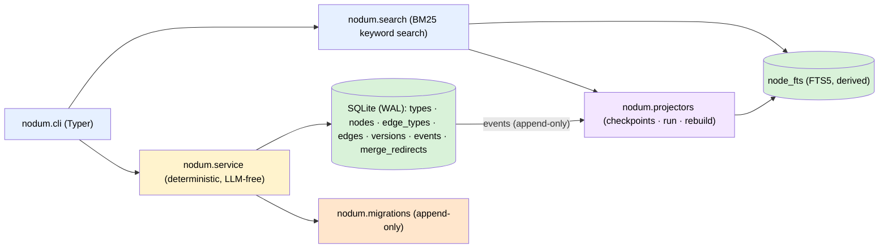

# Architecture

One SQLite file is the only source of truth and the only write path goes
through the service layer. The CLI is a thin adapter; derived stores (FTS
today, vectors/renditions later) are projectors fed by the event log, and
later phases add more adapters (MCP, HTTP) without touching the core.

## Module map

| Module | Role |
|---|---|
| `nodum.db` | Connection management (WAL, foreign keys), `NODUM_DB` resolution, the migration runner over `schema_migrations`. |
| `nodum.migrations` | The append-only migration list: `0001_core` (core DDL), `0002_seed_builtin_types` (the built-in type catalog), `0003_projector_checkpoints_and_fts` (`projector_checkpoints` + the derived `node_fts` FTS5 table), `0004_policies` (per-agent policy rulesets). Shipped entries are never edited; later phases append their own (vectors, assets, renditions). |
| `nodum.service` | The only writer. Validation, the `proposed → active → archived` state machine, the event log, versions, undo, wikilink materialization, agent policies (CRUD + auto-accept evaluation on the edge write path), and the review queue (proposal listing with reviewer context, batch accept/reject by id or filter). Each public function opens a short-lived connection, applies pending migrations idempotently, and commits — adapters stay stateless. |
| `nodum.projectors` | Derived-index consumers of the event log. The `Projector` base class (`reset`/`apply`/`count`), the `REGISTRY`, per-projector checkpoints (`projector_checkpoints.last_event_seq`), incremental `run_projectors`, `rebuild_projector` (reset + replay from event 0), and `projector_status`. The first projector, `fts`, maintains `node_fts` purely from event payloads. Deterministic and LLM-free; the service layer never calls in — the event log is the only coupling. |
| `nodum.search` | The query path. `search()` catches the `fts` projector up with the log, then runs a BM25-ranked FTS5 query (title boosted 5× over content) joined to `nodes` for state/type filters. Hits carry a fused `score` plus a per-signal `signals` breakdown so vector + graph-expansion fusion (RRF) slots in without reshaping the API. |
| `nodum.models` | The pydantic I/O schema shared by every surface (`NodeOut`, `EdgeOut`, `VersionOut`, `EventOut`, `TypeOut`/`EdgeTypeOut`/`TypesOut`, `UndoResult`, `InitResult`, `ProjectorStatus`/`ProjectorRun`, `SearchHit`/`SearchResult`, `PolicyOut`, `ProposalOut`, `BatchTransitionOut`/`TransitionFailure`). Every adapter serialises `model_dump(mode="json")`. |
| `nodum.cli` | Typer adapter. Each command calls one service function and prints exactly one JSON object on stdout; errors go to stderr with exit code 1. No `--json` flag — JSON is the only format. Adds `search`, the `projector run/status/rebuild` group, the `policy set/get/list` group, and the `review queue/accept/reject/accept-all/reject-all` group. |

## Design-doc mapping

The system design lives in the project's design document; this maps its
sections to the code:

| Design section | Where it lands |
|---|---|
| §2.3 constraints (single write path, Markdown truth, LLM-free core) | `nodum.service` is the only mutation entry point; `content` is canonical Markdown; no LLM calls anywhere in the package — projectors included (Constraint 4). |
| §4 architecture (service layer, event log, projectors) | `nodum.service` + the `events` table; `nodum.projectors` implements the derived-index consumers with checkpoint/rebuild mechanics. Internal agents are a later phase. |
| §5.1 everything-is-a-node, structure vs. meaning | One `nodes` table with `parent_id` + fractional `position`; typed `edges` for meaning. |
| §5.2 schema | `nodum.migrations` `0001_core` — Phase-1 subset (`types`, `nodes`, `edge_types`, `edges`, `versions`, `events`, `merge_redirects`), all with reserved `graph_id DEFAULT 'main'`; `0003_projector_checkpoints_and_fts` adds `projector_checkpoints` and `node_fts` (with the design's `extracted_text` column, empty until assets land). Still absent: `node_vec`, `chunks`, `assets`, `renditions` — later migrations. |
| §5.3 built-in types | `nodum.migrations` `0002_seed_builtin_types` (11 node types, 17 edge types with inverses). |
| §5.4 wikilink sugar | `service._materialize_mentions` — parse on write, resolve by id or exact title, create/archive `mentions` edges, skip unresolvable targets. |
| §6 state machine + provenance | `service.transition` (`accept`/`reject`/`archive`), actor column on every row, event per transition. |
| §7 retrieval (keyword signal) | `nodum.search` — BM25 via FTS5, hits shaped for RRF fusion (`score` + `signals`); vector and graph-expansion signals land with the sqlite-vec projector. |
| §8.1 review/accept API | `service.list_proposals` (filterable by actor, type, kind, age; reviewer context: edge endpoints, node parent) + `accept_proposals`/`reject_proposals` (by id, reject carries a `reason` into each event payload) + `accept_matching`/`reject_matching` (batch by filter — resolves to concrete ids, then one event per id). CLI: the `review` group. |
| §8.3 agent policies | `policies` table (migration `0004`) + `service.set_policy`/`get_policy`/`list_policies` (CLI `policy` group) + `_auto_accept_rule` on the edge write path. `job` rules are stored for the Phase-5 runtime; only `edge_type` + `auto_accept` rules act on direct writes today. |

## Key decisions (Phase 1)

- **Built-in type ids equal their names** (`page`, `supports`, …) — stable,
  readable, and directly referenceable in wikilinks. Custom types (a later
  runtime feature) get uuid ids like everything else.
- **Op names record the landing state**: a human create logs `node.create`, an
  agent create logs `node.propose` (same for edges).
- **Undo restores the `before` payload exactly.** Reversing a create deletes
  the row — for nodes, along with their versions and incident edges (all
  recorded in the undo event's payload). A node restore re-runs wikilink
  materialization so edges stay consistent with the restored content. Undo
  events are themselves logged and are not reversible; an already-undone event
  cannot be undone twice.
- **Version snapshots** are written for every node mutation (create, update,
  transition, undo-restore) and point at the causing event's `seq`.
- **`props` is not yet validated against `types.schema_json`** — the column and
  catalog field exist, but JSON-Schema enforcement is deferred until a schema
  engine is actually needed.

## Key decisions (Phase 2, so far)

- **Projectors are pure event-log consumers.** The `fts` projector indexes
  from event payloads (`after` rows, `restored`/`deleted` on `undo` events),
  never from the live `nodes` table, so a rebuild from event 0 is exactly an
  incremental replay. All node states are indexed; search filters by state
  (default `active`) at query time.
- **Checkpoints are one row per projector** (`name`, `last_event_seq`,
  `updated_at`). A run applies all events past the checkpoint in one
  transaction — a failure rolls the batch back and replay is deterministic.
- **`node_fts` is a plain FTS5 table** (not external-content/contentless):
  `node_id UNINDEXED` plus `title`, `content`, `extracted_text` per the design
  schema. Updates are delete + re-insert by `node_id`; storage overhead is
  irrelevant at personal-KM scale and correctness rules are trivial.
- **Free-text queries are compiled to safe MATCH expressions**: each
  whitespace-separated token becomes one double-quoted term, ANDed — FTS5
  operators in user input can never break or hijack the query.
- **Scores are higher-is-better.** `bm25()` returns more-negative-is-better;
  the search layer negates it so `score` (and every entry in `signals`)
  follows the convention RRF fusion expects.
- **Search catches the projector up** before querying, so results always
  reflect the latest committed writes without a manual `projector run`. The
  write path stays free of projector work.
- **Policies are one row per agent**, keyed by the exact actor string
  (`agent:researcher`) — no wildcards, no inheritance. The `rules` JSON array
  keeps the design §8.3 vocabulary (`job`/`edge_type` keys, `auto_accept` /
  `auto_apply` / `always_propose` actions, optional `min_confidence` gate);
  edge types are resolved to ids on write and unknown extra keys pass
  through, so later phases can extend rules without a migration.
- **Only `edge_type` + `auto_accept` rules act on the direct write path**, and
  only on edge creation: any matching rule whose gate passes (no
  `min_confidence` = no gate; a gate requires the edge's confidence ≥ it)
  flips the landing state to `active`. `job` rules govern the internal
  runtime (Phase 5) and are stored unevaluated; node writes have no policy
  keys in the design's vocabulary and stay `proposed` for agents.
- **Auto-accept is attribution, not bypass.** The write remains the agent's
  own event — the op records the landing state (`edge.create`, not
  `edge.propose`) and the payload records the matched rule under
  `policy_rule`, so the log alone explains why an agent write landed active.
- **Policy edits are audited events (`policy.set`) but not undoable.** Undo
  stays scoped to graph events (`node.*`/`edge.*`): its default target skips
  non-graph events, and naming one explicitly is refused. Policy history
  lives in the event payloads (full before/after rulesets).
- **Batch review never aborts on a bad id.** `accept_proposals` /
  `reject_proposals` (and the `*_matching` filter variants, which resolve the
  filter to concrete ids first) transition what they can — one event per id,
  actor and reject `reason` on every event — and report the rest in
  `failed`. A batch is a convenience over single transitions, never a silent
  bulk update.
- **A review `type` filter narrows the kind.** A name known only as a node
  type excludes edges (and vice versa) rather than leaving the other kind
  unfiltered.
