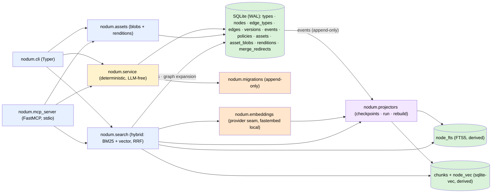

# Architecture

One SQLite file is the only source of truth and the only write path goes
through the service layer. The CLI and the MCP server are thin adapters;
derived stores (FTS, chunk embeddings, renditions) are projectors fed by the
event log or lazily generated, and later phases add more adapters (HTTP)
without touching the core.

## Module map

| Module | Role |
|---|---|
| `nodum.db` | Connection management (WAL, foreign keys), `NODUM_DB` resolution, the migration runner over `schema_migrations`. `apply_migration` wraps each script **and** its `schema_migrations` row in one transaction (`BEGIN … COMMIT` inside the `executescript` payload, rollback on failure), so an interrupted upgrade is retried, not stranded half-applied. |
| `nodum.migrations` | The append-only migration list: `0001_core` (core DDL), `0002_seed_builtin_types` (the built-in type catalog), `0003_projector_checkpoints_and_fts` (`projector_checkpoints` + the derived `node_fts` FTS5 table), `0004_policies` (per-agent policy rulesets), `0005_proposed_versions` (`versions.state` — `applied`/`proposed`/`archived`), `0006_vectors` (the derived `chunks` + `node_vec` sqlite-vec tables), `0007_assets_and_renditions` (`assets` metadata + `asset_blobs` originals + `renditions`, all bytes in-database), `0008_version_proposed_fields` (`versions.proposed_fields` — which fields a proposed update names). Shipped entries are never edited; later phases append their own. |
| `nodum.service` | The only writer. Validation, the `proposed → active → archived` state machine, the event log, versions (incl. `proposed` updates: agent edits stage a version naming the fields they change; accept applies exactly those as an ordinary `node.update`, reject archives it), undo, wikilink materialization (edges land in the *writer's* state — `proposed` for an agent), agent policies (CRUD + auto-accept evaluation on the edge write path), the review queue (proposal listing with reviewer context over nodes/edges/updates, batch accept/reject by id or filter), and the curated graph reads behind the MCP read tier (`get_neighborhood`, `traverse`, `find_path`, `get_schema`, `diff_versions`) plus `propose_edges` batch writes. **`accept`, `reject`, `archive`, and `undo` refuse any actor but `human`, raising `ReviewNotPermitted`.** Each public function opens a short-lived connection, applies pending migrations idempotently, and commits — adapters stay stateless. |
| `nodum.projectors` | Derived-index consumers of the event log. The `Projector` base class (`reset`/`apply`/`count`/`availability`), the `REGISTRY`, per-projector checkpoints (`projector_checkpoints.last_event_seq`), incremental `run_projectors`, `rebuild_projector` (reset + replay from event 0), and `projector_status` (with availability + reason). The `fts` projector maintains `node_fts`; the `vec` projector maintains `chunks` + `node_vec` — re-chunking and re-embedding nodes from event payloads, recording `model_id` per chunk. Deterministic and LLM-free; the service layer never calls in — the event log is the only coupling. An unavailable projector (`vec` without a provider) no-ops and keeps its backlog. |
| `nodum.embeddings` | The embedding provider seam (design D10) + chunking (design D6). Provider interface: `model_id`, `dimensions`, `embed(texts)`. The default `FastembedProvider` runs `sentence-transformers/paraphrase-multilingual-MiniLM-L12-v2` (384-dim, multilingual) in-process via ONNX — behind the optional `embeddings` extra, resolved from the local HF cache only (downloads need `NODUM_EMBED_DOWNLOAD=1`; model override via `NODUM_EMBED_MODEL`). Chunking is a fixed 512-word window with ~15% overlap (words approximate tokens — dependency-free). `set_provider`/`reset_provider` are the test seam (a deterministic hashing fake lives in `tests/conftest.py`). |
| `nodum.search` | The query path (design §7). `search()` catches the `fts` and `vec` projectors up with the log, runs BM25 (title boosted 5×) and — when a provider is available — a sqlite-vec KNN over chunk embeddings (closest chunk per node wins), fuses both lists by reciprocal rank fusion (K=60), then optionally expands the fused hits one hop along `active` edges (type weight × confidence). Hits carry the fused `score` plus a per-signal `signals` breakdown (`bm25`/`vector` RRF contributions summing to `score`, `graph` edge weight). Without a provider the vector signal is skipped — graceful degradation to BM25 + graph. |
| `nodum.assets` | Content-addressed binaries + derived image renditions (design §5.5/§5.7). `register_asset` streams a local file into `asset_blobs` through `Connection.blobopen` (hash pass, then a chunked copy into a `zeroblob` — a large file is never held in memory) and inserts the `assets` metadata row in the same transaction, so a failed copy rolls back whole — idempotent sha256 dedup, deliberately no event-log entry (nothing to undo; ingestion-time asset events are Phase 4). The copy pass re-hashes what it writes and refuses a mismatch (`AssetSourceChanged`): a source that shrank between the passes would otherwise commit with a zero-filled tail under a key its bytes do not match. A file over `SQLITE_LIMIT_LENGTH` (1 GB, read from the connection) is refused up front (`AssetTooLarge`) rather than as a bare `DataError: string or blob too big`. `get_rendition` lazily generates `thumb`/`preview` WebP images with Pillow (downscale-only, EXIF-transposed, 300 KB quality-stepping target on `preview`), stores them in `renditions` keyed by `sha256(asset_hash + ':' + profile)`, and serves cache hits from the stored row thereafter — the rendition's `data` column is read **only** when the caller asks for the bytes, which the MCP `get_asset` path always does (`include_data=True`) and the CLI does only for `asset rendition --out`; `purge_renditions` deletes the rows (all regenerable). Pillow reads originals through `_BlobReader`, a file-like adapter that restores the tolerant out-of-range seeks `sqlite3.Blob` refuses and Pillow's format probing depends on. Non-image assets and unknown profiles are rejected cleanly; `page:<n>` rasters are Phase 4. |
| `nodum.mcp_server` | The MCP adapter: a FastMCP (official Python SDK) server over stdio, launched by `nodum mcp serve`. This is the **external-agent** surface, so it registers the additive half of the tool contract and nothing else: the design §8.1 read tier (`get_node`, `get_children`, `search`, `traverse`, `list_types`, `get_schema`, `find_path`, `history`, `diff`, `get_asset`) and additive tier (`create_node`, `update_node`, `link`, `propose_edges`) — every tool a thin delegate to one service/search/assets function, annotated `readOnlyHint` for reads and non-destructive for additive writes (honest, because nothing registered here archives or overwrites state). `get_asset` enforces the §5.7 binary policy structurally: metadata + a `preview`/`thumb` WebP image block, originals never served. The review tools (`accept`/`reject`, §8.1 "write (human/policy)") and the curative tools (§8.2) are **never registered**. One configured `--actor` per server attributes every write, and it must match `agent:<name>` — `--actor human`, an empty actor, or an unprefixed name is refused at startup. |
| `nodum.models` | The pydantic I/O schema shared by every surface (`NodeOut`, `EdgeOut`, `VersionOut`, `EventOut`, `TypeOut`/`EdgeTypeOut`/`TypesOut`, `UndoResult`, `InitResult`, `ProjectorStatus`/`ProjectorRun`, `SearchHit`/`SearchResult`, `PolicyOut`, `ProposalOut`, `BatchTransitionOut`/`TransitionFailure`, `SubgraphOut`, `PathOut`, `DiffOut`, `ProposeEdgesOut`/`ItemFailure`, `AssetOut`, `RenditionOut`, `PurgeResult`). Every adapter serialises `model_dump(mode="json")`. |
| `nodum.cli` | Typer adapter. Each command calls one service function and prints exactly one JSON object on stdout — a list-returning command always as `{"<plural>": [...], "count": n}`; errors go to stderr with exit code 1 — including the ones that are not service errors at all: `OSError` (a missing file for `asset register`) and `sqlite3.Error` (chiefly "database is locked", SQLite having one writer) are mapped to a message rather than escaping as a traceback. No `--json` flag — JSON is the only format. Adds `search`, `traverse`, `find-path`, `diff`, `schema`, `edge create-batch`, the `projector run/status/rebuild` group, the `policy set/get/list` group, the `review queue/accept/reject/accept-all/reject-all` group, the `asset register/get/list/rendition/purge` group, and `mcp serve`. |

## Design-doc mapping

The system design lives in the project's design document; this maps its
sections to the code:

| Design section | Where it lands |
|---|---|
| §2.3 constraints (single write path, Markdown truth, LLM-free core) | `nodum.service` is the only mutation entry point; `content` is canonical Markdown; no LLM calls anywhere in the package — projectors included (Constraint 4). |
| §4 architecture (service layer, event log, projectors) | `nodum.service` + the `events` table; `nodum.projectors` implements the derived-index consumers with checkpoint/rebuild mechanics. Internal agents are a later phase. |
| §5.1 everything-is-a-node, structure vs. meaning | One `nodes` table with `parent_id` + fractional `position`; typed `edges` for meaning. |
| §5.2 schema | `nodum.migrations` `0001_core` — Phase-1 subset (`types`, `nodes`, `edge_types`, `edges`, `versions`, `events`, `merge_redirects`), all with reserved `graph_id DEFAULT 'main'`; `0003_projector_checkpoints_and_fts` adds `projector_checkpoints` and `node_fts` (with the design's `extracted_text` column, empty until asset extraction lands in Phase 4); `0006_vectors` adds `chunks` + `node_vec` (`chunks.id` is an integer rowid for vec0 keying, and deliberately carries no FK to `nodes` — replaying the log must tolerate nodes whose create was undone); `0007_assets_and_renditions` adds `assets` (metadata), `asset_blobs` (original bytes), and `renditions` (derived rows carrying their WebP `data`, plus `width`/`height`/`size_bytes` beyond the design's columns) — binaries live in the one file from the moment assets exist, with no `path` column anywhere; `0008_version_proposed_fields` adds `versions.proposed_fields`. |
| §5.3 built-in types | `nodum.migrations` `0002_seed_builtin_types` (11 node types, 17 edge types with inverses). |
| §5.4 wikilink sugar | `service._materialize_mentions` — parse on write, resolve by id or exact title, create/archive `mentions` edges, skip unresolvable targets. A materialized edge inherits the *writer's* landing state, so an agent's wikilink is a `proposed` edge, not live structure attached to someone else's node; `service._activate_pending_mentions` brings those edges to `active` when a human accepts the proposing node. |
| §5.5/§5.7 assets + rendition policy | `nodum.assets` + `get_asset` in `nodum.mcp_server`. `get_asset(id_or_hash, rendition)` accepts an asset hash or an asset-reference node id (resolved via the `asset_hash` prop) and returns metadata + a `preview`/`thumb` WebP image block — MCP never serves originals, and non-image assets get metadata only. `page:<n>` rasters, `get_download_url`/`request_upload_url`, and ingestion are Phase 4. |
| §6 state machine + provenance | `service.transition` (`accept`/`reject`/`archive` over nodes, edges, and proposed versions — an id that resolves to none of the three raises the shared `RecordNotFound` base, since the id alone never says which kind was meant), actor column on every row, event per transition (a reject's `reason` among the payload). Every transition — plus `undo` — is gated to the `human` actor by `service._require_human_reviewer` (`HUMAN_ONLY_ACTIONS`) at the single choke point each passes through. Versions carry their own `state` (migration `0005`): `applied` snapshots, `proposed` agent updates, `archived` rejects; `proposed_fields` (migration `0008`) records what a proposal asked to change. |
| §7 retrieval (hybrid fusion) | `nodum.search` — BM25 via FTS5 and vector ANN via sqlite-vec (the `vec` projector, migration `0006`), fused by reciprocal rank fusion (K=60) with per-signal `signals`; one-hop graph expansion over `active` edges (type weight × confidence) applies post-fusion as the `graph` signal. The vector signal degrades gracefully when no embedding provider is available. |
| §15.1 D6 embedding lifecycle | `nodum.embeddings` chunking (512-word window, ~15% overlap — words approximate tokens) + `chunks.model_id` per embedding (migration `0006`) + `projector rebuild vec` as the full-rebuild-on-model-change path (reset + replay re-embeds everything with the new model). |
| §15.1 D10 provider abstraction | `nodum.embeddings.EmbeddingProvider` — `model_id` / `dimensions` / `embed(texts)`. The default is local in-process fastembed (no daemon, no API key, no `agedum` dependency); an API-key provider slots in behind the same interface. |
| §8.1 review/accept API — the "write (human/policy)" tier | `service.list_proposals` (filterable by actor, type, kind, age; reviewer context: edge endpoints, node parent, update target) + `accept_proposals`/`reject_proposals` (by id, reject carries a `reason` into each event payload) + `accept_matching`/`reject_matching` (batch by filter — resolves to concrete ids, then one event per id). All four refuse a non-`human` actor with `ReviewNotPermitted`, as do `archive` and `undo`. `transition` takes the same `reason` and writes it to the same place, so the single-item CLI `reject <id> --reason` is audited exactly like the batch one — the two spellings of a reject differ only in cardinality. CLI: the `review` group (and top-level `accept`/`reject`/`archive`/`undo`). **Not** an MCP tool. |
| §8.1 tool contract (read + additive tiers) | `nodum.mcp_server` over stdio: read tier `get_node`/`get_children`/`search`/`traverse`/`list_types`/`get_schema`/`find_path`/`history`/`diff`/`get_asset`, additive tier `create_node`/`update_node`/`link`/`propose_edges`. That is the whole registry — the review tier is a *different* tier and is not exposed here. All delegate to `nodum.service` / `nodum.search` / `nodum.assets` with tool annotations (`readOnlyHint`, `destructiveHint`). Not yet: `ingest_*`, `get_download_url`, `request_upload_url`, `get_context`, `export`, `schema_propose` (later phases). |
| §8.2 additive vs. curative | Structural: `nodum.mcp_server` never registers the curative tools (`merge_nodes`, `retype`, `supersede_edge`, `bulk_relink`, `consolidate`) nor the review tools (`accept`, `reject`) — they don't exist on the MCP surface at all; tests assert the registry stays disjoint from both `CURATIVE_TOOLS` and `REVIEW_TOOLS`. |
| §8.3 agent policies | `policies` table (migration `0004`) + `service.set_policy`/`get_policy`/`list_policies` (CLI `policy` group) + `_auto_accept_rule` on the edge write path. `job` rules are stored for the Phase-5 runtime; only `edge_type` + `auto_accept` rules act on direct writes today. A `min_confidence` gate grades the agent's own self-reported confidence, so it fires only when the rule also carries `trust_self_reported_confidence: true`. |

## Key decisions (Phase 1)

- **Built-in type ids equal their names** (`page`, `supports`, …) — stable,
  readable, and directly referenceable in wikilinks. Custom types (a later
  runtime feature) get uuid ids like everything else.
- **A migration and its bookkeeping row are one transaction.** `init_db`
  applies each script through `db.apply_migration`, which wraps the script
  *and* the `INSERT INTO schema_migrations` in `BEGIN … COMMIT` and rolls back
  on failure. Applied in autocommit — the original shape — an interruption
  partway through left the statements that had already run in place with no
  record of the migration, so every later run re-ran the script and died on
  "table … already exists" with no way forward. Since `executescript` takes no
  parameters, the name is inlined and therefore validated against
  `MIGRATION_NAME_RE` first.
- **Op names record the landing state**: a human create logs `node.create`, an
  agent create logs `node.propose` (same for edges).
- **Undo restores the `before` payload exactly.** Reversing a create deletes
  the row — for nodes, along with their versions and incident edges (all
  recorded in the undo event's payload). A node restore re-runs wikilink
  materialization so edges stay consistent with the restored content. Undo
  events are themselves logged and are not reversible; an already-undone event
  cannot be undone twice.
- **Undo reverses one event; it never cascades or pretends.** Rows the event
  did not create are not collateral: undoing the create of a node that has
  since gained children is refused (`UndoNotPossible`) rather than deleting
  those children through the `nodes.parent_id` FK — which used to surface as a
  raw `sqlite3.IntegrityError`. A restore that matches no row (the row was
  deleted by a later undo) is refused for the same reason: reporting
  `restored` and marking the event reversed would bury a real failure behind a
  success. Both leave the log untouched — no `undo` event is written.
- **Version snapshots** are written for every node mutation (create, update,
  transition, undo-restore) and point at the causing event's `seq`.
- **`props` is not yet validated against `types.schema_json`** — the column and
  catalog field exist, but JSON-Schema enforcement is deferred until a schema
  engine is actually needed.

## Key decisions (Phase 2, so far)

- **Projectors are pure event-log consumers.** The `fts` projector indexes
  from event payloads (`after` rows, `restored`/`deleted` on `undo` events),
  never from the live `nodes` table, so a rebuild from event 0 is exactly an
  incremental replay. All node states are indexed; search filters by state
  (default `active`) at query time.
- **Checkpoints are one row per projector** (`name`, `last_event_seq`,
  `updated_at`). A run applies all events past the checkpoint in one
  transaction — a failure rolls the batch back and replay is deterministic.
- **`node_fts` is a plain FTS5 table** (not external-content/contentless):
  `node_id UNINDEXED` plus `title`, `content`, `extracted_text` per the design
  schema. Updates are delete + re-insert by `node_id`; storage overhead is
  irrelevant at personal-KM scale and correctness rules are trivial.
- **Free-text queries are compiled to safe MATCH expressions**: each
  whitespace-separated token becomes one double-quoted term, ANDed — FTS5
  operators in user input can never break or hijack the query.
- **Scores are higher-is-better RRF contributions.** Raw signal scores
  (`bm25()`'s more-negative-is-better rank, sqlite-vec distances) only order
  their lists; the fused `score` and every `signals` entry are RRF
  contributions (`1/(60 + rank)`), which are comparable across signals by
  construction.
- **Search catches the projector up** before querying, so results always
  reflect the latest committed writes without a manual `projector run`. The
  write path stays free of projector work.
- **Policies are one row per agent**, keyed by the exact actor string
  (`agent:researcher`) — no wildcards, no inheritance. The `rules` JSON array
  keeps the design §8.3 vocabulary (`job`/`edge_type` keys, `auto_accept` /
  `auto_apply` / `always_propose` actions, optional `min_confidence` gate);
  edge types are resolved to ids on write and unknown extra keys pass
  through, so later phases can extend rules without a migration.
- **Only `edge_type` + `auto_accept` rules act on the direct write path**, and
  only on edge creation: a matching ungated rule (no `min_confidence`) flips
  the landing state to `active`. `job` rules govern the internal runtime
  (Phase 5) and are stored unevaluated; node writes have no policy keys in the
  design's vocabulary and stay `proposed` for agents.
- **A `min_confidence` gate grades untrusted input, so it needs an explicit
  opt-in.** The only confidence on the direct write path is the number the
  writing agent reports about its own write — an agent that wants `active` can
  claim `1.0`, which makes a self-graded gate worth nothing. A gated rule
  therefore fires only when the same rule carries
  `"trust_self_reported_confidence": true` — a human writing down, in the
  policy, that they accept this agent's self-grading for this edge type.
  Without the flag the gate can never be satisfied here and the edge stays
  `proposed`, so *no* agent-supplied value can by itself buy auto-accept. The
  flag is validated as a boolean; a later phase supplying an independently
  measured confidence grades against the same gate without it.
- **Auto-accept is attribution, not bypass.** The write remains the agent's
  own event — the op records the landing state (`edge.create`, not
  `edge.propose`) and the payload records the matched rule under
  `policy_rule`, so the log alone explains why an agent write landed active.
- **Policy edits are audited events (`policy.set`) but not undoable.** Undo
  stays scoped to graph events (`node.*`/`edge.*`): its default target skips
  non-graph events, and naming one explicitly is refused. Policy history
  lives in the event payloads (full before/after rulesets).
- **Batch review never aborts on a bad id.** `accept_proposals` /
  `reject_proposals` (and the `*_matching` filter variants, which resolve the
  filter to concrete ids first) transition what they can — one event per id,
  actor and reject `reason` on every event — and report the rest in
  `failed`. A batch is a convenience over single transitions, never a silent
  bulk update.
- **Live state is the human tier, enforced at the choke point.** `accept`,
  `reject`, `archive`, and `undo` require actor `human`; anything else raises
  `ReviewNotPermitted`. The check lives in `service._require_human_reviewer`
  over `HUMAN_ONLY_ACTIONS`, called from `_transition_row` — the single
  function every transition passes through — plus `_transition_many` and the
  `*_matching` entry points so a refused reviewer fails before any id is
  touched (a batch is never half-reviewed), and from `undo` itself. This holds
  whoever filed the proposal: an agent may neither accept its own work nor
  reject a rival's. `archive` and `undo` are gated for a different reason than
  review: they are how an agent could otherwise *write live state*. Undo in
  particular restores an event's `before` payload verbatim, `state = 'active'`
  included, so an agent allowed to undo could put back exactly what the
  propose-only rule forbids it to write. Neither is reachable over MCP either,
  but structural safety does not rest on which adapter happens to exist.
- **A review `type` filter narrows the kind.** A name known only as a node
  type excludes edges (and vice versa) rather than leaving the other kind
  unfiltered.
- **Agent updates stage as `proposed` versions** (design §8.1, migration
  `0005`). `update_node` with a non-human actor inserts a `versions` row in
  state `proposed` (carrying the full would-be title/content/props — unset
  fields copy the current values) and emits `version.propose`; the node
  itself is untouched. Accepting applies the staged fields to the node as an
  ordinary `node.update` event (payload records `applied_version_id`,
  `applied_fields`, and `proposed_event_seq`) — so the FTS projector
  re-indexes and undo works unchanged — and wikilinks re-materialize **as the
  accepting actor** when the content was among the applied fields: the
  reviewer owns every state change the accept causes (edges going live, edges
  the rewrite dropped being archived), because those are the reviewer's
  decision, not the proposer's. Rejecting flips the version to `archived`
  (`version.reject`, reason in the payload). Human updates keep applying in
  place; their snapshots are `applied`. Review ids are unified:
  `accept`/`reject` resolve a numeric id against `versions` after nodes and
  edges, so the same batch APIs serve all three proposal kinds.
- **An accepted update applies the proposed *fields*, not the proposed
  snapshot** (migration `0008`, `versions.proposed_fields`). The version row
  stores all three fields because a reviewer needs to see the whole would-be
  node, but the fields the agent never named are context, not intent: writing
  them back at accept time would silently revert every edit landed while the
  proposal waited (agent proposes content, human fixes the title, accept
  restores the old title) and would make two queued proposals against one node
  clobber each other. `proposed_fields` is the JSON list of what the call
  named; accept builds its `UPDATE` from exactly that list against the node's
  *current* row, and records it as `applied_fields` on the event. `NULL` means
  the row predates the column and is read as all three fields — the semantics
  it was staged with. This is what makes the documented contract ("only the
  given fields change") true on the agent path as well as the human one.
- **Materialized wikilink edges inherit the writer's landing state**:
  `active` for the human, `proposed` for an agent. An agent writing
  `[[Someone's Concept]]` therefore *proposes* an edge instead of attaching
  itself to live structure. Accepting the proposing node sweeps its own
  pending `mentions` edges to `active` (`_activate_pending_mentions`, matched
  on `created_by` so another agent's pending edge out of the same node stays
  in the queue), each as its own `edge.accept` event attributed to the
  reviewer. Materialization treats `proposed` edges as already present, so a
  later human rewrite re-resolves rather than duplicating them; a dropped
  wikilink archives a pending edge as `edge.reject` (`proposed → archived`)
  and a live one as `edge.archive`.
- **Graph traversals follow `active` edges only** (`get_neighborhood`,
  `traverse`, `find_path`, search expansion), so proposed *structure* never
  extends a walk. Proposed *rows* are not hidden, though: `get_node`,
  `get_children`, `list_nodes`, `history`, and `search` with
  `state: "any"`/`--state` all return them, a walk reports a proposed node it
  reached as an endpoint of an active edge, and the review queue exists to
  show them. "Proposed is invisible until accepted" would be the wrong summary
  — proposed structure is *inert*, not concealed.
- **The MCP server holds one configured actor** (`nodum mcp serve --actor`,
  default `agent:mcp`). Every tool call passes it to the service layer, so
  attribution, the proposed-by-default rule, and policy auto-accept behave
  exactly as CLI `--actor` writes. The actor must match `agent:<name>`:
  `--actor human` would have turned the whole server into a direct writer
  into the live graph (and, while the review tools were registered, into a
  self-approving one), and an empty or unprefixed actor was silently accepted
  — both are now startup errors. There is no per-connection handshake identity
  yet — multi-tenant auth belongs with the HTTP API phase.
- **`accept`/`reject` are not MCP tools.** Registering them handed the review
  tier to the agent being reviewed: an agent could accept its own proposals
  and reject another agent's, and the tool was annotated
  `destructiveHint=False` while accept archives active edges. The fix is
  structural on both sides — the tools are absent from the registry (so there
  is nothing to argue around) *and* the service layer refuses a non-human
  reviewer on every path, so no future adapter can re-open the hole. A human
  works the queue through `nodum review …`.
- **Search `expand` is the interim graph signal**: one hop along `active`
  edges from the BM25 hits, scored `type weight × confidence` (`supports`
  1.0, `relates_to` 0.5, others 0.5; design §7), deduped against direct hits
  and capped at `k`. It ships as the `graph` entry in `signals` so RRF
  fusion replaces it without reshaping the API.
- **Embeddings are local and in-process** (fastembed, ONNX Runtime on CPU):
  no Ollama, no daemon, no API key. The default model is
  `sentence-transformers/paraphrase-multilingual-MiniLM-L12-v2` — 384
  dimensions, multilingual, ~0.22 GB, Apache-2.0, and in fastembed's
  built-in registry (no custom registration). It lives behind the optional
  `embeddings` extra so the core install stays lean, and behind the
  `EmbeddingProvider` interface (`model_id` / `dimensions` / `embed`) so an
  API-key provider can replace it per design D10.
- **Downloads are never implicit.** The default provider resolves only from
  the local Hugging Face cache (`HF_HUB_OFFLINE` during construction);
  fetching the model needs `NODUM_EMBED_DOWNLOAD=1` once. Anything less
  gives a clean *unavailable* state with the reason in `projector status`,
  and search silently falls back to BM25 + graph — CI and fresh machines
  never touch the network.
- **Chunking approximates tokens with words** (design D6's 512-token window,
  ~15% overlap): whitespace-splitting needs no tokenizer download and is
  close enough for ranking at personal-KM scale. Chunks are cut from
  `title + content`; `chunks.model_id` records the producing model per
  chunk, and `projector rebuild vec` (reset + replay) is the
  full-rebuild-on-model-change path.
- **`chunks` has an integer rowid and no FK to `nodes`.** vec0 rows key on
  integer rowids, so each vector shares its chunk's rowid (the design's TEXT
  chunk id doesn't apply); and the projector replays the *event log*, which
  still contains events for nodes whose create was later undone — a foreign
  key to the live `nodes` table would make that replay fail.
- **Fusion is plain RRF (K=60) over ranked lists.** Each signal contributes
  `1/(60 + rank)`; `signals` carries the per-signal contributions and they
  sum to `score` exactly, so the breakdown explains the ranking. The vector
  ANN list is k-deep with no similarity threshold (RRF wants ranks, not
  cutoffs); chunks aggregate to nodes by closest chunk. Graph expansion runs
  on the fused list, after fusion.
- **Projector availability is first-class.** `Projector.availability()`
  gates runs (an unavailable projector no-ops and keeps its checkpoint — the
  backlog waits) and surfaces in `projector status` as
  `available`/`detail`. Rebuilding an unavailable projector is refused —
  it would empty the store without being able to refill it.
- **Asset bytes live in the database, not on the filesystem.** Originals go
  in `asset_blobs` and renditions in `renditions`, both keyed off the same
  sha256 as the `assets` metadata row, so disaster recovery is
  `DB = everything` — one file to back up, copy, and restore, with no second
  artefact that can drift or be restored inconsistently. Bytes sit in their
  own table rather than a column on `assets` so metadata queries and FTS
  never scan blob overflow pages, and so the table could be `ATTACH`ed out to
  a second file if scale ever demanded it. `db.connect` sets
  `PRAGMA page_size=8192` before enabling WAL (sqlite.org's blob benchmarks
  peak at 8-16 KiB pages, and the page size cannot change once WAL is on).
  Registration is idempotent sha256 dedup with **no event-log entry**:
  content-addressed rows are immutable, so there is no state to transition
  or undo, and re-registering the same bytes returns the existing row.
  Ingestion-time asset events land with the Phase-4 pipeline and must record
  `hash`/`mime`/`size`/`original_name` only — **never inline blob bytes into
  an event payload**, or every undoable asset write would copy megabytes of
  base64 into the log.
- **A migration may not move stored bytes.** Byte storage arrives with the
  table that owns it (`asset_blobs` is part of `0007`, the same migration that
  creates `assets`), because a migration that relocates already-written bytes
  has to copy them — and one that forgets, as an earlier split of this schema
  did, strands every asset written under the old layout permanently, with
  dedup refusing to repair them since the metadata row still exists. No table
  here has a filesystem `path` column, so there is nothing to relocate.
- **Registration is verified content addressing, not hopeful content
  addressing.** The hash pass and the copy pass read the file separately, so
  the copy re-hashes what it writes: a source that shrank in between (a
  rotating log, a partial download) would otherwise commit a `zeroblob` with a
  zero-filled tail under a key its bytes do not match — silently and
  permanently, since dedup then treats the row as already correct. A grown
  source already failed safely (the write runs past the end of the blob).
  Size is checked against `SQLITE_LIMIT_LENGTH` up front so a >1 GB file gets
  a sentence instead of `DataError: string or blob too big`. **Known
  limitation:** the streamed copy holds SQLite's single write lock for its
  whole duration, so registering a very large asset can block other writers
  for about the busy timeout.
- **Renditions are lazily generated, not projected.** Unlike FTS/vectors
  there is no event to consume — a rendition derives from stored bytes, not
  from graph events — so `get_rendition` builds on first request and stores
  the WebP in `renditions`, keyed by
  `sha256(asset_hash + ':' + profile)` (§5.7). Everything is
  regenerable; `asset purge` is the eviction hatch (freed pages return to the
  filesystem on `VACUUM`). Downscaling uses
  `Image.thumbnail` (never upscales), EXIF orientation is applied, and every
  encode starts at the profile's own nominal quality: `thumb` has no size
  target, so its q75 encode is the only one that runs, while `preview`'s
  ≤300 KB target is met by stepping quality down from its q80 (the smallest
  encode wins if no step fits). Originals in modes WebP cannot take (palette,
  grayscale, CMYK) are converted first — to RGBA when the source carries
  alpha, whether in its bands or in a palette's `transparency` entry.
- **`get_asset` over MCP enforces the §5.7 binary policy structurally.** The
  rendition argument is validated against the `thumb`/`preview` profiles
  before anything is read — `full`/`page:<n>`/anything else is a tool
  error, so no code path can return original bytes. Non-image assets return
  the metadata block alone (`rendition: null`), matching §5.7's
  per-media-type rule (extracted text arrives with Phase-4 ingestion).
