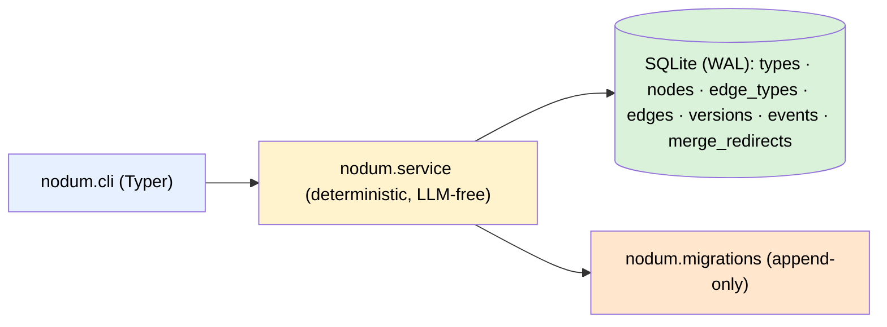

# Architecture — Phase 1 (core)

One SQLite file is the only source of truth and the only write path goes
through the service layer. The CLI is a thin adapter; later phases add more
adapters (MCP, HTTP) and derived stores (FTS, vectors, renditions) without
touching the core.

## Module map

| Module | Role |
|---|---|
| `nodum.db` | Connection management (WAL, foreign keys), `NODUM_DB` resolution, the migration runner over `schema_migrations`. |
| `nodum.migrations` | The append-only migration list: `0001_core` (core DDL) and `0002_seed_builtin_types` (the built-in type catalog). Shipped entries are never edited; later phases append their own (FTS, vectors, assets, renditions). |
| `nodum.service` | The only writer. Validation, the `proposed → active → archived` state machine, the event log, versions, undo, wikilink materialization. Each public function opens a short-lived connection, applies pending migrations idempotently, and commits — adapters stay stateless. |
| `nodum.models` | The pydantic I/O schema shared by every surface (`NodeOut`, `EdgeOut`, `VersionOut`, `EventOut`, `TypeOut`/`EdgeTypeOut`/`TypesOut`, `UndoResult`, `InitResult`). Every adapter serialises `model_dump(mode="json")`. |
| `nodum.cli` | Typer adapter. Each command calls one service function and prints exactly one JSON object on stdout; errors go to stderr with exit code 1. No `--json` flag — JSON is the only format. |

## Design-doc mapping

The system design lives in the project's design document; this maps its
sections to the Phase-1 code:

| Design section | Where it lands |
|---|---|
| §2.3 constraints (single write path, Markdown truth, LLM-free core) | `nodum.service` is the only mutation entry point; `content` is canonical Markdown; no LLM calls anywhere in the package. |
| §4 architecture (service layer, event log) | `nodum.service` + the `events` table; projectors/internal agents are later phases. |
| §5.1 everything-is-a-node, structure vs. meaning | One `nodes` table with `parent_id` + fractional `position`; typed `edges` for meaning. |
| §5.2 schema | `nodum.migrations` `0001_core` — Phase-1 subset (`types`, `nodes`, `edge_types`, `edges`, `versions`, `events`, `merge_redirects`), all with reserved `graph_id DEFAULT 'main'`. Derived tables (`node_fts`, `node_vec`, `chunks`, `assets`, `renditions`) are deliberately absent — later migrations add them. |
| §5.3 built-in types | `nodum.migrations` `0002_seed_builtin_types` (11 node types, 17 edge types with inverses). |
| §5.4 wikilink sugar | `service._materialize_mentions` — parse on write, resolve by id or exact title, create/archive `mentions` edges, skip unresolvable targets. |
| §6 state machine + provenance | `service.transition` (`accept`/`reject`/`archive`), actor column on every row, event per transition. |

## Key decisions (Phase 1)

- **Built-in type ids equal their names** (`page`, `supports`, …) — stable,
  readable, and directly referenceable in wikilinks. Custom types (a later
  runtime feature) get uuid ids like everything else.
- **Op names record the landing state**: a human create logs `node.create`, an
  agent create logs `node.propose` (same for edges).
- **Undo restores the `before` payload exactly.** Reversing a create deletes
  the row — for nodes, along with their versions and incident edges (all
  recorded in the undo event's payload). A node restore re-runs wikilink
  materialization so edges stay consistent with the restored content. Undo
  events are themselves logged and are not reversible; an already-undone event
  cannot be undone twice.
- **Version snapshots** are written for every node mutation (create, update,
  transition, undo-restore) and point at the causing event's `seq`.
- **`props` is not yet validated against `types.schema_json`** — the column and
  catalog field exist, but JSON-Schema enforcement is deferred until a schema
  engine is actually needed.
