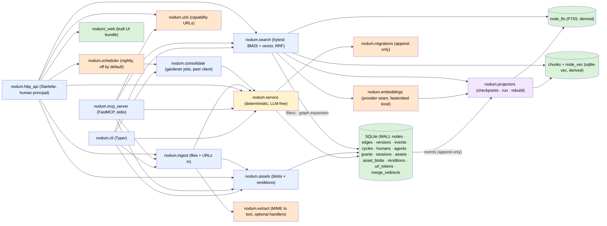

# Architecture

One SQLite file is the only source of truth and the only write path goes
through the service layer. The CLI, the MCP server, and the HTTP API are thin
adapters over it — each with its own identity rule and no logic of its own;
derived stores (FTS, chunk embeddings, renditions) are projectors fed by the
event log or lazily generated.



## Module map

One line per module; the full narrative is in the `###` sections below.

| Module | Role |
|---|---|
| `nodum.service` | The spine and the only writer — validation, the state machine, the event log, versions, undo, wikilinks, the review queue, grants, spaces, cycles and rollback. |
| `nodum.mcp_server` | The external-agent surface — the §8.1 read + additive tiers and nothing else. |
| `nodum.http_api` | The human surface — Starlette app, `/api` + the built UI, password-login sessions. |
| `nodum.consolidate` | The consolidation runner — five deterministic jobs, the abstraction job, five coherence metrics. |
| `nodum.scheduler` | The nightly schedule — one asyncio task in `nodum serve`'s lifespan, off unless configured. |
| `nodum.envelope` | The JSON envelope both the CLI and the HTTP API emit. |
| `web/` (built into `nodum/_web/`) | The human UI — React 19 + TypeScript, ten lazily loaded views. |
| `nodum.projectors` | Derived-index consumers of the event log — `fts` and `vec`, checkpoints, rebuild. |
| `nodum.embeddings` | The embedding provider seam (D10) and chunking (D6) — local fastembed default. |
| `nodum.llm` | The LLM provider seam (P1) — the one wire to a model, no module-level `chat`. |
| `nodum.agent` | The internal agent's runtime — the one door to the model, budgets, the kill switch. |
| `nodum.answers` | The read-only smart surface — `ask`, `summarize`, `natural_search`, `provider_status`. |
| `nodum.assets` | Content-addressed binaries and their derived `thumb`/`preview`/`page:<n>` renditions. |
| `nodum.extract` | MIME → text through handlers that degrade instead of failing. |
| `nodum.ingest` | The ingestion pipeline — bytes in, reviewable subgraph out. |
| `nodum.urls` | Short-lived, single-use capability URLs (§5.7 rule 4). |
| `nodum.search` | The query path — BM25 + vector fused by RRF, graph expansion, quorum matching. |
| `nodum.db` | Connection management (WAL, foreign keys), `NODUM_DB` resolution, the migration runner. |
| `nodum.migrations` | The append-only migration list — `0001_core` … `0019_unique_human_names`. |
| `nodum.models` | The pydantic I/O schema shared by every surface. |
| `nodum.cli` | The Typer adapter — one JSON object per command. |

## Module architecture

One `###` section per module; the two giant cells of the old module-map table
are split into `####` subsections here. Design-section mappings are in the
table below; the measured how-and-why behind each module is in
`docs/decisions.md`; the rules agents must obey are in `AGENTS.md`.

### `nodum.service` — the spine and the only writer

Validation, the `proposed → active → archived` state machine, the event log,
versions (including `proposed` updates: agent edits stage the fields they
name, accept applies exactly those, reject archives), undo, wikilink
materialization, the review queue (proposal listing with reviewer context —
every referenced node reported as `{id, title, space_id}` — batch
accept/reject by id or filter), and grant enforcement through the scope-bound
store (`suggest` lands `proposed`, `edit` lands `active` and carries in-space
accept/reject; `archive` and `undo` stay human-only). The curated graph reads
(`get_neighborhood`, `traverse`, `find_path`, `get_schema`, `diff_versions`,
`propose_edges`) sit here too. Every public function opens its own short-lived
connection (applying pending migrations idempotently) and commits; each takes
a `Principal`. New behaviour and validation go here first; adapters must not
add behaviour the service lacks.

#### Spaces

The read-side `space` filter on `list_nodes` (and its twin in `nodum.search`),
the lifecycle trio `create_space`/`rename_space`/`archive_space` plus the
`list_spaces` aggregation — thin delegates to `create_node`/`update_node`/
`transition` that own the "a space is a node of type `space` in meta" rule so
neither adapter has to restate it. Four space rules are enforced here rather
than on a screen. **`main` and `meta` cannot be archived**
(`STRUCTURAL_SPACE_IDS`): the check sits in `_transition_row`, since
`archive <id>` and `POST /api/nodes/{id}/archive` reach the same row without
going near the lifecycle helper. **No two spaces may answer to one name**
(`_require_space_name_free`): a reference resolves as `id = ? OR title = ?`,
so a duplicate would make `--space research` mean whichever row SQLite reached
first; migration `0013_unique_space_titles` is the structural half under it —
a unique index over `nodes(title)` where `type_id = 'space'`, with **no state
predicate** (a space title is reserved forever, archived ones included,
because `undo` restores an archived row past `TRANSITIONS` and a freed-then-
retaken name made that undo die on `UNIQUE constraint failed`). A collision is
`SpaceNameTaken` (a `ValueError`, **409** over HTTP); comparison is BINARY
like the lookup's. The service check additionally catches the half no index
can express: a title equal to another space's *id*. **A space lives in `meta`,
and `create_node` enforces it** (`_require_space_lives_in_meta`); `update_node`
also requires READ on `meta` before the name check, so a legacy or raw-SQL
space node cannot reopen the oracle. **Archiving a space makes every grant on
it inert** — enforced where grants become a principal (`auth._grant_set`), so
reads, writes, proposals and review all inherit it; the grant **rows** survive
on purpose, so `list_grants` still shows them and `revoke` still reaches them
(`_resolve_space_for_admin`, human-only). `grant` on an archived space is
refused and says why.

#### Cycles, the curative tier and rollback

`open_cycle`/`close_cycle`/`abandon_cycle`/`request_stop`/`stop_requested`/
`get_cycle`/`list_cycles` own the `cycles` row — the dream journal's record of
what ran, who asked, over what, and how it ended — and store **no diff**,
because the diff is `list_events(cycle_id=…)` and a journal that kept its own
copy could disagree with the log. `triggered_by` (who *asked*: a `human:<id>`,
or the literal `scheduler`) is deliberately not the `actor` on the events
inside (who *acted*: the gardener). **"Who asked" is structurally one of those
two**: `open_cycle` refuses a non-human principal on `trigger='manual'`,
because `consolidate.consolidate` takes `triggered_by` as a plain **string**
and re-mints a principal from it. **One cycle at a time, in the whole file —
and the guard is a row, not a lock** (see `docs/decisions.md`). The curative
operations are `merge_nodes` (soft, D9: tombstones keep `props.merged_into`, a
`merge_redirects` row records where each went, incident edges are repointed —
or archived when repointing would self-loop or duplicate, each reported in
`retired[]` with its own `reason`), `retype` (the one sanctioned exception to
an immutable field; **no props are transformed**, because what a property
*means* after a retype is judgement), `supersede_edge` (two facts, recorded as
two: `valid_to` closed — *when* it stopped being true, written by the shared
active→archived edge writer — **and** `archived` — *it is no longer live*; a
replacement inherits every field it does not name; the seeded
`supersedes`/`superseded_by` pair is carried **in props, not as an edge**), and
`bulk_relink` (an empty selector is refused; `MAX_RELINK_EDGES` caps one call;
`dry_run=True` opens no cycle and emits no event). **Every curative op runs
inside a cycle**, including one a human invokes directly (`_curative_cycle`),
so rollback is the single reverse for the whole tier. The op **names** are not
free either: `nodum.projectors` dispatches on `op.startswith("node.")` and
indexes `payload["after"]`, so a curative op that changes a node's text or
type must be `node.*` with one event per node or the search index silently
desynchronises. `rollback_cycle` is human-only, atomic, and **refuses rather
than clobbers**: anything outside the cycle that has touched a row the cycle
touched is a `RollbackConflict` naming the rows and both ends of each
collision. "Touched" is a **fixpoint, not a set** — a reversal can itself be
reversed, resolved by recursion. Every foreign key into `nodes(id)` is guarded
(`nodes.parent_id`, `nodes.space_id`, `merge_redirects`, `grants.space_id`,
`nodes.type_id`), because an unguarded one is a bare `IntegrityError`. The
reversal-chain bookkeeping and the two-sided version-review fix are recorded
in `docs/decisions.md`. The **landing seam**: `Store.cap_landing` and a
keyword-only `landing=` on `create_edge`/`propose_edges`/`create_node` let a
writer file below its own grant (§8.3 — a grant is a **ceiling, not a
mandate**); asking to land *above* the grant is refused rather than quietly
downgraded. Migration `0016` adds the **conventions space** — the gardener's
own workspace (§L2), where the gardener holds `edit` on it **alone** — and the
**annotations table** (§L1): one row per queue item, an **exclusive arc**
(three typed nullable `ON DELETE CASCADE` targets, a CHECK that exactly one is
non-null), written only through `service.annotate` (gated like a review,
replacing rather than accumulating per target) and read only by
`list_proposals`.

### `nodum.mcp_server` — the external-agent surface

The MCP adapter (stdio, official Python SDK FastMCP): registers the design
§8.1 read + additive tiers and nothing else, each tool a thin delegate to a
service/search/ingest function. The three never-registered tiers
(`REVIEW_TOOLS`, `CURATIVE_TOOLS`, `HUMAN_ONLY_TOOLS`) are structural
absences, and `UNREGISTERED_TOOLS` is their union — see the MCP contract in
`AGENTS.md`. Phase 4 additions: `ingest_url`,
`request_upload_url` (additive) plus `get_download_url` (read), and `get_asset`
carries the **extracted text** (capped, with the real length and a truncation
flag) and serves **`page:<n>` PDF rasters** beside `preview`/`thumb`.
Annotations state each tool's worst case; auth is `NODUM_AGENT_TOKEN`,
verified at launch and re-verified on every tool call. Launched by
`nodum mcp serve`.

### `nodum.http_api` — the human surface

The HTTP adapter (design §9), the exact inverse of the MCP server.
`create_app(*, db_path, allowed_hosts, secure_cookies)` builds a Starlette
app: the JSON API under `/api`, the built UI at `/`, launched by `nodum serve`
(loopback, port 8600). Auth is password login (`POST /api/login`, argon2id,
constant-time on failure) creating a server-side session row (30-day sliding
expiry, keyed by the cookie's sha-256) and setting an `HttpOnly;
SameSite=Strict` cookie; `SessionMiddleware` resolves it to the session's
human principal on every `/api` request — reads included; only `/healthz`,
`/api/login` and the static UI stay open. A failed-login **lockout** throttles
brute force (M5): five failed attempts per name inside fifteen minutes refuse
further attempts with a **429**, applied identically to names that do not
exist. Every attempt **that reaches a password check** is event-logged
through `service.record_auth_event`
(`human.login`/`human.login_failed`/`human.logout`) — the qualifier is
load-bearing: an attempt the lockout refuses writes nothing (its refusals are
a rate limit, and logging them let an unauthenticated caller append to the log
without bound and hold the real human out forever), and neither does one
refused for an over-long field. What is on the record is the five failures
that earned the lockout. The actor on a failure is `unauthenticated`, never
the attempted name — that name is in the payload, because on this route it is
a string the caller chose. Verification runs off the event loop behind a
`CapacityLimiter` of 2: argon2id is ~64 MiB a hash, and this is the one route
reachable without a session.

#### Identity is structural

Every write is attributed to that principal and **no request field, header, or
query parameter can set an identity** — a body carrying
`{"actor": "agent:x"}` is refused, never honoured. Every `principal=` binding
is `_session_principal(request)`; handlers forward only fields they name; and
`_write` refuses a caller-supplied principal outright. Tests in
`tests/test_http_api.py` enforce it over the *live route table* and the
module's AST, so a new endpoint is covered without being added to a list — if
you add an endpoint, route its writes through `_write` and never mention an
identity in a handler.

#### The error envelope

One `EXCEPTION_STATUS` table becomes the error envelope. It covers every class
`cli._run` catches — the `sqlite3.Error` and `OSError` rows are the **base**
classes, so `DatabaseError`/`IntegrityError`/`ProgrammingError`/`DataError`
land on a status rather than a generic 500 — plus `sqlite3.OperationalError` →
503, `OverflowError` → 400, `urls.PayloadTooLarge` → 413 and
`ClientDisconnect` → 499. Four of the package's exceptions sit in the `OSError`
subtree (through `PermissionError`): `auth.InvalidCredentials` → 401,
`auth.PrincipalDisabled` → 403, `store.GrantNotPermitted` → 403, and
`auth.LoginLocked` → 429. Each needs a row of its own **and** `_failure_message`
leaving its message alone — the rewrite-to-`storage error:` rule is scoped by
`_is_domain_failure` (was the class defined in this package?) after a literal
exemption tuple was wrong twice (recorded in `docs/decisions.md`). Three rows
came with the journal: `RollbackConflict` is **409** with the conflicts in the
body, `consolidate.CycleInProgress` is **409** (a `ValueError` re-exported from
`nodum.service`), and `auth.UnknownPrincipal` is **404** (a `LookupError` that
inherited no row and escaped as a generic 500). `RequestGuardMiddleware` is the
origin control under all of it (see the HTTP contract). The read-heavy routes
and blocking writes run through `run_in_threadpool`; the write-lock caveat is
measured (see `docs/decisions.md`).

### `nodum.consolidate` — the consolidation runner

Everything on the near side of the LLM line (design §8.4/§8.5): five
deterministic jobs, the abstraction job (the deliberate exception), and five
coherence metrics, with no provider, no generation and no judgement anywhere
in the deterministic five. **It is a peer client, not an insider** (§8.4 rule
1): every read and write goes through a public `nodum.service` function
exactly as the MCP server's do — asserted over this file's **AST** by
`tests/test_consolidate.py`. The jobs: `duplicate_candidates`
(normalised-title equality, near-equality at 0.95, embedding cosine at 0.93
where a provider exists — writes a `proposed` `duplicate_of` edge and **never
merges**, because D9 says a merge is always human-approved), `link_maintenance`
(exact-duplicate edges and edges incident to archived nodes pruned on `active`
edges only, then `relates_to` inference from embedding proximity and
co-citation), `curation` (§L1–§L4: acceptance rates filed as convention notes
plus one `annotations` row per queue item; nothing auto-accepts and nothing
gates on `confidence`), `housekeeping` (D3's position rebalance — a **correct
no-op**, since `create_node` is the only writer of `position` and writes
`max + 1.0` — plus D6 embedding catch-up by re-running the `vec` projector),
and `neglect_report` (names active nodes untouched past 90 days and **writes
nothing**). Every edge a job suggests is filed `proposed` through the landing
seam **whatever the gardener's grant allows**. A **dry run opens a cycle
flagged `dry_run` and emits zero events**. One job's failure never loses the
others. `abstraction` is the one LLM job — deterministic selection (dense,
sized, fresh, cohesive clusters), model writes only the `{title, content}`,
filed as a `concept` node `proposed` with `props.synthesized` plus one
`derived_from` edge per member, gated on `NODUM_LLM_CYCLE_BUDGET` (off by
default) and a configured provider; cost rides `report["llm"]`. Three rules
guard the run: one cycle at a time (the index — see `docs/decisions.md`), the
scoped-cycle grant check after `open_cycle` naming
`nodum grant builtin-gardener <space> edit`, and `BaseException` caught so
Ctrl-C closes the cycle `failed` instead of stranding it `running`. The
gardener's principal is minted **once per run** — a revoked grant bites at the
next cycle, not mid-flight.

### `nodum.scheduler` — the nightly schedule (decision J1)

One asyncio task in `nodum serve`'s lifespan, no `cron` file, no second
process, no new dependency. It **cannot overlap itself** — the next wait is
computed only after the run it follows has returned. A **crash neither takes
the server down nor stops the schedule**. **A night the runner *refused* is a
skip, not a failure**: `CycleInProgress` is caught ahead of the generic
handler and logged at WARNING with the runner's own reason and no traceback.
A skipped night is visible in the **server log and deliberately nowhere
else** — a journal row for a non-event would carry no events (a dry run's
shape). **"One cycle a night" holds on the two nights a year that are not 24
hours long**: `NODUM_CONSOLIDATE_AT` is a wall clock, so `seconds_until` does
its arithmetic in aware local time; the DST bug and its test rule are in
`docs/decisions.md`. It is **off unless configured**, an unparseable value is
**announced and ignored**, and **shutdown does not wait for it**
(`SHUTDOWN_GRACE_SECONDS`). The cycle runs through `asyncio.to_thread`. The
clock, the sleep and the runner are injectable.

### `nodum.envelope` — the JSON envelope both surfaces emit

`envelope()`, `list_envelope()` (the `{"<plural>": [...], "count": n}`
convention), and `render_json()`. Extracted so the surfaces cannot drift —
`GET /api/nodes/{id}` is byte-identical to `nodum node get <id>` on stdout.
New list output goes through `list_envelope`, never a hand-built dict.

### `web/` — the human UI

React 19 + TypeScript + Vite, built into `nodum/_web/` by `make web-build` and
served by `nodum serve`. Ten views, each lazily loaded so CodeMirror, Mermaid,
and Cytoscape stay out of the initial bundle: login, editor, search, review,
graph, assets, spaces, admin, history, and the **dream journal** (cycle list,
one entry with its metrics and events, run-and-rehearse, abandon, stop, and
rollback confirms — the rollback confirm is the only place a human meets a 409
with a `conflicts` list, so it renders *both* ends of each collision). The
journal also renders the curation job's **acceptance section** (L4) and each
review card's **annotation**. **No sentence on either journal screen carries a
raw id or a server refusal it has not read** — server strings have their
32-hex ids replaced by the page's name for that row, and the `CycleInProgress`
refusal points at the Abandon button rather than printing a terminal command.
`src/api/client.ts` is the only `fetch` in the app and has **no identity
parameter anywhere**; `src/lib/` holds the cross-view invariants (timestamps,
failure classification, the sticky write target); `src/components/` holds
shared components plus the space filter's two halves; a view owns its own
directory and links to other views by URL. Full rules: `web/README.md` and the
frontend contract.

### `nodum.projectors` — derived-index consumers of the event log

A projector registry (`REGISTRY`), per-projector checkpoints in
`projector_checkpoints`, incremental `run_projectors`, and
`rebuild_projector` (reset derived state, replay from event 0). The `fts`
projector maintains `node_fts`; the `vec` projector maintains `chunks` +
`node_vec` (rebuild = the model-change re-embed path, design D6). The `fts`
projector also joins `assets.extracted_text` into the index row — **for
`asset_ref` nodes only**, and that restriction is load-bearing: the `source`
node and every per-page `block` already carry their own text, and a prop-only
join gave every page of a document the whole document's text plus
double-weighted the `source` node in BM25. The join is a read of *live* state
inside an event replay, deliberately: `assets` is not event-logged (nothing to
undo about content-addressed bytes), but the *write* is logged
(`assets.set_extracted_text` appends an `asset.extract` event), so a rebuild
from event 0 lands on the same index an incremental replay produced. The
service layer never calls projectors — the event log is the only coupling. A
projector whose requirements are unmet reports itself unavailable in
`projector status` and its runs are no-ops — the backlog waits.

### `nodum.embeddings` — the embedding provider seam (design D10) and chunking (design D6)

The provider interface is `model_id` + `dimensions` + `embed(texts) -> vectors`;
the default is a local in-process fastembed model
(`sentence-transformers/paraphrase-multilingual-MiniLM-L12-v2`, 384-dim,
multilingual, ONNX/CPU — no daemon, no API key) behind the optional
`embeddings` extra. A model is never downloaded implicitly: the provider
resolves only from **nodum's own model cache** unless `NODUM_EMBED_DOWNLOAD=1`
is set. `NODUM_EMBED_MODEL` overrides the model name (a different
dimensionality needs a new migration — the vec0 table is fixed at 384). Tests
inject a deterministic hashing fake via `embeddings.set_provider`. The cache
defaults to `~/.local/share/nodum/models` and is always passed explicitly (the
temp-directory alternative and its boot-time deletion are in
`docs/decisions.md`). **One definition of a node's chunks**: `node_chunks(node)`
is the single spelling of how a node is split; the `vec` projector stores one
vector per chunk, while `node_vectors(provider, nodes)` reduces the same
chunks to the L2-normalised mean — a pure function of the projector's rows, so
the consolidation cycle and search cannot disagree.

### `nodum.llm` — the LLM provider seam (Phase 5b, design P1)

Shaped deliberately like `nodum.embeddings`: a `Protocol`, a cached
`get_provider()` → provider or `None`, an `unavailable_reason()`, and a
`set_provider()` test seam. **One class covers both halves**
(`OpenAICompatProvider`): ollama serves an OpenAI-compatible
`/v1/chat/completions` that honours `response_format: {type: json_schema}` and
returns `usage` plus `finish_reason`, so the local default
(`http://localhost:11434/v1`, no key) and a remote API are the same wire. It
deliberately abstracts over **nothing else**: no streaming, no tool calling,
no embeddings, no retries, no prompt templates, no sampling (`TEMPERATURE`
pinned at 0). **There is no module-level `chat`** — every provider call goes
through `nodum.agent` (P3). Configuration is `NODUM_LLM_MODEL` (**unset means
no provider**), `NODUM_LLM_BASE_URL`, `NODUM_LLM_API_KEY`,
`NODUM_LLM_CONTEXT_TOKENS` (4096 by default), and `NODUM_LLM_THINKING`
(`none`/`low`/`medium`/`high`, default `high`; anything else is no provider
with a reason). The measured findings this module produced — base-URL and
credential rules, capability negotiation, the two truncation signals, the
`IncompleteRead` class, the import rail — are in `docs/decisions.md`. Design
Constraint 4 is held structurally: `tests/test_llm.py` walks the package's
import graph and proves the core modules cannot reach this one.

### `nodum.agent` — the internal agent's runtime and the **one door to the model** (design P3)

`AgentRun.chat` takes a principal, a job budget and a prompt version, and
returns the text with the provenance a write must record. **A peer client,
like the runner**: it opens no connection, imports no service private, and
mints no principal — it receives one. *Accounting* (A1): `GeneratedBy =
{provider, model_id, prompt_version}` goes on the **event**; `actor` stays
`agent:builtin-gardener` (the model is *how*, not *who*); cost goes on the
**cycle report** under `report["llm"]`. *Budgets* (B1/B2): **per-call ⊂
per-job ⊂ per-cycle**, metered in tokens from `usage`, with an **independent
wall-clock ceiling** beside them; a budget that was never turned on is refused
as `kind="off"`; a failed call is charged and counted in `failed_calls`; a
`PromptTooLong` costs nothing but records a skip. *At a ceiling* (B3):
**refuse and itemise, never truncate**. *The kill switch* (K1–K3): a
`cycles.stop_requested` row, not a reuse of `abandon_cycle`, checked
immediately before every provider call here and between jobs by the runner,
read fresh every time. The human end is `nodum cycle-stop <id>`,
`POST /api/cycles/{id}/stop`, and a confirm on the journal entry. The
measured findings — thinking metered beside the spend, the wall clock starting
at the first provider call, share-accumulating budgets, the 512→4096 ceiling
sweep, the private provider object — are in `docs/decisions.md`.

### `nodum.answers` — the read-only smart surface (Phase 5b-i, design E1–E3)

`ask`, `summarize`, `natural_search` and `provider_status`, behind
`POST /api/ask`, `POST /api/summarize`, `GET /api/search?nl=1` and
`nodum llm status`. **Nothing here writes.** It reads through the ordinary
public `nodum.service`/`nodum.search` calls and reaches the model only through
`nodum.agent`. Its result models live here rather than in `nodum.models`,
following `nodum.agent`'s precedent. Route handlers stay thin delegates over
it, and the CLI verbs call the same functions. **`answered` is computed, never
read from the model** (E2): ids are resolved against the notes *this request*
retrieved, and zero surviving citations means `answered: false` with the
answer text withheld. **Citation resolvability is not groundedness** — an
answer can pass every check and be false, which is why 5b-i ships no Ask view
and the envelope is built to be read. `SENDABLE_STATES` narrows what may be
*sent* (archived, proposed and meta-space nodes never reach the provider; they
are named in `withheld`). The prompt is fitted to the model's context window
before the call (`_fit_prompt`), with the four lists — `considered`,
`truncated_notes`, `dropped`, `withheld` — and every `Citation` carrying
`truncated`. **Every provider failure is a 200 with `answered: false` and a
`refusal`.** The measured findings — the AWS answer, the number checks, the
marker grammar, the defusing, the residual — are in `docs/decisions.md`.

### `nodum.assets` — content-addressed binaries and their derived renditions (design §5.5/§5.7)

Reads take a principal, and **an asset is as reachable as its describing
nodes**: a principal may read an asset iff it can read an active `asset_ref`
node carrying the hash. Asset rows are deduped globally by sha256; the
per-space thing is the node (0009's unique index is `(asset_hash, space_id)`
over `asset_ref` nodes). Bytes nobody has described are visible to humans
only. **Bytes live in the database**: `assets` holds metadata (including the
`extracted_text` ingestion writes through `set_extracted_text`, which logs
`asset.extract` because the `fts` projector consumes it), `asset_blobs` holds
the bytes under the same sha256 key, so the whole system is one file and
recovery is `nodum backup <dest>` (a consistent `VACUUM INTO` snapshot).
Registration is idempotent sha256 dedup with no event-log entry, streams
through `Connection.blobopen`, and the copy is re-hashed (`AssetSourceChanged`
on mismatch); a file above `SQLITE_LIMIT_LENGTH` (1 GB) is refused up front
(`AssetTooLarge`). **One sniffer, `sniff_mime`**, over `RECOGNISED_MIMES` — a
signature always beats the name, the text heuristic only fills in where the
name guessed nothing, and a displaced `%PDF-` header is definite evidence too
(the measured stories are in `docs/decisions.md`). Registration itself
**refuses nothing on type** — a type policy belongs to the HTTP surfaces that
take bytes from a stranger. Renditions (`thumb` ≤256px WebP q75, `preview`
≤1024px WebP q80 with a 300 KB quality-stepping target) are keyed by
`sha256(asset_hash + ':' + profile)`, generated lazily with Pillow on first
request, stored as blobs, evicted by `purge_renditions` — fully regenerable.
**`page:<n>` is the third profile shape** (`resolve_profile`): a 1-based page
of a PDF rasterised by `pypdfium2` at `PAGE_DPI` (144 — exactly 2× the PDF
canvas unit), then encoded down the *same* WebP path. `pypdfium2` won on
licence (PyMuPDF is AGPL). The import is lazy and sits behind the `pdf` extra.
`check_image_pixel_budget` takes its ceiling as an argument — the bomb guard
and the 40 MP ceiling answer two different questions. Pillow reads originals
through `_BlobReader`, which restores the tolerant seeks `sqlite3.Blob`
refuses.

### `nodum.extract` — MIME → text, through handlers that degrade instead of failing

A registry shaped exactly like the embedding provider seam: each handler
declares the MIME families it claims and whether it can run, and **an absent
dependency is a returned `Extraction`, never an exception** — `extract()` on a
machine with no OCR still returns a result, so ingestion still registers the
asset and writes its describing node, saying in `detail` that no text came
out. Registry order is `text`, `html`, `pdf`, `image`, `audio`, first handler
claiming the MIME wins; `text` claims `text/*` plus JSON but stands aside for
the two HTML types. `text` and `html` are stdlib-only and therefore **always
available**; `pdf` (`pypdf`), `image` (`pytesseract` *and* the tesseract
binary — two conditions, reported apart) and `audio` (`faster-whisper`) sit
behind the `pdf`/`ocr`/`audio` extras. `NODUM_AUDIO_MODEL` and
`NODUM_AUDIO_DOWNLOAD` mirror the embeddings posture exactly. `video/*` is
deliberately **unclaimed** (it would mean demuxing with ffmpeg). Every result
is capped at `MAX_TEXT_CHARS` (2 M, ~600 pages), reported in `detail` when it
bites; paginated formats return per-page text, pages capped rather than the
joined text.

### `nodum.ingest` — the pipeline (design §5.5–§5.7)

`ingest_file`, `ingest_url`, `ingest_upload` all converge on one path —
register the asset, extract, then write an `asset_ref` node (the description
that makes the bytes reachable *in one space*), a `source` node whose content
is the extracted text, a `derived_from` edge from source to bytes, and one
`block` child per page. **Every graph write goes through the public
`nodum.service` API**, so a `suggest` grant gets the whole subgraph `proposed`
and an `edit` grant gets it live. Extracted text lives in **two** places on
purpose — the full text on `assets.extracted_text` (where the FTS projector
joins it) and a capped copy (`SOURCE_CONTENT_CHARS`, marked when cut) as the
`source` node's content (what the vec projector chunks). **Idempotent per
`(hash, space)`** on 0009's unique index. `pages` is the source's **`block`
children in a non-archived state**, `pages_truncated` is inferred from
`MAX_PAGE_BLOCKS` (100), blank pages are skipped while the page number stays
in props. **Nothing irreversible happens before the refusals that need no
bytes**: the target space, the write grant and the describing-node types are
probed before `register_asset`, because registration is the irreversible half
(review F13/B6 — see `docs/decisions.md`). `ingest_url` is `http`/`https`
only, one bounded read, redirects confined to the same two schemes; it does
**not** block loopback or private ranges (the server is itself a loopback
service). `ingest_upload` re-mints the principal from the token row's
`created_by`, which is why it lives here and not in the HTTP adapter. **Claim
extraction is deliberately absent.**

### `nodum.urls` — short-lived, single-use capability URLs (design §5.7 rule 4)

`mint_download` hands out a URL for an asset's original, `mint_upload` a place
to PUT bytes exactly once, `consume` redeems either. Both ends of both are
event-logged (`asset.download_url`/`asset.upload_url` on the mint,
`asset.download`/`asset.upload` on the redemption) — audit records only, which
`service.undo` refuses by name — and **no payload ever carries bytes or the
secret**. **A token is a capability, not a signature**: 256 bits from
`secrets`, only its sha-256 stored; the row *is* the authority, so expiry,
single use and revocation are one `UPDATE`. Single use is enforced by
**rowcount, not by reading first**. **No Python clock is involved anywhere in
the module** — every timestamp is SQLite's `datetime('now')`, because the
stored strings carry no zone marker and a naive `datetime.now()` comparison
would honour expired tokens for the length of the host's UTC offset. TTL
defaults to five minutes, bounded at one hour, checked when the request
*starts*. `MAX_UPLOAD_BYTES` is deliberately equal to
`http_api.MAX_REQUEST_BYTES` and must never exceed it; a declared size above
it raises **`PayloadTooLarge`** (a `ValueError`, mapped to 413 by the
adapter). `TokenInvalid` is one class with one message for unknown, expired,
spent, and wrong-kind. Both mints resolve through `assets.get_asset`, so an
asset the principal cannot read answers *not found*.

### `nodum.search` — the query path (design §7)

BM25 over the `fts` projector's index and vector ANN over the `vec`
projector's chunks (closest chunk per node wins), fused by reciprocal rank
fusion (K=60) with `type`/`state`/`created_by`/date filters; optional one-hop
graph expansion over `active` edges (`--expand`) applies after fusion. Hits
carry the fused `score`, a per-signal `signals` breakdown (`bm25`/`vector`/
`graph`) **and their `space_id`** — a result list spans every space in scope
unless `space` narrowed it. With no embedding provider the vector signal is
skipped — graceful degradation to BM25 + graph. **The keyword half matches on
a quorum, not a conjunction**: a node is a candidate when the query terms it
carries are worth at least **half** the query's total
inverse-document-frequency weight; three kinds of term are dropped before the
quorum (never seen, in more than half the rows, and a fixed English
function-word list), and the measured history of the rule — the kafka
questions, the equal-df strictness, the punctuation-fold, the 64-term cap, the
similarity floor — is in `docs/decisions.md`. Document frequencies are counted
through the search's own filters, so a term's weight never depends on rows the
caller cannot read.

### `nodum.db` — connection management and the migration runner

Connection management (WAL, foreign keys), `NODUM_DB` resolution, the
migration runner. Each migration's script and its `schema_migrations` row are
one transaction (`apply_migration`), so an interrupted upgrade rolls back
whole and retries cleanly. A migration runs with **`foreign_keys=OFF`** and is
checked with `PRAGMA foreign_key_check` before its commit (deferring cannot
work for a table rebuild — the deferred-violation counter survives the rename).
The schema-consistency check runs **before** the apply loop.

### `nodum.migrations` — the append-only migration list

`0001_core` … `0019_unique_human_names` — never edit a shipped migration;
append a new one. A migration must never leave data readable only through a
store a later migration replaces (asset bytes are part of `0007`; there is no
`path` column anywhere). `0014` adds the `cycles` table, seeds the
`builtin-gardener` internal agent with its two ordinary grant rows (`read` on
`meta`, `edit` on `main`), and **refuses the upgrade** on a database that
already holds an agent id under the reserved `builtin-` prefix — the guard is
`id LIKE 'builtin-%'` and not the single id (the reasoning is in
`docs/decisions.md`); the abort is a `CHECK` constraint whose **name** carries
the message. `0015` adds the kill switch's row: `cycles.stop_requested_at` and
`cycles.stop_requested_by`, **two columns and no boolean flag**, under a
cross-column CHECK. `db._cycles_problems` and `db._cycle_stop_problems` check
the index and the columns exist on any file recording the migrations, with
repairs that are each their own (see `docs/decisions.md`).

### `nodum.models` — the pydantic I/O schema shared by every surface

The pydantic I/O schema shared by every surface (`NodeOut`, `EdgeOut`,
`VersionOut`, `EventOut`, `TypeOut`/`EdgeTypeOut`/`TypesOut`, `UndoResult`,
`InitResult`, `ProjectorStatus`/`ProjectorRun`, `SearchHit`/`SearchResult`,
`ProposalOut`, `BatchTransitionOut`/`TransitionFailure`, `SubgraphOut`,
`PathOut`, `DiffOut`, `ProposeEdgesOut`/`ItemFailure`, `AssetOut`,
`RenditionOut`, `PurgeResult`, `HumanOut`, `AgentOut`/`AgentCreatedOut`,
`GrantOut`). Every adapter serialises `model_dump(mode="json")`.

### `nodum.cli` — the Typer adapter

Each command calls one service function and prints exactly one JSON object on
stdout — a list-returning command always as `{"<plural>": [...], "count": n}`;
errors go to stderr with exit code 1, including the ones that are not service
errors at all (`OSError`, `sqlite3.Error`). No `--json` flag — JSON is the
only format. Every command that touches the graph takes a required `--as
<human>`; `serve` converts uvicorn's own startup failure into the contract's
exit 1.

## Design-doc mapping

The system design lives in the project's design document; this maps its
sections to the code:

| Design section | Where it lands |
|---|---|
| §2.3 constraints (single write path, Markdown truth, LLM-free core) | `nodum.service` is the only mutation entry point; `content` is canonical Markdown; the **core** is LLM-free and structurally so — `tests/test_llm.py` walks the package's import graph and proves `nodum.service`, `nodum.projectors`, `nodum.store` and `nodum.migrations` cannot reach `nodum.llm` under any spelling or number of hops, and that `nodum.agent` is its only importer (Constraint 4). Phase 5b adds a model to the package; it does not add one to the core, and the rail is what makes that a fact rather than a habit. |
| §4 architecture (service layer, event log, projectors) | `nodum.service` + the `events` table; `nodum.projectors` implements the derived-index consumers with checkpoint/rebuild mechanics. The internal-agent runtime is `nodum.consolidate` over `auth.internal_principal` and migration `0014`'s `builtin-gardener` — a peer client of the service, not a privileged path inside it. |
| §5.1 everything-is-a-node, structure vs. meaning | One `nodes` table with `parent_id` + fractional `position`; typed `edges` for meaning. |
| §5.2 schema (as amended by Q13) | `nodum.migrations` `0001_core` — Phase-1 subset (`types`, `nodes`, `edge_types`, `edges`, `versions`, `events`, `merge_redirects`), all with reserved `graph_id DEFAULT 'main'` — **superseded by `0009`**: `graph_id` became `space_id` on `nodes` only, the `types`/`edge_types` tables were dropped and their rows became type-nodes in the meta space (ids preserved), and `0009`–`0011` added `humans`/`agents`/`grants`/`sessions` and structured actor strings; `0003_projector_checkpoints_and_fts` adds `projector_checkpoints` and `node_fts` (whose `extracted_text` column the `fts` projector now fills for `asset_ref` nodes); `0006_vectors` adds `chunks` + `node_vec` (`chunks.id` is an integer rowid for vec0 keying, and deliberately carries no FK to `nodes` — replaying the log must tolerate nodes whose create was undone); `0007_assets_and_renditions` adds `assets` (metadata), `asset_blobs` (original bytes), and `renditions` (derived rows carrying their WebP `data`, plus `width`/`height`/`size_bytes` beyond the design's columns) — binaries live in the one file from the moment assets exist, with no `path` column anywhere; `0008_version_proposed_fields` adds `versions.proposed_fields`; `0012_url_tokens` adds the capability-URL rows behind the two §5.7 escape hatches; `0013_unique_space_titles` adds the unique index that stops two spaces answering to one name, in any state — a space title is reserved for good; `0019_unique_human_names` is its login-handle twin — a unique index over `humans(name)`, with no state predicate either (a disabled account keeps its name, because `enable_human` brings it back), deduping any pre-existing collision by renaming the losers `<name> (<id>)` first, since `auth.verify_login` resolves an account by name and a name two accounts shared resolved to neither, permanently; `0014_cycles_and_gardener` adds `cycles` (the table `events.cycle_id` has referenced since `0001` with nothing on the other end) and seeds the internal agent with its two grants; `0015_cycle_stop_switch` adds the kill switch's `cycles.stop_requested_at` + `cycles.stop_requested_by` under a cross-column CHECK, the boolean being derived rather than stored. Two columns reserved by `0001` get their first writers in the same phase: `merge_redirects` from `merge_nodes`, and the edge validity window becomes a real capability (D2) — `edges.valid_from` is written at create by an edge landing `active` (an active edge is true at creation, so the value is a fact) and by the accept transition when a proposed edge is accepted and still has none; `edges.valid_to` is written by the shared `active`→`archived` edge writer (`_set_edge_state`) on every retirement path — plain archive, wikilink/synthesis retirement, merge, and `supersede_edge`, which routes its closure through that same writer with its `superseded_by` props write riding the same UPDATE — while a rejected proposal (never true) closes no window. The read paths pair with the writers: `list_edges`, `subgraph`, `traverse`/`get_neighborhood` and search expansion gain an `as_of` instant; the default read is unchanged (the live graph), and an as-of read returns exactly the edges whose validity window covered the instant (`valid_from` unset or `<= t`, and `valid_to` unset on a live row or `> t`), with pre-D2 NULL rows read as "valid since the beginning" (active) or "closed at an unknown time, so not placeable" (archived). |
| §5.3 built-in types | `nodum.migrations` `0002_seed_builtin_types` (13 node types — the 11 `0002` seeds plus `type` and `space` bootstrapped by `0009` — 17 edge types with inverses). |
| §5.4 wikilink sugar | `service._materialize_mentions` — parse on write, resolve by id or exact title, create/archive `mentions` edges, skip unresolvable targets. A materialized edge inherits the *writer's* landing state, so an agent's wikilink is a `proposed` edge, not live structure attached to someone else's node; `service._activate_pending_mentions` brings those edges to `active` when a human accepts the proposing node. |
| §5.5/§5.7 assets + rendition policy | `nodum.assets` + `get_asset` in `nodum.mcp_server`. Asset reads take a principal and resolve through the graph: an asset is readable iff an active `asset_ref` node carrying its hash is. Global sha256 dedup is why the space lives on the describing node rather than on the asset row — 0009's unique index is already `(asset_hash, space_id)` over `asset_ref` nodes. `get_asset(id_or_hash, rendition)` accepts an asset hash or an asset-reference node id (resolved via the `asset_hash` prop) and returns metadata — including the asset's extracted text, capped, with its real length and a truncation flag — plus a `preview`, `thumb`, or `page:<n>` WebP image block. MCP never serves originals; an asset with no renderable form for the profile asked (a text file, or a PDF under `preview`) comes back as the metadata block alone, while a *named page* that cannot be rendered is an error, since the caller asked for something specific. The one documented exception to the binary policy is `get_download_url` (§5.7 rule 4): a single-use, minutes-long capability URL built on `NODUM_PUBLIC_URL`, minted by `nodum.urls`, with the mint and the redemption both in the event log. |
| §5.5–§5.7 ingestion pipeline | `nodum.extract` (the handler registry) + `nodum.ingest` (`ingest_file`/`ingest_url`/`ingest_upload`). One document becomes an asset, an `asset_ref` node, a `source` node holding the extracted text, a `derived_from` edge, and one `block` per page — every write through the public `nodum.service` API, so the subgraph lands in the state the writer's grant earns. Idempotent per `(hash, space)` on `0009`'s unique index. Surfaces: CLI `ingest file|url|handlers`, MCP `ingest_url`/`request_upload_url` (**no MCP tool takes a server path** — see the §8.1 row), HTTP `POST /api/ingest`. **Claim proposals are deliberately Phase 5b** — deciding a sentence *is* a claim is the design §3 research agent's judgement, and sentence-splitting prose would fill the review queue with noise. Phase 5a's gardener is the deterministic half and proposes none either. |
| §5.7 rule 4 capability URLs | `nodum.urls` + migration `0012_url_tokens`. Short-lived, single-use, event-logged download and upload grants for an agent host that shares no filesystem with the graph. Surfaces: CLI `asset download-url`/`asset upload-url`, MCP `get_download_url`/`request_upload_url`, HTTP `POST /api/assets/{id}/download-url` + `POST /api/uploads` to mint and `GET /api/download/{token}` + `PUT /api/uploads/{token}` to redeem — the only two `/api` routes outside the session gate, since a capability carries no ambient credential for a cross-origin page to ride. |
| §6 state machine + provenance | `service.transition` (`accept`/`reject`/`archive` over nodes, edges, and proposed versions — an id that resolves to none of the three raises the shared `RecordNotFound` base, since the id alone never says which kind was meant), actor column on every row, event per transition (a reject's `reason` among the payload). accept/reject are gated at the single choke point each passes through (`Store.require_review`): a human, or `edit` on the item's space; `archive` — retiring live state — and `undo` require a human outright. Versions carry their own `state` (migration `0005`): `applied` snapshots, `proposed` agent updates, `archived` rejects; `proposed_fields` (migration `0008`) records what a proposal asked to change. |
| §7 retrieval (hybrid fusion) | `nodum.search` — BM25 via FTS5 and vector ANN via sqlite-vec (the `vec` projector, migration `0006`), fused by reciprocal rank fusion (K=60) with per-signal `signals`; one-hop graph expansion over `active` edges (type weight × confidence) applies post-fusion as the `graph` signal. The keyword half matches on a **quorum of the query's inverse-document-frequency weight** (half of it, counted over content words and through the search's own filters), so a question-shaped query is not emptied by one word the graph does not hold — nor outvoted by the words it asked with. The vector signal degrades gracefully when no embedding provider is available. |
| §15.1 D6 embedding lifecycle | `nodum.embeddings` chunking (512-word window, ~15% overlap — words approximate tokens) + `chunks.model_id` per embedding (migration `0006`) + `projector rebuild vec` as the full-rebuild-on-model-change path (reset + replay re-embeds everything with the new model). |
| §15.1 D10 provider abstraction | `nodum.embeddings.EmbeddingProvider` — `model_id` / `dimensions` / `embed(texts)`. The default is local in-process fastembed (no daemon, no API key, no `agedum` dependency); an API-key provider slots in behind the same interface. |
| §8.1 review/accept API — the review tier | `service.list_proposals` (filterable by actor, type, kind, age; reviewer context: edge endpoints, node parent, update target, each as `{id, title, space_id}` — the space is what the human UI's review queue groups by; plus each item's **annotation slot**, populated by `list_proposals` from the `annotations` table (migration `0016`): the parsed body of its row — what a proposer's acceptance signal judged and at what rate — or `None` when it has none; the write half is `service.annotate`, gated like a review by `Store.require_review`, resolving the target through the principal's read scope so it is no existence oracle, and replacing rather than accumulating per target) + `accept_proposals`/`reject_proposals` (by id, reject carries a `reason` into each event payload) + `accept_matching`/`reject_matching` (batch by filter — resolves to concrete ids, then one event per id). Reviewing needs a human or `edit` on the item's space (`GrantNotPermitted` otherwise); `undo` stays human-only. `transition` takes the same `reason` and writes it to the same place, so the single-item CLI `reject <id> --reason` is audited exactly like the batch one — the two spellings of a reject differ only in cardinality. CLI: the `review` group (and top-level `accept`/`reject`/`archive`/`undo`). **Not** an MCP tool. |
| §8.1 tool contract (read + additive tiers) | `nodum.mcp_server` over stdio: read tier `get_node`/`get_children`/`search`/`traverse`/`list_types`/`get_schema`/`find_path`/`history`/`diff`/`get_asset`, `get_download_url` (a read where §8.1's own table puts it), additive tier `create_node`/`update_node`/`link`/`propose_edges`/`ingest_url`/`request_upload_url`. That is the whole registry — the review tier is a *different* tier and is not exposed here, and neither is anything that takes a **path on the server's disk**: `ingest_file` was registered until finding B1, where an agent holding the minimal write grant used it plus `get_asset` to read an arbitrary server file. Grants scope the graph; a filesystem read is not a graph read, so the grant model could not bound it (`mcp_server.FILESYSTEM_TOOLS`). All delegate to `nodum.service` / `nodum.search` / `nodum.assets` / `nodum.ingest` / `nodum.urls` with tool annotations (`readOnlyHint`, `destructiveHint`). Not yet: `get_context`, `export`, `schema_propose` (later phases). |
| §8.2 additive vs. curative | The curative tier is `service.merge_nodes` / `retype` / `supersede_edge` / `bulk_relink`, gated by the review path's own check (`Store.require_review` — a human, or `edit` on every space touched) and surfaced on the CLI as `merge-nodes` / `retype` / `supersede-edge` / `bulk-relink`. Each runs **inside a consolidation cycle**, including one a human invokes directly (`_curative_cycle` opens a one-op `trigger='curative'` cycle), because each writes several rows from one decision while `undo` reverses one row from one payload — so `rollback` is the single reverse for the tier and `undo` refuses a cycle-stamped event by name. Structural still: `nodum.mcp_server` never registers the curative tools nor the review tools (`accept`, `reject`) — they don't exist on the MCP surface at all; tests assert the registry stays disjoint from `UNREGISTERED_TOOLS` — `CURATIVE_TOOLS`, `REVIEW_TOOLS` and `HUMAN_ONLY_TOOLS` together. Nor are they on the HTTP API, which carries only the journal and rollback. |
| §8.3 learned trust (Q13 — policies died) | There is no policy table and no rule engine. Two grant levels with agent self-governance: `suggest` queues everything, `edit` writes `active` and the agent self-governs with its own confidence (indicative data, triggering nothing hardcoded). Phase 5a gave that self-governance a seam: `Store.cap_landing` plus a keyword-only `landing=` on `create_edge`/`propose_edges`/`create_node`, so **a grant is a ceiling, not a mandate** — a writer holding `edit` may file a write it is unsure of as a proposal, and asking to land *above* the grant is refused rather than quietly downgraded. That is what puts the gardener's inferences in the review queue despite its `edit` grant. **The graduated middle gear — queue curation — shipped with 5b-ii**: `nodum.consolidate`'s curation job (§L1–§L4) computes each proposer's acceptance rate from **its proposals** (row state measures the outcomes; the one event-log read, `service.list_proposal_creations`, classifies which rows were proposals — `list_events` itself still refuses the gardener) and records it as convention notes in the `conventions` space plus one `annotations` row per queue item via `service.annotate`; nothing auto-accepts and nothing gates a write on the proposer's own `confidence` (auto-accept exists as an interface, read off the `auto_accept_above` props field of a conventions-space note, and stays OFF at `null`). Structural rails stay hardcoded: merges always human-approved (D9), no curative tools over MCP. |
| §8.4 the internal agent + consolidation cycle | Migration `0014_cycles_and_gardener` (the `cycles` table, the `builtin-gardener` internal agent with `read` on `meta` and `edit` on `main` as ordinary grant rows, the reserved `builtin-` id prefix, refused on the whole prefix at upgrade) + `auth.internal_principal` (the one principal that authenticates by being in-process: no credential to present, none to steal, an ordinary grant set loaded exactly as an external agent's, so archiving a space cuts the gardener off like anyone else and `nodum revoke` reaches its grants) + `service.open_cycle`/`close_cycle`/`in_cycle` + `nodum.consolidate` (the runner, a **peer client** over the public service API — rule 1, asserted over the module's AST; the five deterministic jobs include **queue curation** (§L1–§L4: proposers' acceptance rates over their proposals — row state measures the outcomes, the event log classifies which rows were proposals — filed as convention notes in the `conventions` space and one `annotations` row per queue item via `service.annotate`; statistics and the record, never the judgement: nothing auto-accepts and nothing gates a write on the proposer's own `confidence`); serialised by `0014`'s partial unique index over `cycles(status)`, checks the *gardener's* grant on a scoped cycle right after `open_cycle` and names `nodum grant builtin-gardener <space> edit` instead of reporting an unknown space, and catches `BaseException` so Ctrl-C closes the cycle `failed` instead of stranding it `running` — a `running` cycle is un-rollbackable and `undo` refuses its events) + `nodum.scheduler` (decision J1: one asyncio task in `nodum serve`'s lifespan, `NODUM_CONSOLIDATE_AT`, off by default). **The serialisation is a row, not a lock**: one `running` consolidation cycle exists in the whole file, so `open_cycle` refuses the second opener on the INSERT (`CycleInProgress`, defined in `nodum.service` beside the guard and re-exported by `nodum.consolidate` as the same class) and the rule holds **across processes**. The module-level lock it replaced covered the HTTP route, the nightly task and an in-process caller, and covered a `nodum consolidate` typed at a terminal while the server ran one not at all: both completed, 1580 `duplicate_of` edges over 790 pairs, two journal rows for one human intention. `curative` and `rollback` cycles stay outside the index — each is one short human-driven operation, and blocking them for the length of a nightly sweep would take the curative tier offline every night — and the refusal names the blocking cycle plus the `nodum cycle-abandon <id>` that clears it, since a run a `SIGKILL` ended never closes itself and would otherwise block every later run behind advice nobody can carry out. `db._cycles_problems` asserts the index exists on any file recording `0014`, because `0014` was amended in place while unreleased and `init_db` skips a migration whose name it already has. The journal is `cycles` read by `list_cycles`/`get_cycle` (human-only) and the diff is `list_events(cycle_id=…)` — one record, never two that can disagree. `abandon_cycle` is the door out of a run a `SIGKILL`, a power cut or a mid-cycle shutdown left `running`: it closes the row `failed` through `close_cycle` with a report naming who abandoned it, which is what makes that run's writes rollback-able at all. **The kill switch is the other half of that pair and deliberately not the same verb** (K1): `service.request_stop` (human-only) stamps migration `0015`'s `stop_requested_at`/`stop_requested_by` on a `running` cycle and closes nothing, and `service.stop_requested` is the read the run obeys — not human-only, because a runner that cannot ask whether it was told to stop cannot obey, and scoped instead by the authority to close the cycle. An abandon is a human declaring somebody else's dead process dead from outside; a stop is an instruction a live run winds down under and answers for in its own report. Both leave a `failed` cycle, and the journal keeps them apart by which record is present (`report["abandoned"]` versus the two stamps) rather than by a sentence a reader has to parse. Surfaces: CLI `consolidate` / `cycle-list` / `cycle-get` / `cycle-abandon` / `events --cycle`, HTTP `GET|POST /api/cycles`, `GET /api/cycles/{id}` and `POST /api/cycles/{id}/abandon`, and the web UI's dream-journal view. **Not** MCP. |
| §8.5 reversibility + reviewable refactors | `service.rollback_cycle` — human-only, atomic, newest-first, reusing `undo`'s own primitives, emitting `node.rollback`/`edge.rollback` inside the projector-dispatched namespaces plus one `cycle.rollback` summary, all stamped with the rollback's own cycle id (C5). It **refuses rather than clobbers** (C4): anything outside the cycle that has touched a row the cycle touched is a `RollbackConflict` naming the rows and the events, and nothing is written. A rollback is itself a cycle, so rolling *it* back re-applies the original and clears the mark — the journal never says a cycle is taken back while its writes are live. `dry_run` computes the plan and writes nothing, returning conflicts in `conflicts` rather than raising, which is the "would this succeed?" a confirm dialog needs. The reviewable large refactor is `bulk_relink(dry_run=True)`: every check a real run makes, no cycle opened and no event emitted, and the result is the diff. Surfaces: CLI `rollback` / `bulk-relink --dry-run`, HTTP `POST /api/cycles/{id}/rollback` (409 with `conflicts`). |

## Key decisions (Phase 1)

- **Built-in type ids equal their names** (`page`, `supports`, …) — stable,
  readable, and directly referenceable in wikilinks. Custom types (a later
  runtime feature) get uuid ids like everything else.
- **A migration and its bookkeeping row are one transaction.** `init_db`
  applies each script through `db.apply_migration`, which wraps the script
  *and* the `INSERT INTO schema_migrations` in `BEGIN … COMMIT` and rolls back
  on failure. Applied in autocommit — the original shape — an interruption
  partway through left the statements that had already run in place with no
  record of the migration, so every later run re-ran the script and died on
  "table … already exists" with no way forward. Since `executescript` takes no
  parameters, the name is inlined and therefore validated against
  `MIGRATION_NAME_RE` first.
- **Op names record the landing state**: a human create logs `node.create`, an
  agent create logs `node.propose` (same for edges).
- **Undo restores the `before` payload exactly.** Reversing a create deletes
  the row — for nodes, along with their versions and incident edges (all
  recorded in the undo event's payload). A node restore re-runs wikilink
  materialization so edges stay consistent with the restored content. Undo
  events are themselves logged and are not reversible; an already-undone event
  cannot be undone twice.
- **Undo reverses one event; it never cascades or pretends.** Rows the event
  did not create are not collateral: undoing the create of a node that has
  since gained children is refused (`UndoNotPossible`) rather than deleting
  those children through the `nodes.parent_id` FK — which used to surface as a
  raw `sqlite3.IntegrityError`. A restore that matches no row (the row was
  deleted by a later undo) is refused for the same reason: reporting
  `restored` and marking the event reversed would bury a real failure behind a
  success. Both leave the log untouched — no `undo` event is written.
- **Version snapshots** are written for every node mutation (create, update,
  transition, undo-restore) and point at the causing event's `seq`.
- **`props` is not yet validated against `types.schema_json`** — the column and
  catalog field exist, but JSON-Schema enforcement is deferred until a schema
  engine is actually needed.

## Key decisions (Phase 2, so far)

- **Projectors are pure event-log consumers.** The `fts` projector indexes
  from event payloads (`after` rows, `restored`/`deleted` on `undo` events),
  never from the live `nodes` table, so a rebuild from event 0 is exactly an
  incremental replay. All node states are indexed; search filters by state
  (default `active`) at query time. The **one** read of live state is an
  `asset_ref` node's `assets.extracted_text`, and it is deliberate: `assets` is
  not event-logged, because there is nothing to undo about content-addressed
  bytes. What keeps the rebuild claim true is that the *write* is logged:
  `assets.set_extracted_text` appends an `asset.extract` event, and the `fts`
  projector re-projects the describing nodes when it replays one — so text
  stored *after* a node was projected is indexed by the next projector run,
  and a rebuild from event 0 lands on the same index an incremental replay
  produced. (The ingestion pipeline still stores the text before it creates
  the `asset_ref` node; the event then replays as a no-op and the node's own
  create does the join.)
- **Checkpoints are one row per projector** (`name`, `last_event_seq`,
  `updated_at`). A run applies all events past the checkpoint in one
  transaction — a failure rolls the batch back and replay is deterministic.
- **`node_fts` is a plain FTS5 table** (not external-content/contentless):
  `node_id UNINDEXED` plus `title`, `content`, `extracted_text` per the design
  schema. Updates are delete + re-insert by `node_id`; storage overhead is
  irrelevant at personal-KM scale and correctness rules are trivial.
- **Free-text queries are compiled to safe MATCH expressions**: each
  whitespace-separated token becomes one double-quoted term — FTS5 operators
  and punctuation in user input can never break or hijack the query.
- **The terms are ORed under a quorum, not ANDed.** A node is a keyword
  candidate when the query terms it carries are worth at least **half** the
  query's total inverse-document-frequency weight, so a rare term counts for
  more than a common one and a document qualifies by carrying enough of the
  query's *discriminating power* rather than enough of its *words*. Terms that
  discriminate nothing are dropped first: one the index has never seen (a
  typo, or a term a model invented while rewriting the query), one in more
  than half the indexed rows, and one on a fixed **English function-word
  list**. The list is there because the frequency rule is an estimator of it
  and a small graph breaks the estimator: a 47-row graph of short claims holds
  *what* in 7 rows and *does* in 8, well under any ceiling worth setting, so
  the question words of a question outweighed the one term that answered it and
  the answering node was excluded by exactly the words it does not contain.
  A list does not move with corpus size. Measured on question-shaped queries at
  five sizes (recall, precision over the returned list): 47 rows 0.74/0.65 →
  0.87/0.73, 26 rows 0.79/0.63 → 0.88/0.65, 52 rows 0.73/0.57 → 0.89/0.69,
  78 rows 0.70/0.52 → 0.81/0.63, 312 rows 0.74/0.63 → 0.86/0.77 — with the
  keyword, two-term and hallucinated-term suites unchanged at every size.
  **With exactly two terms the comparison is strict**, since equal document
  frequency makes each term exactly half and `>=` would admit either alone
  (measured: 10 hits at precision 0.100 against 1 at 1.000). **Document
  frequencies are counted through the search's own filters**, so a term's
  weight never depends on rows the caller cannot read — counting the whole
  index made the matcher an existence oracle across spaces. **A query carries
  at most 64 distinct terms**; more is a 400, because above 500 the quorum's
  `UNION ALL` hits SQLite's compound-SELECT limit and surfaced as a 503.
  Ranking is
  unchanged — `bm25()` with the same weights over the same index, capped at
  the same `k` — so the quorum decides which rows are candidates and nothing
  downstream of that changes. Conjunction was the shipped rule and it made a
  question-shaped query answer with **silence**: FTS5 requires every term, so
  one word the graph does not hold empties the result set, and on an install
  with no embedding provider (the default) nothing else is there to carry it.
  Measured over a 312-node corpus and 40 question-shaped queries: **85 % of
  them returned no hits at all**, against 3 % after the change, with recall
  0.06 → 0.74 and precision over the returned list 0.15 → 0.63. A bare
  disjunction was measured too and rejected on the second number: it reaches
  recall 0.94 and drops keyword-query precision from 1.00 to 0.32.
- **Scores are higher-is-better RRF contributions.** Raw signal scores
  (`bm25()`'s more-negative-is-better rank, sqlite-vec distances) only order
  their lists; the fused `score` and every `signals` entry are RRF
  contributions (`1/(60 + rank)`), which are comparable across signals by
  construction.
- **Search catches the projector up** before querying, so results always
  reflect the latest committed writes without a manual `projector run`. The
  write path stays free of projector work.
- **Grants are one row per (agent, space)** at three hierarchical levels —
  `read` ⊂ `suggest` ⊂ `edit` (migration `0010`) — per-agent only, no
  class-defaults layer. Creation-time templates copy a standard row set;
  administration is owner-only and event-logged.
- **Policies died with Q13 (§8.3 learned trust).** No policy table, no rule
  engine, no auto-accept on the write path. Landing state is a function of the
  grant on the target space alone: `suggest` → `proposed`, `edit` → `active`.
  Confidence is indicative data for reviewers and for the gardener — it
  triggers nothing hardcoded. Phase 5a added the *writer's* half of §8.3 and
  nothing else: `landing=` on `create_edge`/`propose_edges`/`create_node` lets a
  writer file below its own grant (a ceiling,
  not a mandate), which is a choice the caller makes, not a rule the service
  applies. **The graduated middle gear (queue curation) shipped with 5b-ii as
  the curation job** (§L1–§L4): proposers' acceptance rates over their
  proposals — row state measures the outcomes, the event log classifies which
  rows were proposals — recorded as convention notes in the `conventions` space and one
  `annotations` row per queue item — statistics and the record, never the
  judgement. Auto-accept stays off at `null` and nothing gates a write on the
  proposer's own `confidence`; the `policies` table stays dead.
- **An `edit` grant carries in-space state-machine authority** (Q13 note 03
  Q1): accept/reject within the granted space, delegated explicitly
  and revocably. `archive` is not grantable either — it retires live state,
  and an `edit` grant is in-space authority, not the right to retire it — and
  `undo` is not: restoring an event's payload
  verbatim (`state = 'active'` included) across spaces is exactly the
  live-state back door the grant model must not open.
- **Batch review never aborts on a bad id.** `accept_proposals` /
  `reject_proposals` (and the `*_matching` filter variants, which resolve the
  filter to concrete ids first) transition what they can — one event per id,
  actor and reject `reason` on every event — and report the rest in
  `failed`. A batch is a convenience over single transitions, never a silent
  bulk update.
- **Live state is gated at the choke point, per item.** `accept`, `reject`,
  and `archive` require a human or `edit` on the item's space (both endpoint
  spaces for an edge); `undo` requires a human outright. The check lives in
  `Store.require_review` / `Store.require_human`, called from
  `_transition_row` — the single function every transition passes through —
  and refusals land per item in a batch's `failed` (grants are per-item, so
  a batch may be partially applied). This holds
  whoever filed the proposal: an agent may neither accept its own work nor
  reject a rival's. `archive` and `undo` are gated for a different reason than
  review: they are how an agent could otherwise *write live state*. Undo in
  particular restores an event's `before` payload verbatim, `state = 'active'`
  included, so an agent allowed to undo could put back exactly what the
  propose-only rule forbids it to write. Neither is reachable over MCP either,
  but structural safety does not rest on which adapter happens to exist.
- **A review `type` filter narrows the kind.** A name known only as a node
  type excludes edges (and vice versa) rather than leaving the other kind
  unfiltered.
- **Agent updates stage as `proposed` versions** (design §8.1, migration
  `0005`). `update_node` from a `suggest`-grant agent inserts a `versions` row in
  state `proposed` (carrying the full would-be title/content/props — unset
  fields copy the current values) and emits `version.propose`; the node
  itself is untouched. Accepting applies the staged fields to the node as an
  ordinary `node.update` event (payload records `applied_version_id`,
  `applied_fields`, and `proposed_event_seq`) — so the FTS projector
  re-indexes and undo works unchanged — and wikilinks re-materialize **as the
  accepting actor** when the content was among the applied fields: the
  reviewer owns every state change the accept causes (edges going live, edges
  the rewrite dropped being archived), because those are the reviewer's
  decision, not the proposer's. Rejecting flips the version to `archived`
  (`version.reject`, reason in the payload). Human updates keep applying in
  place; their snapshots are `applied`. Review ids are unified:
  `accept`/`reject` resolve a numeric id against `versions` after nodes and
  edges, so the same batch APIs serve all three proposal kinds.
- **An accepted update applies the proposed *fields*, not the proposed
  snapshot** (migration `0008`, `versions.proposed_fields`). The version row
  stores all three fields because a reviewer needs to see the whole would-be
  node, but the fields the agent never named are context, not intent: writing
  them back at accept time would silently revert every edit landed while the
  proposal waited (agent proposes content, human fixes the title, accept
  restores the old title) and would make two queued proposals against one node
  clobber each other. `proposed_fields` is the JSON list of what the call
  named; accept builds its `UPDATE` from exactly that list against the node's
  *current* row, and records it as `applied_fields` on the event. `NULL` means
  the row predates the column and is read as all three fields — the semantics
  it was staged with. This is what makes the documented contract ("only the
  given fields change") true on the agent path as well as the human one.
- **Materialized wikilink edges inherit the writer's landing state**:
  `active` for the human, `proposed` for an agent. An agent writing
  `[[Someone's Concept]]` therefore *proposes* an edge instead of attaching
  itself to live structure. Accepting the proposing node sweeps its own
  pending `mentions` edges to `active` (`_activate_pending_mentions`, matched
  on `created_by` so another agent's pending edge out of the same node stays
  in the queue), each as its own `edge.accept` event attributed to the
  reviewer. Materialization treats `proposed` edges as already present, so a
  later human rewrite re-resolves rather than duplicating them; a dropped
  wikilink archives a pending edge as `edge.reject` (`proposed → archived`)
  and a live one as `edge.archive`.
- **Graph traversals follow `active` edges only** (`get_neighborhood`,
  `traverse`, `find_path`, search expansion), so proposed *structure* never
  extends a walk. Proposed *rows* are not hidden, though: `get_node`,
  `get_children`, `list_nodes`, `history`, and `search` with
  `state: "any"`/`--state` all return them, a walk reports a proposed node it
  reached as an endpoint of an active edge, and the review queue exists to
  show them. "Proposed is invisible until accepted" would be the wrong summary
  — proposed structure is *inert*, not concealed. `subgraph` is the one walk
  that can be pointed elsewhere, and only when asked: `edge_states` defaults
  to `("active",)` like every other traversal, and a reviewer who passes
  `--edge-state proposed` is deliberately looking at what is pending.
- **The MCP server authenticates exactly one agent per process.** The token
  comes from `NODUM_AGENT_TOKEN` — the environment, never a flag, because a
  flag leaks into `ps` and shell history — and is verified against the
  `agents` table at startup; an unknown or disabled agent is a startup
  error. The verified agent's principal is loaded with its grant set, and
  every read and write the tools make is confined by the store to those
  grants. An earlier interim took a configured `--actor` flag instead:
  `--actor human` would have turned the whole server into a direct writer
  into the live graph (and, while the review tools were registered, into a
  self-approving one), and an empty or unprefixed actor was silently accepted
  — the token closes both, since it can only ever name one enabled agent.
  There is still no per-connection handshake identity — one stdio process,
  one agent.
- **`accept`/`reject` are not MCP tools.** Registering them handed the review
  tier to the agent being reviewed: an agent could accept its own proposals
  and reject another agent's, and the tool was annotated
  `destructiveHint=False` while accept archives active edges. The fix is
  structural on both sides — the tools are absent from the registry (so there
  is nothing to argue around) *and* the service layer refuses a non-human
  reviewer on every path, so no future adapter can re-open the hole. A human
  works the queue through `nodum review …`.
- **Search `expand` is the interim graph signal**: one hop along `active`
  edges from the BM25 hits, scored `type weight × confidence` (`supports`
  1.0, `relates_to` 0.5, others 0.5; design §7), deduped against direct hits
  and capped at `k`. It ships as the `graph` entry in `signals` so RRF
  fusion replaces it without reshaping the API.
- **Embeddings are local and in-process** (fastembed, ONNX Runtime on CPU):
  no Ollama, no daemon, no API key. The default model is
  `sentence-transformers/paraphrase-multilingual-MiniLM-L12-v2` — 384
  dimensions, multilingual, ~0.22 GB, Apache-2.0, and in fastembed's
  built-in registry (no custom registration). It lives behind the optional
  `embeddings` extra so the core install stays lean, and behind the
  `EmbeddingProvider` interface (`model_id` / `dimensions` / `embed`) so an
  API-key provider can replace it per design D10.
- **Downloads are never implicit.** The default provider resolves only from
  nodum's model cache (`HF_HUB_OFFLINE` during construction); fetching the
  model needs `NODUM_EMBED_DOWNLOAD=1` once. Anything less gives a clean
  *unavailable* state with the reason in `projector status`, and search
  silently falls back to BM25 + graph — CI and fresh machines never touch the
  network.
- **The model cache is nodum's, not a temp directory.**
  `~/.local/share/nodum/models` by default (beside the database), overridable
  with `NODUM_EMBED_CACHE`, and always passed to fastembed explicitly —
  fastembed's own default is `<tempdir>/fastembed_cache`, which a system that
  clears `/tmp` on boot deletes, silently removing the vector signal from
  search and consolidation until somebody re-runs the gated download.
- **Chunking approximates tokens with words** (design D6's 512-token window,
  ~15% overlap): whitespace-splitting needs no tokenizer download and is
  close enough for ranking at personal-KM scale. Chunks are cut from
  `title + content`; `chunks.model_id` records the producing model per
  chunk, search filters the KNN join to the active provider's model
  (finding M13), and `projector rebuild vec` (reset + replay) is the
  full-rebuild-on-model-change path that makes a new model's chunks
  searchable again.
- **`chunks` has an integer rowid and no FK to `nodes`.** vec0 rows key on
  integer rowids, so each vector shares its chunk's rowid (the design's TEXT
  chunk id doesn't apply); and the projector replays the *event log*, which
  still contains events for nodes whose create was later undone — a foreign
  key to the live `nodes` table would make that replay fail.
- **Fusion is plain RRF (K=60) over ranked lists.** Each signal contributes
  `1/(60 + rank)`; `signals` carries the per-signal contributions and they
  sum to `score` exactly, so the breakdown explains the ranking. The vector
  ANN list is floored by cosine similarity (`search._VECTOR_MIN_SIMILARITY`,
  0.5 — a chunk below the bar never enters the list, so it can be shorter
  than `k`, or empty), which is what makes a query for a term the graph has
  never seen answer with nothing even when an embedding provider is present
  (finding M20); chunks aggregate to nodes by closest chunk. Graph expansion
  runs on the fused list, after fusion.
- **Projector availability is first-class.** `Projector.availability()`
  gates runs (an unavailable projector no-ops and keeps its checkpoint — the
  backlog waits) and surfaces in `projector status` as
  `available`/`detail`. Rebuilding an unavailable projector is refused —
  it would empty the store without being able to refill it.
- **Asset bytes live in the database, not on the filesystem.** Originals go
  in `asset_blobs` and renditions in `renditions`, both keyed off the same
  sha256 as the `assets` metadata row, so recovery is `nodum backup <dest>` —
  a consistent `VACUUM INTO` snapshot that folds the WAL in; copying the raw
  file while the database is open can strand committed rows in `-wal`. Bytes
  sit in their
  own table rather than a column on `assets` so metadata queries and FTS
  never scan blob overflow pages, and so the table could be `ATTACH`ed out to
  a second file if scale ever demanded it. `db.connect` sets
  `PRAGMA page_size=8192` before enabling WAL (sqlite.org's blob benchmarks
  peak at 8-16 KiB pages, and the page size cannot change once WAL is on).
  Registration is idempotent sha256 dedup with **no event-log entry**:
  content-addressed rows are immutable, so there is no state to transition
  or undo, and re-registering the same bytes returns the existing row.
  The ingestion pipeline writes one `asset.ingest` event covering a whole run,
  and it records `hash`/`mime`/`size`/`original_name`, the origin, the handler
  and what it produced — **never the blob bytes and never the extracted text
  itself**, or every asset write would copy megabytes into the log.
  `set_extracted_text` appends its own `asset.extract` event on every store or
  clear (metadata only: the hash and a character count) — registration writes
  no event, but extraction has to, or a rebuild from event 0 would replay a
  log that never mentions the text the `fts` projector joins (finding M14).
- **A migration may not move stored bytes.** Byte storage arrives with the
  table that owns it (`asset_blobs` is part of `0007`, the same migration that
  creates `assets`), because a migration that relocates already-written bytes
  has to copy them — and one that forgets, as an earlier split of this schema
  did, strands every asset written under the old layout permanently, with
  dedup refusing to repair them since the metadata row still exists. No table
  here has a filesystem `path` column, so there is nothing to relocate.
- **Registration is verified content addressing, not hopeful content
  addressing.** The hash pass and the copy pass read the file separately, so
  the copy re-hashes what it writes: a source that shrank in between (a
  rotating log, a partial download) would otherwise commit a `zeroblob` with a
  zero-filled tail under a key its bytes do not match — silently and
  permanently, since dedup then treats the row as already correct. A grown
  source already failed safely (the write runs past the end of the blob).
  Size is checked against `SQLITE_LIMIT_LENGTH` up front so a >1 GB file gets
  a sentence instead of `DataError: string or blob too big`. **Known
  limitation:** the streamed copy holds SQLite's single write lock for its
  whole duration, so registering a very large asset can block other writers.
  The wait is bounded — every connection waits up to 15 s
  (`nodum.db.BUSY_TIMEOUT_MS`) rather than the 5 s Python applies by default
  — and the bound exceeds the projected worst-case hold: at the measured
  200 MB → 1.22 s copy rate, the 1 GB ceiling extrapolates to ≈ 6 s of
  write-lock hold, so a writer that collides with a big registration waits it
  out instead of dying on "database is locked".
- **Renditions are lazily generated, not projected.** Unlike FTS/vectors
  there is no event to consume — a rendition derives from stored bytes, not
  from graph events — so `get_rendition` builds on first request and stores
  the WebP in `renditions`, keyed by
  `sha256(asset_hash + ':' + profile)` (§5.7). Everything is
  regenerable; `asset purge` is the eviction hatch (freed pages return to the
  filesystem on `VACUUM`). Downscaling uses
  `Image.thumbnail` (never upscales), EXIF orientation is applied, and every
  encode starts at the profile's own nominal quality: `thumb` has no size
  target, so its q75 encode is the only one that runs, while `preview`'s
  ≤300 KB target is met by stepping quality down from its q80 (the smallest
  encode wins if no step fits). Originals in modes WebP cannot take (palette,
  grayscale, CMYK) are converted first — to RGBA when the source carries
  alpha, whether in its bands or in a palette's `transparency` entry.
- **`get_asset` over MCP enforces the §5.7 binary policy structurally.** The
  rendition argument is resolved against the profile grammar
  (`thumb`/`preview`/`page:<n>`) before anything is read — `full`,
  `original`, anything else is a tool error, so no code path can return
  original bytes. Non-image assets return the metadata block alone
  (`rendition: null`), matching §5.7's per-media-type rule; the metadata now
  carries the asset's extracted text, capped at the `source` node's own cap
  with the real length and a `text_truncated` flag beside it, so an agent can
  tell a short document from a clipped one. A *named page* that cannot be
  rendered — the asset is not a PDF, or the page is past its end — is an error
  rather than a metadata-only fallback: the metadata answer belongs to the
  profiles a caller gets by default, where "this is not an image" is a fact and
  not a failure, but a page the caller asked for by number is a request that
  did not succeed.

## Key decisions (Phase 3, so far)

- **A capped read caps the walk, not the result.** `service.subgraph` exists
  because `traverse` filters by edge type alone and has no ceiling — fine for
  a CLI, wrong for a client that renders whatever it is handed. Its filters
  (edge type, edge state, confidence floor, edge author, node type) compose as
  one SQL conjunction, and its `limit` is checked **before the far side of an
  edge is read**, so the walk both stops growing at the cap and stops *paying*
  at it — the graph beyond the cap is never read, let alone materialized and
  sliced. The node cap alone is not enough: it bounds nodes, and one pair of
  nodes can carry any number of edges, so the edge list has a second cap at
  `limit * SUBGRAPH_EDGE_FACTOR` and `limit` itself has a server ceiling
  (`MAX_SUBGRAPH_LIMIT`) that the HTTP layer's pass-through cannot exceed.
  `truncated` reports whichever cap bit, conservatively — a walk that stopped
  early says "partial" rather than checking whether it would have found more.
  `limit` is rejected below 1 rather than passed to SQL, where `LIMIT -1` means
  *unbounded* — the exact hole the cap exists to close. An edge whose far node
  the node-type filter or the cap excludes is dropped with it, so the result
  never carries an edge pointing outside its own node list; the root is exempt
  from the node-type filter, being what was asked for rather than something
  the walk found. `SubgraphOut.truncated` reports whichever cap bit and
  defaults to false, so the uncapped walks sharing the model are unchanged. A
  `min_confidence` floor drops edges with no stated confidence: unstated is
  not "meets the bar".

  **The result is closed over its own node set.** A breadth-first walk only
  ever selects edges incident to its frontier, so at the outermost ring two
  returned nodes can be connected by an edge the walk never touched — the B–C
  edge of a triangle read at depth 1. `traverse` lives with that; `subgraph`
  does not, because a renderer showing two nodes with no line between them is
  asserting something false. One extra query, bounded by the node cap that
  already exists and costing no node reads, adds the edges whose endpoints
  were both admitted.
- **Autocomplete must not depend on a projector.** `service.suggest_links`
  matches a title prefix against the `nodes` table itself, never `node_fts`,
  so an editor's `[[` popup works on a database whose projectors have never
  run — an empty list means "no such title", not "the index is cold". Case is
  folded in Python (`str.casefold`) rather than by SQL `LIKE`/`lower()`, which
  fold ASCII only while the graph's titles are multilingual (`STRASSE` matches
  `Straße`). Folding is not enough on its own: both sides are NFC-normalised
  around the fold (UAX #15's caseless match), because the same title arrives
  NFD from macOS paths and some input methods and NFC from a browser, and
  comparing code points loses the match entirely. Note that `_resolve_wikilink`
  still matches titles by exact SQL comparison and therefore does **not** share
  this tolerance — a hand-typed NFC `[[…]]` against an NFD-stored title does
  not resolve. Only the `limit` survivors are then read in full, so titles are
  scanned but content is not. Archived nodes are excluded — a retired node is
  not a link target — while `proposed` ones are kept, matching how every other
  node read treats state.
- **The HTTP surface is the human's, and says so structurally.** `nodum serve`
  is the inverse of `mcp serve`: the MCP adapter authenticates exactly one
  agent by token, while `nodum.http_api` never
  reads an identity from a request at all. The temptation on an HTTP surface is a filter — "strip
  `actor` from the body before forwarding it" — which is one forgotten endpoint
  away from failing. Instead the module binds `principal` in exactly one
  expression (`_write`, to `_session_principal(request)` — what the session
  middleware verified into the scope), handlers name
  the fields they forward one by one rather than splatting request data, and
  `_write` refuses a caller-supplied principal outright, so a future `**body`
  forward would raise rather than write as an agent.
- **A structural claim needs a test that can falsify it.** The first cut said
  the boundary held because three AST/source properties enforced it: no route
  handler may mention an actor, exactly one `actor=` binding may exist, and no
  actor-taking service function may be called outside `_write`. All three were
  evadable, and a reviewer landed a handler that passed every one of them while
  writing `created_by: "agent:evil"` —

  ```python
  from nodum.service import create_node as _service_create_node
  async def quick_create(request):
      body = await _json_body(request)
      return EnvelopeResponse(envelope(_service_create_node(**body, path=db_path)))
  ```

  — because the handler never spells "actor" (the source scan looks for the
  literal), a `**` unpack is an `ast.keyword` with `arg=None` (the binding count
  looks for `arg == "actor"`), and an aliased bare-name import is not an
  `ast.Attribute` on the name `service` (the direct-call scan looks for exactly
  that). The load-bearing test is now a **runtime sweep** over the live route
  table: every state-changing method of every route is driven with
  actor-carrying bodies, query strings and headers, and the assertion is made
  against the database — nothing written during the sweep may name anything but
  `human`. It knows no endpoint, no helper and no mechanism, so it covers a
  rogue handler however that handler reaches the service. The AST properties
  remain as a belt, each widened to the spelling that evaded it: the import ban
  (which catches every alias, since an alias renames only the local name), a
  ban on `getattr` over an adapter module, and an allowlist of the `**` unpack
  sources a call may use.
- **An adapter may not invent a field the domain cannot express.** The first
  cut of the (since-deleted) policies API accepted `{rules, enabled}`, mapping
  `enabled: false` onto the service's "an empty ruleset disables the policy".
  It was removed: the model had no `enabled` field to echo back, so the flag
  existed only in the adapter, and its effect was to *delete* the caller's
  rules — a user toggling a policy off and later on would find the ruleset
  gone, unrecoverably. The general rule (recorded in `AGENTS.md`): a request key
  with no counterpart in `nodum.models`/`nodum.service` does not belong on an
  adapter, least of all when its convenience is spent destroying state.
- **One envelope, one renderer, two surfaces.** The list convention
  (`{"<plural>": [...], "count": n}`) and the JSON rendering moved out of
  `cli.py` into `nodum.envelope`, which both adapters call. The HTTP response
  class renders through the same function (plus the newline `print` adds), so
  `GET /api/nodes/{id}` is *byte-identical* to `nodum node get <id>` on
  stdout — a parity a test asserts literally, multibyte content included,
  rather than after re-parsing both sides. The alternative (two independently
  correct serialisers) drifts the first time one of them is touched.
- **Errors are the CLI's, translated to status codes.** `EXCEPTION_STATUS`
  maps every exception class `cli._run` catches, so a failure reads the same on
  both surfaces: not-found ids are 404, bad values and impossible transitions
  400, `GrantNotPermitted` 403, `UndoNotPossible` and `SpaceNameTaken` 409, and
  `sqlite3.OperationalError` — "database is locked", which a large asset
  registration really can cause, since it holds SQLite's single writer for the
  whole streamed copy — a **retryable 503** rather than a server error.
  The table's `sqlite3.Error` and `OSError` rows are **base** classes: the first
  cut listed `sqlite3.OperationalError` alone while claiming to hold "exactly
  the ones `cli._run` catches", so a `--db` pointing at a non-SQLite file was a
  generic 500 where the CLI prints `database error: file is not a database`,
  and `IntegrityError`, `ProgrammingError`, `DataError` and every `OSError` were
  the same. `OSError`'s message is the one deliberate divergence — the CLI
  appends the filename, this surface must not, because over a socket that path
  is a stranger's. Two `auth` classes are listed for exactly that reason: both
  derive from `OSError` through `PermissionError`, so `InvalidCredentials` (401)
  and `PrincipalDisabled` (**403**, which the capability upload route reaches
  when a grant outlives the account that minted it) would otherwise inherit the
  500 *and* the storage-error rewrite — `storage error: PrincipalDisabled` is
  what a human was shown for a plain refusal. `OverflowError` → 400 (a caller's
  `?limit=` bignum, which
  reached the sqlite3 driver as a 500 before `_int_param` bounded it),
  `urls.PayloadTooLarge` → 413 and `ClientDisconnect` → 499 complete it.
  The table-driven test that used to cover this was tautological: parametrised
  over `EXCEPTION_STATUS` itself with a monkeypatched read endpoint, it could
  only confirm that what was in the table was in the table, and all four 500s
  above were invisible to it. It is replaced by provocations through real
  endpoints plus one test that reads `cli._run`'s own `except` clauses and
  asserts each class is mapped — so the claim is checked rather than restated.
- **Loopback is not an origin boundary.** `nodum serve` binds `127.0.0.1`,
  and every page the user visits can reach `127.0.0.1`: a form with
  `enctype="text/plain"` posting to `/api/review/accept` is a CORS-*simple*
  request, so there is no preflight, and the absence of CORS response headers
  stops the attacker *reading the reply* — not the write landing. That is worse
  than an unauthorized write, because the accept is stamped `human` and the
  event log then says a human reviewed agent output when none did.
  `RequestGuardMiddleware` answers it in layers rather than with one trick:
  every JSON route requires `Content-Type: application/json` (not CORS-simple,
  so a cross-origin page needs a preflight this app never answers — bodyless
  writes included, which is where it is the only content-type signal there is);
  every state-changing request must additionally *prove* it is same-origin via
  `Sec-Fetch-Site`, `Origin`, or an explicit non-browser header, which is what
  covers `POST /api/assets`, whose multipart content type is simple and cannot
  be gated the first way; and the `Host` header is validated against the names
  the server answers to, which is the only check that survives DNS rebinding —
  after a rebind the attacker's page *is* same-origin by every other measure.
  Host names are compared without ports, deliberately: the `make web-dev` proxy
  forwards the browser's own `Host: localhost:5700`, and a port is no part of
  the rebinding defence. What none of it does is authenticate — any local
  process satisfies every check with three curl headers — so every `/api` route
  sits behind the password-login session gate, and `nodum serve` says in its
  banner that the password is the heart of the defence there — a failed-login
  lockout (five misses per name per quarter-hour, then a 429 until the window
  slides past them) is the one throttle on it.
- **A limit that fires after the bytes are on disk is not a limit.**
  `POST /api/assets` was bounded only by `assets.AssetTooLarge` at SQLite's 1 GB
  blob ceiling, checked inside `register_asset` — after Starlette's parser had
  spooled the whole part to disk and the handler had copied it to a second temp
  file. A 400 MB upload measured 839 MB of `/tmp` (2.1× amplification) and
  tripping the real limit needed >2 GB first, which makes it a disk-exhaustion
  primitive rather than a guard. The cap now lives in the middleware's wrapped
  `receive`: `Content-Length` is refused up front where a client offers one, and
  the stream is cut mid-read regardless, because that header is client-supplied.
  Type is decided by sniffing the bytes, not by `mimetypes.guess_type(name)` —
  the name is chosen by whoever sent the file, so `.exe` renamed `.png` used to
  be stored as `image/png`. And size in bytes says nothing about cost to decode:
  a 612 KB PNG at 14000×14000 raised `DecompressionBombError` as a 500, while a
  375 KB one at 121 MP sat *below* Pillow's threshold and simply decoded, at
  +185 MB RSS on the event loop — so `assets.MAX_IMAGE_PIXELS` is checked from
  the image header, at upload and again before any stored original is rendered.
  There is deliberately **no delete route**: reclaiming asset bytes is a design
  decision (event log, undo semantics, rendition eviction) rather than a fix, so
  the gap is recorded instead of closed.
- **A type policy on one upload route and none on the other was the split, not
  the strictness.** `POST /api/assets` sniffed every byte against an allowlist of
  six rasters while `PUT /api/uploads/{token}` beside it examined nothing at all
  — so the strict route refused a legitimate PDF and the lax one took a renamed
  executable, in both directions at once. There is now one refusal helper,
  `_refuse_unsupported_upload(spooled, name, admits=…, pixel_limit=…,
  cli_hint=…)`, called by both with the
  set that route can act on: `INLINE_IMAGE_MIMES` (the rasters a note can inline
  and this server can render) for `/api/assets`, and `INGESTIBLE_MIMES` —
  `assets.RECOGNISED_MIMES` itself, not a copy — for the capability route, whose
  bytes become an `asset_ref`/`source`/`derived_from`/`block` subgraph. Every
  other difference between the routes is a named argument rather than a set
  comparison: the decompression-bomb guard runs on both, because that bomb through
  the capability route is the same bomb and was unguarded there, while
  `pixel_limit` puts the 40 MP *rendition* ceiling on `/api/assets` alone — a
  600 dpi A3 scan is ~70 MP, and refusing it where bytes become knowledge would be
  capability gating admission, the very thing this policy refuses to do when it
  admits a PDF on an install with no `pdf` extra. `cli_hint` likewise says
  whether the refusal points at `nodum ingest file`, which is a fact about being
  the widest *network* route. `text/html` moved from denied to admitted, and
  that is the policy being re-derived rather than relaxed: the old allowlist's
  comment named `.html` beside `.exe` and `.iso`, and Phase 4 then made HTML a
  first-class extractable type with an always-available handler. The stored-XSS
  worry that argument rested on is answered at the download end, where every
  original is served as `application/octet-stream` with `nosniff` and
  `attachment`. What both routes still refuse — a `.docx`, a `.zip`, anything
  carrying NULs and no signature — is the deliberate cost, and the refusal names
  `nodum ingest file`, because the pipeline's tolerance for a file no handler
  claims is unchanged and the CLI is where an operator registers a file they
  already own. That refusal is a **heuristic and not a guarantee**, with two
  documented ways through. The displaced-PDF scan admits non-text bytes carrying
  a versioned `%PDF-` header anywhere in the head window, so a zip whose first
  entry is a PDF is taken (and answers with an extraction `detail`, never a 500);
  it grants nothing the same bytes at offset 0 did not already grant as a leading
  signature. And the text
  decision reads a window at each end of the file, so a NUL-free, control-free
  binary format is admitted as text, and the bound on what that costs is the
  download route serving every original as an opaque attachment.
  One consequence worth stating rather than rediscovering: the escape hatch logs
  both ends (`asset.upload_url`, `asset.upload`) and ingestion logs
  `asset.ingest`, so a spent `asset.upload` with no `asset.ingest` after it now
  means *type-refused* **or** *over the grant's size* **or** *already ingested* —
  three outcomes and one silence, a readability cost on the audit log rather than
  a missing record.
- **An unbuilt UI is a page, not a crash.** `nodum/_web/` is gitignored whole
  (Vite's `emptyOutDir` wipes it on every build, so nothing tracked can live
  there) and may be missing entirely in a source checkout. The static handler
  therefore resolves the entry point per request: the bundle's `index.html`
  when it exists, the tracked `nodum/_web_placeholder.html` otherwise — which
  also means `make web-build` takes effect without restarting the server.
  Unknown non-`/api` paths fall through to whichever entry point is live, so a
  reload on `/graph/:id` works; unknown `/api` paths stay JSON 404s rather than
  silently returning the SPA shell to a fetch.
- **The SPA catch-all gets an exemption list, starting with `/favicon.ico`.**
  The catch-all's premise is "an unknown non-API path is a client route", and
  that is true of everything a *user* can type. It is false of the paths a
  browser requests on its own: `/favicon.ico` was answered with `index.html`
  under a 200 and `text/html`, which a client asking for an image cannot detect
  as a non-answer. It is now routed ahead of the catch-all and serves the
  bundle's icon if one exists, **204 otherwise** — the page declares its icon as
  an inline SVG data URI, so normally there is no file and "nothing here" is the
  true answer. A 404 would be equally honest; 204 was chosen because it is not
  an error and produces no console noise. The general rule the entry records: a
  path the browser invents belongs in the exemption list, not in the catch-all.
- **The stored timestamp is UTC and does not say so.** Every `created_at` /
  `updated_at` is SQLite's `datetime('now')` — `YYYY-MM-DD HH:MM:SS`, UTC, with
  no zone marker — and `new Date("2026-07-24 21:49:13")` parses that as *local*
  time. Every view printing a timestamp was therefore wrong by the reader's UTC
  offset, silently and identically. The fix is one parser
  (`web/src/lib/time.ts`), which normalises a zone-less stored string to UTC
  before constructing the `Date`; every formatter in the app goes through it,
  and `new Date()` on a server string is banned by convention. The alternative —
  writing offsets into the column — would be a migration over every row and a
  change to what the CLI prints, to fix a bug that only ever existed in one
  client.
- **One classifier for "the API refused" versus "nothing was listening".**
  These are the same event with two spellings: same-origin (the packaged app) an
  unreachable server rejects `fetch` with a `TypeError` and there is no status
  to read, while behind the Vite dev proxy it arrives as a **502** — a real HTTP
  response from a gateway whose upstream is dead. Three views independently
  wrote the first test and got the second one wrong in different ways, which
  reads on screen as "the server refused your request" for a server that never
  saw it. `web/src/lib/failure.ts` is now the only place that decides; views map
  its `kind` onto their own panels and copy, and derive nothing themselves.
- **A node's `type` is fixed at creation, and the editor says so.**
  `service.update_node` takes `title`/`content`/`props` and no `type`, so
  `PATCH /api/nodes/{id}` cannot retype a node. That is the design, not a gap:
  retyping is a **curative** operation (§8.2), and Phase 5a built it as
  `service.retype` / `nodum retype` — inside a consolidation cycle, behind the
  review tier's authority, with rollback as its reverse. None of that machinery
  is on the update path, and none of it is on HTTP, so the rule here is
  unchanged: the editor's
  slash palette offers the node types only while the document is
  unsaved and renders the type as a read-only badge afterwards — an affordance
  that silently did nothing would be worse than its absence.
- **The frontend harness is unit-only, and it pins its own timezone.** Vitest
  over the pure modules in `web/src`, with no DOM environment and no
  component-testing stack: the alternative is a much larger dependency set to
  assert things `tsc` and a browser pass already cover, and it would not have
  caught any bug this phase actually had. The bugs it *does* catch all live in
  plain functions — the zone-less timestamp parser, the refused-versus-
  unreachable classifier, the graph URL codec, the diff zipper, the RRF signal
  reader, and the batch clustering.
  The timezone pin is the load-bearing part. `web/src/lib/time.ts` exists
  because a zone-less UTC string read as local time is wrong by the reader's
  offset — and **in UTC the bug and the fix produce the same instant**, so on a
  UTC machine the test is a tautology. Every CI runner is UTC. `TZ` is therefore
  set to `Asia/Kathmandu` in `web/vitest.config.ts` (UTC+05:45, no DST: a
  non-integer offset catches an hours-only assumption too), and `time.test.ts`
  asserts the pin took effect, so removing it fails the suite instead of quietly
  disarming it. Measured with the normalisation removed from `parseTimestamp`:
  12 of 20 timestamp tests fail under the pin, 4 under UTC.

## Key decisions (Phase 5a, the gardener's spine)

- **The cycle is the unit of reversal, and `undo` gets out of its way.** A
  curative operation writes several rows from one decision — a merge touches a
  tombstone, a redirect row, and every edge incident to the merged-away node —
  while `undo` reverses exactly one row from one payload. Undoing one of those
  in isolation leaves the other half standing. So every write made inside a
  cycle is stamped with its id, and `undo` **refuses a cycle-stamped event** and
  says to roll back instead, naming the cycle. Its no-argument search **finds**
  those events rather than stepping over them: `nodum undo` means *take back the
  last thing that happened*, and skipping the cycle to reach an older event
  reversed something the caller never named — right after a merge it deleted the
  edge the merge had just relinked, and that undo then stood between the merge
  and its own rollback as a conflict, leaving the merge unrollbackable with both
  reversal verbs spent. Only an event a previous `undo` already reversed is
  still skipped; that one has a reversal, while a cycle is simply the most
  recent thing that happened. The alternative — teaching
  `undo` to recognise multi-row operations — is a second reversal mechanism to
  build and keep correct forever.
  **The refusal names `rollback` and no other verb**, and that follows from the
  paragraph above rather than being a separate style rule. It briefly ended with
  a second sentence naming the last write outside the cycle and the
  `nodum undo <seq>` that reverses it, on the premise that pointing at rollback
  alone looped — a rollback being itself a cycle. `nodum rollback <cycle>` does
  not loop: it reverses the cycle, and nothing follows it that a bare `undo`
  fixes. And the event that sentence named is the one this refusal exists to
  keep `undo` away from, so following the printed advice caused exactly the harm
  described above. A reversal verb that reaches past a cycle is what the refusal
  stops; a refusal must not print one as its remedy.
- **An interrupted cycle needs a door, and `abandon_cycle` is it.** A cycle that
  never closed cannot be rolled back (its event set is not closed) and `undo`
  refuses every event it stamped, so a run killed by `SIGKILL`, a power cut, or
  the scheduler cancelling a mid-cycle task on shutdown left its writes
  irreversible on every surface — behind a refusal that said "close it first"
  when nothing could. `service.abandon_cycle(cycle_id, *, principal)` is
  human-only, refuses a cycle that is not `running`, and closes the row `failed`
  through `close_cycle` with a report naming who abandoned it. Reachable as
  `nodum cycle-abandon <id>`, `POST /api/cycles/{id}/abandon`, and a confirm on
  the journal entry: a door nothing opens is not a door.
- **The kill switch is a third verb and is deliberately not either of the other
  two** (K1–K3). `service.request_stop(cycle_id, *, principal)` is human-only,
  refuses a cycle that is not `running`, and stamps `0015`'s two columns without
  closing the row, emitting an event, or touching a write — the run notices at
  its next check (`service.stop_requested`, read fresh by
  `agent.cycle_stop_check`) and closes its own entry. Asking twice keeps the
  first asker rather than raising, because a switch that objected to a second
  press would make a human doubt the first. It is **not** `abandon_cycle`: a
  repair closes somebody else's dead process from outside, an instruction is
  obeyed by a live run, and both end `failed`, so the record is what tells them
  apart the next morning. It is **not** a rollback either: every write the run
  made stays, stamped with the cycle. Reachable as `nodum cycle-stop <id>`,
  `POST /api/cycles/{id}/stop`, and a confirm on the journal entry, which also
  renders who asked and when. What obeys it today is `AgentRun.chat`, before a
  provider call; the five deterministic jobs make none, so a run of those
  finishes with the stop recorded on it — the abstraction job is the exception,
  checking through that same `AgentRun.chat` — and every surface says exactly
  that rather than promising a wind-down that would not arrive.
- **Every curative operation runs inside a cycle, including one a human types**
  (decision C2). A human `nodum merge-nodes` opens a one-op `trigger='curative'`
  cycle, runs inside it, and closes it. That looks like ceremony until you ask
  what reverses it: without the cycle, the human path would need the multi-row
  `undo` this phase just decided not to build.
- **The op names are not free.** `nodum.projectors` dispatches on
  `op.startswith("node.")` and indexes `payload["after"]`, so a curative op that
  changes a node's text or type has to be a `node.*` event with an `after` row
  shaped like every other node event's, **one event per node** rather than one
  per call. An op named outside that namespace would desynchronise FTS and the
  embeddings silently, and a search index that lies is worse than one that is
  missing. `edge.supersede` and `edge.relink` sit in the `edge.` namespace where
  the projectors correctly ignore them, since an edge carries no node text.
- **Rollback refuses rather than clobbers** (decision C4). If anything outside
  the cycle has touched a row the cycle touched, nothing is written and the
  refusal is a list naming, for each row, the cycle event that wrote it and the
  later event that moved it. Two things are deliberately *not* conflicts: an
  event some later event has already taken back (the end state rollback wants is
  the state the row already has), and a reversal judged by what it reversed
  rather than by its own sequence number. Events from a **different** cycle do
  count — "another cycle touched it" is exactly as much of a later modification
  as a human's edit. And "already taken back" is a **fixpoint, not a set**: a
  reversal can itself be reversed, so a cycle whose write was rolled back and
  then rolled back again is live, and treating every named seq as reversed let
  an older cycle's rollback write straight over it — reporting no conflicts
  first. A seq counts as reversed iff some reversal of it is not itself
  reversed, resolved by recursion (reversals strictly increase in seq).
- **A rollback refuses for two reasons, and the plan models both.** A conflict
  is the graph having *moved* a row the cycle wrote; a **blocker** is the graph
  having *grown something onto* a row the cycle created, which the delete guards
  refuse. Every foreign key into `nodes(id)` is guarded — `nodes.parent_id`,
  `nodes.space_id`, `merge_redirects`, `grants.space_id`, `nodes.type_id` —
  because an unguarded one surfaces as a bare `IntegrityError` (a 500 over HTTP)
  instead of a sentence naming what is in the way. `dry_run` returns them in
  `blockers`; both lists empty is the only clean verdict.
- **A rollback is itself a cycle** (decision C5), which is how its own writes
  are reversed: `undo` will not touch a cycle-stamped event, and a rollback's
  events are cycle-stamped like any other's. Rolling one back re-applies the
  original and clears the mark on it, so the journal never says a cycle is taken
  back while its writes are live. The reversal is an involution **at every
  depth**, and that is what forces `merge_redirects` removal to key on the
  payload rather than the op name: a rollback that re-applies a merge writes the
  same before/after pair as `node.rollback`, so keying on `op == 'node.merge'`
  was correct for two rollbacks and stranded the redirect from the third on.
- **The journal stores no diff.** `cycles.report` says what each job examined,
  proposed, applied and skipped, plus the coherence metrics before and after.
  What the cycle *changed* is `list_events(cycle_id=…)` — the same append-only
  log everything else reads. A journal keeping its own copy of the diff would be
  a second record that can disagree with the first, and the log exists precisely
  so there is no second record.
- **`triggered_by` and `actor` are two different questions.** The cycle row
  records who *asked* (a `human:<id>`, or the literal `scheduler`); the events
  inside record who *acted* (the gardener). An entry carrying only one of them
  could answer "I did not ask for this" **or** "who ran this at 04:00", never
  both. The first of those answers is **structural**: `open_cycle` refuses a
  non-human principal on `trigger='manual'`, because `consolidate.consolidate`
  takes `triggered_by` as a plain string and re-mints a principal from it, so
  nothing downstream had a `principal=` binding to check and a caller reaching
  it could write `agent:builtin-gardener` into that column. `scheduled` records
  the clock whatever principal it is handed, and `curative` genuinely records
  the principal running the operation, which may be an `edit`-granted agent.
- **The gardener is a peer client, not an insider** (§8.4 rule 1).
  `nodum.consolidate` opens no connection, imports no service private, and
  touches no table — every read and write goes through a public
  `nodum.service` function, exactly as the MCP server's do. That is what makes
  it an agent with grants rather than a back door with a name, and the property
  is asserted over the module's AST so a refactor cannot quietly drop it. Its
  authority is two ordinary grant rows seeded by migration `0014`, visible in
  `space-list` and removable by `nodum revoke`.
- **The internal agent holds no credential, and its id is reserved.** It
  authenticates by being in-process, so there is nothing to present and nothing
  to steal (`rotate_agent_token` refuses to mint one for an internal agent), and
  `internal_principal` takes no `agent_id` argument — an internal identity a
  caller could name is one a caller could choose. The `builtin-` prefix is
  refused for new accounts and by `0014` for old ones, because
  `Principal.actor_string` renders every agent as `agent:<id>`: an external
  agent free to take that id would write events indistinguishable from the
  gardener's, and an answer two principals can produce is not an answer.
- **A grant is a ceiling, not a mandate** (§8.3). `Store.cap_landing` plus a
  keyword-only `landing=` on `create_edge`/`propose_edges`/`create_node` lets a
  writer file below its own grant, and the gardener uses it for every edge it
  infers — otherwise its `edit` grant would turn arithmetic over titles and
  vectors into asserted fact, and job 1's whole D9 argument (a merge is always
  human-approved) would have nothing to rest on. It only ever lowers: asking to
  land above the grant is refused rather than quietly downgraded, because a
  caller that named a state and silently got another one has been told nothing.
- **A dry run's shape follows what the dry run is for.** `consolidate
  --dry-run` writes its cycle row, flagged, and emits zero events — the journal
  has to say which it was, and an empty event list is the machine-checkable form
  of "it changed nothing". `bulk_relink(dry_run=True)` opens no cycle at all,
  because it is a diff a human is reading right now rather than a rehearsal
  anyone will read later. `rollback --dry-run` opens nothing either and returns
  conflicts in `conflicts` — and the delete guards in `blockers` — instead of
  raising, because a confirm dialog is asking a question, not attempting an
  operation. It answers with **both** lists because a rollback refuses for two
  different reasons: a conflict is the graph having *moved* a row the cycle
  wrote, a blocker is the graph having *grown something onto* a row the cycle
  created (a child node, a space occupant, a grant, a type in use, a merge
  redirect). A preflight modelling only the first said "clean" for rollbacks
  that then died on a guard, which is the one answer a confirm dialog must not
  give.
- **The rebalance job is a correct no-op, not an unimplemented one.**
  `create_node` is the only writer of `position` and writes `max + 1.0` among
  siblings; no move, reorder or insert-between operation exists on any surface,
  so positions are integral and append-only and no sibling pair can converge on
  float precision. The gap check is live rather than decorative — the day a
  reorder lands and fractional positions start being written, the job starts
  reporting real work. Inventing the scheme now would rewrite every sibling's
  position, one event per node, every night, to fix a condition that cannot
  occur.
- **The schedule lives in the server, and it is off by default** (decision J1).
  Pushing it onto `cron` would leave "a cycle runs on a schedule" depending on a
  file this repo does not ship, so it is one asyncio task in `nodum serve`'s
  lifespan: no second process, no new dependency, no timer that can fire into a
  cycle still in progress. `NODUM_CONSOLIDATE_AT` is unset by default and unset
  means no task is created at all — a background process writing to the human's
  graph unasked is not something to enable by surprise — and there is
  deliberately no `--consolidate-at` flag, which would put exactly that one
  keystroke from an ordinary `serve`.
