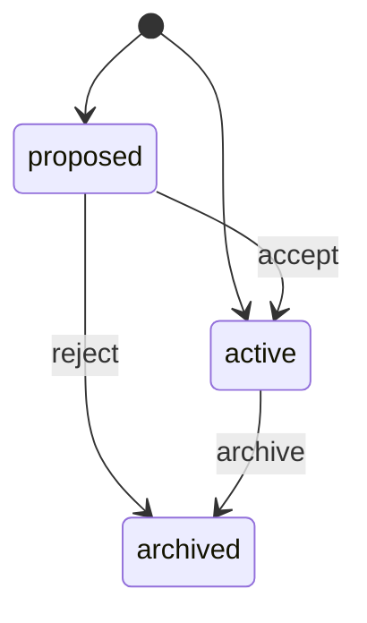

# Concepts

## Nodes and typed edges

Knowledge is a **typed graph**, not a folder of files. A node carries Markdown
content plus structured props; an edge is typed and directed. Both are governed
by a **type catalog** stored in the database, and each type carries a JSON
schema that the service layer validates against.

```sh
nodum types --as owner       # the catalog
nodum schema note --as owner # one type's entry, including its JSON schema
```

Because the catalog lives in the database rather than in code, the schema can
evolve at runtime without a release.

### Markdown is the truth

Node content is Markdown, and `[[wikilinks]]` inside it are **materialised as
real edges** — the prose and the graph cannot disagree, because one derives
from the other.

## The state machine

Every node and edge is in exactly one state:



`proposed` is the waiting room for anything an agent wrote. `archived` is how
things retire — nodum does not delete.

## The event log

Every mutation appends an entry with **full before/after payloads**. That one
decision buys three properties at once:

- **Versioned** — a node's history is a sequence of snapshots (`nodum history`).
- **Auditable** — who changed what, when, and with what reason.
- **Reversible** — `nodum undo` restores the prior state from the payload.

The log is also the input to the projectors, below.

## Actors and privilege

nodum assumes humans and agents both write, and separates them **at the service
layer** rather than by convention. There are human and agent **accounts** (tables
`humans` and `agents`), and per-(agent, space) **grants** at three hierarchical
levels: `read` ⊂ `suggest` ⊂ `edit`.

| | Human | Agent |
|---|---|---|
| A write lands as | `active` | `proposed` on a `suggest` grant, `active` on `edit` |
| Can accept / reject / archive | yes | only with `edit` on the item's space |
| Can undo | yes | no |
| Administers accounts and grants | yes | no |

The human-only set is not delegable, whoever filed the proposal. `undo` most of
all, since restoring an event's payload can write `state = 'active'` back.

### Proposed updates

An agent with a `suggest` grant editing a node does not overwrite it. It stages
a `proposed` **version** that records *which fields it named*. Accepting applies
only those fields to the node as it stands at that moment, so a human edit made
while the proposal waited survives.

### Grants

A grant is one row per (agent, space). It is set with
`nodum grant <agent> <space> <level>` (human-only, event-logged). A `suggest`
grant queues everything for review; an `edit` grant writes live and carries
in-space review authority. There is deliberately no auto-accept machinery: an
agent earns `edit`, or it waits.

## Projectors and derived indexes

Search indexes are **projections of the event log**, not a second source of
truth. Each projector tracks a checkpoint, can report its backlog, and can be
dropped and replayed from event 0:

```sh
nodum projector status
nodum projector rebuild vec     # e.g. after an embedding-model change
```

Two ship today:

- **`fts`** — a SQLite FTS5 full-text index, giving BM25 keyword ranking.
- **`vec`** — a sqlite-vec chunk-embedding index, using a local in-process
  model. No daemon, no API key. Optional: without the `embeddings` extra it
  reports unavailable rather than failing.

**Hybrid search** fuses the two by reciprocal rank fusion, then re-ranks by
graph expansion — so a result's neighbours in the graph inform its rank.

## Assets

Binaries are content-addressed by sha256 and stored in the same file as the
graph, so one file is still the whole knowledge base. Registering the same
bytes twice is idempotent.

Derived `thumb` and `preview` renditions are generated lazily and cached; they
can be purged and will rebuild on next request. **Agents receive renditions,
never originals.**

## Surfaces are adapters

The CLI, the HTTP API, and the MCP server are thin adapters over one service
layer, each with its own identity rule and no logic of its own:

- **CLI** — human-only; every command that touches the graph names its human
  with a required `--as human:<id>`, reads included.
- **HTTP API** — every write is attributed to the session's human (password
  login, server-side session); no request field can say otherwise.
- **MCP server** — one agent, authenticated by its token (`NODUM_AGENT_TOKEN`),
  exposing the read and additive tool tiers *and nothing else*.

Because the logic lives in one place, the surfaces cannot drift apart.
