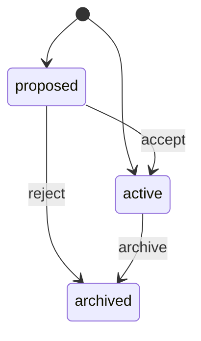
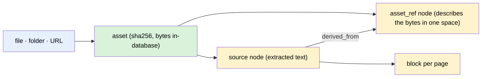

# Concepts

## Nodes and typed edges

Knowledge is a **typed graph**, not a folder of files. A node carries Markdown
content plus structured props; an edge is typed and directed. Both are governed
by a **type catalog** stored in the database, and each type carries a JSON
schema that the service layer validates against.

```sh
nodum types --as owner       # the catalog
nodum schema note --as owner # one type's entry, including its JSON schema
```

Because the catalog lives in the database rather than in code, the schema can
evolve at runtime without a release.

### Markdown is the truth

Node content is Markdown, and `[[wikilinks]]` inside it are **materialised as
real edges** — the prose and the graph cannot disagree, because one derives
from the other. A link only becomes (or stops being) an edge as far as the
writer's grants reach: a mention into a space they may only suggest in stays
`proposed`, and one into a space they cannot read at all is left exactly as it
is, since an unresolvable link is not a deleted one.

## The state machine

Every node and edge is in exactly one state:



`proposed` is the waiting room for anything an agent wrote. `archived` is how
things retire — nodum does not delete.

## The event log

Every mutation appends an entry with **full before/after payloads**. That one
decision buys three properties at once:

- **Versioned** — a node's history is a sequence of snapshots (`nodum history`).
- **Auditable** — who changed what, when, and with what reason.
- **Reversible** — `nodum undo` restores the prior state from the payload. An
  event written inside a consolidation cycle carries that cycle's id and is
  reversed by `nodum rollback <cycle-id>` instead, whole: see below for why one
  row of a multi-row decision is the wrong unit to take back.

The log is also the input to the projectors, below.

## Actors and privilege

nodum assumes humans and agents both write, and separates them **at the service
layer** rather than by convention. There are human and agent **accounts** (tables
`humans` and `agents`), and per-(agent, space) **grants** at three hierarchical
levels: `read` ⊂ `suggest` ⊂ `edit`.

| | Human | Agent |
|---|---|---|
| A write lands as | `active` | `proposed` on a `suggest` grant, `active` on `edit` |
| Can accept / reject / archive | yes | only with `edit` on the item's space |
| Can run curative operations | yes | only with `edit` on every space touched |
| Can undo | yes | no |
| Can roll a cycle back | yes | no |
| Administers accounts and grants | yes | no |

The human-only set is not delegable, whoever filed the proposal. `undo` most of
all, since restoring an event's payload can write `state = 'active'` back — and
`rollback` above even that, since it does exactly the same thing for a whole
cycle at once, across spaces.

A grant is a **ceiling, not a mandate**. An agent holding `edit` may still file
a write it is unsure of as `proposed` and put it in front of a human; what it
may not do is ask to land above its grant, which is refused rather than quietly
downgraded. This is how the gardener's inferences reach the review queue despite
its `edit` grant.

### Proposed updates

An agent with a `suggest` grant editing a node does not overwrite it. It stages
a `proposed` **version** that records *which fields it named*. Accepting applies
only those fields to the node as it stands at that moment, so a human edit made
while the proposal waited survives.

**A review is reversible, on both halves.** A version leaves `proposed` exactly
once, so a reversal that put the node back and left the proposal marked
`applied` would strand it: neither acceptable nor rejectable, over content that
had gone back. Both `undo` and `rollback` therefore move the version row with
the node — an accept records that move on the `node.update` it emits, a reject
is an event in its own right — and a rejection is as reversible as an
acceptance. This matters more than it looks: the gardener holds `edit` on
`main`, which is authority to *review*, so a proposal accepted inside a
consolidation cycle is taken back by `nodum rollback <cycle-id>` like every
other write the cycle made.

### Grants

A grant is one row per (agent, space). It is set with
`nodum grant <agent> <space> <level>` (human-only, event-logged). A `suggest`
grant queues everything for review; an `edit` grant writes live and carries
in-space review authority. There is deliberately no auto-accept machinery: an
agent earns `edit`, or it waits.

### Spaces

A space is the second axis beside the type graph: `main` and `meta` are seeded,
and `nodum space-create` adds more. A space is itself a **node** — builtin type
`space`, living in the meta space — so creating, renaming
(`nodum space-rename`) and archiving (`nodum space-archive`) one are ordinary
node writes, each event-logged, versioned and undoable. `nodum space-list`
reports every active space with its live node count and the agents granted on
it.

Two spaces may not share a name, because every space reference resolves as
`id = ? OR title = ?` and a duplicate would make `--space research` mean
whichever row the database reached first. The comparison is exact — `Research`
and `research` are two spaces, and both resolve — and an **archived** space
keeps its name. A retired name stays reserved for good: archiving is not
deletion, and the one route back (undoing the `node.archive` event) has to be
able to put the space back exactly as it was, which it cannot do if something
else took the name meanwhile. The price is that a retired name is not reusable
unless you rename that space.

`main` and `meta` cannot be archived. Every write that names no space lands in
`main`, and that default resolves by id whatever state the row is in, so
archiving it would hide the space while nodes kept arriving there; `meta` is the
space that spaces themselves live in. Renaming either is fine — a rename moves
the title, and it is the id everything structural depends on.

**Archiving a space cuts every agent off it.** That is usually the reason to
reach for it, so it is what it does: while a space is archived, a grant on it
confers nothing — no reads, no writes, no proposals, no review — whether the
call names the space or reaches a node inside it by id. The grant *rows* are
kept rather than deleted, so `nodum grants` still lists them and
`nodum revoke <agent> <space>` still takes one away (by the space's id or its
name, archived or not), and undoing the archive puts the delegation back exactly
as it was. Granting on an archived space is refused: it would confer nothing
until someone undid the archive, which is delegation by accident.

A space is used two ways, and they are deliberately two separate controls:

- **Reading** — an optional filter (`--space` on `node list` and `search`,
  `?space=` on the HTTP reads) that defaults to *every space in scope*.
- **Writing** — a target (`--space` on `node create` and `ingest`, `space` in
  the `POST /api/nodes` body) that defaults to `main`.

Reading one space while still filing into another is the ordinary case, which
is why a single "current space" switch would not do. The read filter is a
convenience and **not** a permission boundary: an agent stays confined to its
grants underneath it, and a space it holds no grant on does not resolve at all
— answering exactly as a space that does not exist would, so the filter is
never an existence oracle. Archiving a space retires it from the vocabulary;
nothing moves, and every node in it keeps its `space_id`.

The web UI (`nodum serve`) says the same thing with controls instead of flags.
Search, the graph and the review queue carry a **space filter** that defaults to
every space in scope; a single **write target**, sticky across sessions and
shared by every open tab, says where a new node lands and is shown on every
surface that creates one — a target the human cannot see is how work gets filed
somewhere nobody chose. The `/spaces` screen is the lifecycle: every active
space with its live node count and the agents granted on it, plus create,
rename and archive. The review queue groups proposals by space and then by
agent, which is the only way a space that governs itself — an agent holds
`edit` there, so its writes land `active` and never queue — can be told apart
from a space where nothing happened. And because the server refuses an unknown
space and an ungranted one with identical words, no screen ever reports a space
as missing; it says what changed instead.

## Consolidation cycles and the gardener

The graph maintains itself, and the mechanism is an ordinary agent doing
ordinary writes under an ordinary grant.

A **consolidation cycle** groups a run of writes under one id. Every event a
cycle produces carries that id, which buys one thing: `nodum rollback
<cycle-id>` reverses the whole of it in a single transaction — all of it, or
none of it. It **refuses rather than clobbers**, so if anything outside the
cycle has touched a row the cycle touched, nothing is written and the refusal
names both ends of every collision. A rollback is itself a cycle, so rolling
*that* back re-applies the original.

The **gardener** (`builtin-gardener`) is the agent that runs the cycle. It is an
internal account: it holds no credential at all and authenticates by being
in-process, so there is nothing to present and nothing to steal. Everything else
about it is unremarkable on purpose — it has `read` on `meta` and `edit` on
`main` as two
ordinary grant rows, they appear in `nodum space-list` beside every other
agent's, and `nodum revoke builtin-gardener main` takes them away with the
command that was already there. There is no gardener-shaped exception anywhere
in the grant model, which is the point. `read` on meta is what resolving a type
costs; consolidation never writes the vocabulary, so it is never granted to.
Any other space is an explicit `nodum grant builtin-gardener <space> edit`, and
a cycle scoped to a space the gardener holds nothing on says so and names that
command — rather than reporting that the space does not exist, which is true of
neither the space nor the person reading it.

A revoked grant takes effect from the **next** cycle: the gardener's principal
is minted once when a run starts, so a cycle already in flight finishes under
the grants it began with. A cycle is minutes at most, and rolling it back takes
back whatever it wrote in the meantime.

Its four jobs are arithmetic over data the file already holds — no model is
involved, and a cycle runs fine on a machine that has none:

- **Duplicate candidates** — normalised title equality, near-equality, and
  embedding cosine where a provider exists. It writes a `proposed`
  `duplicate_of` edge and never merges: a merge is always human-approved, and a
  proposed edge is already a queue item with a diff and an accept button.
- **Link maintenance** — the two prunings a machine can be right about (an exact
  duplicate edge, an edge incident to an archived node), then `relates_to`
  inference from embedding proximity and shared neighbours.
- **Housekeeping** — the fractional-position check, and embedding catch-up by
  running the `vec` projector rather than growing a second embedding path that
  could disagree with search.
- **Neglect report** — names the active nodes nobody has touched in ninety days,
  and writes nothing. Age is arithmetic; deciding something has gone *stale* is
  judgement, and judgement is a later phase.

Everything it infers is filed `proposed`, even though its grant would let it
write live — a suggestion nobody reviews is not a suggestion.

The **dream journal** is what a cycle leaves behind: `nodum cycle-list` and
`nodum cycle-get <id>` say what ran, who asked, what it measured (five coherence
metrics, before and after) and how it ended. What it *changed* is a separate
question with a separate answer — `nodum events --cycle <id>`, read off the same
append-only log as everything else. The journal stores no diff of its own,
because two records of one event are two records that can disagree.

A cycle that never closed — a `SIGKILL`, a power cut, a server stopped
mid-cycle — is not a cosmetic wart in that journal: it makes the run's own
writes irreversible, because `rollback` refuses a cycle whose event set is not
closed and `undo` refuses every cycle-stamped event. `nodum cycle-abandon <id>`
closes it `failed`, with a report naming who declared it dead, and `rollback`
then works normally. A cycle that already said how it ended is refused rather
than re-closed.

### Stopping a run, and the three verbs it sits between

`nodum cycle-stop <id>` (or the button on the journal entry) is the **kill
switch**: it records that a human asked this run to stop, and who, and when. It
changes nothing else — the entry stays `running`, and the run closes its own
entry `failed` when it next checks. Asking twice keeps the first asker rather
than raising, because a switch that objected to a second press would make a
human doubt the first, which is the one moment that must not be ambiguous.

**A stop is not an abandon.** Abandoning is a *repair*: a human declaring
somebody else's dead process dead and closing its entry from outside, so that
what it wrote becomes reversible. A stop is an *instruction* to a run that is
still alive and expected to obey it and close itself honestly. The two end in
the same status, so the journal keeps them apart in the record instead: an
abandoned entry carries who abandoned it, a stopped one carries who asked it to
stop and when. Reading a `failed` cycle at 09:00, that difference is the whole
question.

**Neither one reverses anything.** Every write the run made stays in the graph,
stamped with the cycle, and `nodum rollback <cycle-id>` is what takes those back
once the entry has closed. Stopping and undoing are two decisions, and a switch
that did both would make "stop, look at what it did, then decide" impossible —
which is the reason a human hits one.

What obeys a stop is the run. The check that exists today sits immediately
before every model call, so a cycle of the four **deterministic** jobs — which
call no model — runs to completion even after you stop it, and closes
`completed` with the stop recorded on it. That is not a failure and the journal
does not read it as one. For a run that is never going to finish at all,
`cycle-abandon` is the verb.

The **curative tier** is the human-facing half of the same machinery:
`merge-nodes`, `retype`, `supersede-edge` and `bulk-relink` change structure
rather than adding to it. Each runs inside a cycle even when you type it
yourself, which is why `undo` refuses a cycle-stamped event and points at
`rollback` instead: a merge is several rows from one decision, and reversing one
of them would leave the other half standing. `rollback` is the only verb the
refusal names — it briefly also named an `undo <seq>` for the last write outside
the cycle, and that was the harm it exists to prevent, printed as a remedy:
following it deletes something the cycle never named and turns the undo into a
conflict that blocks the rollback.

Cycles run on demand (`nodum consolidate`, or a button in the web UI) and
nightly when `NODUM_CONSOLIDATE_AT` is set. Unset means off, which is the
default; when it is set, `nodum serve` says so in its startup banner. Only one
consolidation cycle runs at a time **against a database file**, not merely
within one process: the guard is a uniqueness rule on the journal itself, so a
`nodum consolidate` you type at a terminal while `nodum serve` is running one is
refused just as an in-process caller is. A second caller is refused rather than
queued, since queueing would run it over a graph the first had just changed —
and the refusal names the cycle in the way, plus the `nodum cycle-abandon <id>`
that clears it, because a run that was killed never closes itself and would
otherwise block every later run behind advice nobody could act on. Curative
operations and rollbacks are outside that rule: each is one short operation you
asked for, and neither is what proposes a duplicate twice.

## Projectors and derived indexes

Search indexes are **projections of the event log**, not a second source of
truth. Each projector tracks a checkpoint, can report its backlog, and can be
dropped and replayed from event 0:

```sh
nodum projector status
nodum projector rebuild vec     # e.g. after an embedding-model change
```

Two ship today:

- **`fts`** — a SQLite FTS5 full-text index, giving BM25 keyword ranking. A
  query's terms are not all required: a node is kept when the ones it carries
  are worth at least half the query's weight, rare words counting for more than
  common ones and unknown words for nothing, so a question-shaped query works
  and one absent term does not empty the result. An
  ingested document's full extracted text is joined onto the `asset_ref` node
  that stands for its bytes — and onto that node only, so a word on page 3 does
  not match every other page of the document just as strongly.
- **`vec`** — a sqlite-vec chunk-embedding index, using a local in-process
  model. No daemon, no API key. Optional: without the `embeddings` extra it
  reports unavailable rather than failing.

**Hybrid search** fuses the two by reciprocal rank fusion, then re-ranks by
graph expansion — so a result's neighbours in the graph inform its rank.

## Assets

Binaries are content-addressed by sha256 and stored in the same file as the
graph, so one file is still the whole knowledge base. Registering the same
bytes twice is idempotent.

Derived `thumb` and `preview` renditions are generated lazily and cached; they
can be purged and will rebuild on next request. `page:<n>` is the third
rendition shape — a 1-based page of a PDF, rasterised on first request and
cached like any other. **Agents receive renditions, never originals.**

**An asset is as reachable as the nodes that describe it.** A principal may
read an asset exactly when it can read an active `asset_ref` node carrying that
hash — so asset access is an ordinary scoped graph read rather than a rule of
its own. Bytes nobody has described yet are visible to humans only, which is
the right default for a file whose ingestion has not run.

The one documented exception to "agents never receive originals" is a
**capability URL**: single-use, minutes-long, minted against a principal who
could already read the asset, and event-logged at both the mint and the
redemption. The token is a random secret stored only as its sha-256; the row is
the whole authority, so expiry, single use, and revocation are one update.

## Ingestion

`nodum ingest` is how a document becomes knowledge. A file, a folder, or a URL
turns into a small subgraph:



Every one of those writes goes through the ordinary service layer, so the
subgraph lands in the state the writer's grant earns — an agent with `suggest`
proposes the whole thing into the review queue. Ingestion is **idempotent per
(hash, space)**: re-running the same folder finds what already landed instead
of duplicating it, which is what makes an interrupted run safe to repeat.

Ingestion proposes *sources and structure* and stops there. Turning prose into
**claims** is a judgement call, and it belongs to the research agent — splitting
sentences and calling each one a claim would fill the review queue with noise
rather than knowledge.

### Extraction handlers degrade, they do not fail

Text, Markdown, JSON, and HTML are read by the standard library and always
work. PDF text, image OCR, and audio transcription are optional extras, and an
absent one is a **reported result, not an error**: the asset is still
registered, the nodes are still written, and the answer says plainly that no
text came out. A corrupt file is treated the same way.

```sh
nodum ingest handlers    # every handler, its MIME families, and what to install
```

Nothing is downloaded implicitly — as with the embedding model, a transcription
model is confined to its local cache unless you say otherwise.

## Surfaces are adapters

The CLI, the HTTP API, and the MCP server are thin adapters over one service
layer, each with its own identity rule and no logic of its own:

- **CLI** — human-only; every command that touches the graph names its human
  with a required `--as human:<id>`, reads included.
- **HTTP API** — every write is attributed to the session's human (password
  login, server-side session); no request field can say otherwise.
- **MCP server** — one agent, authenticated by its token (`NODUM_AGENT_TOKEN`),
  exposing the read and additive tool tiers *and nothing else*.

Because the logic lives in one place, the surfaces cannot drift apart.
