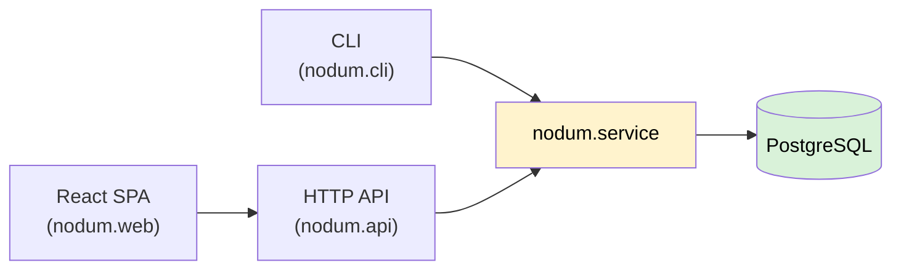
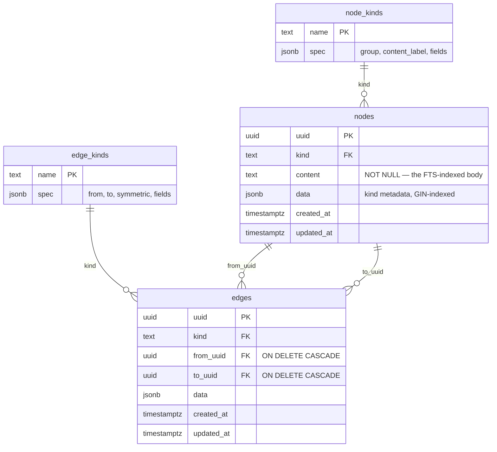
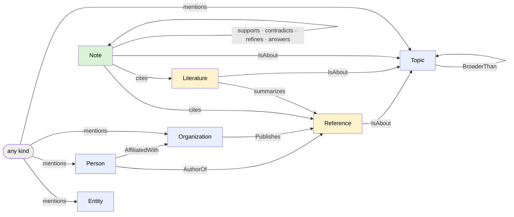
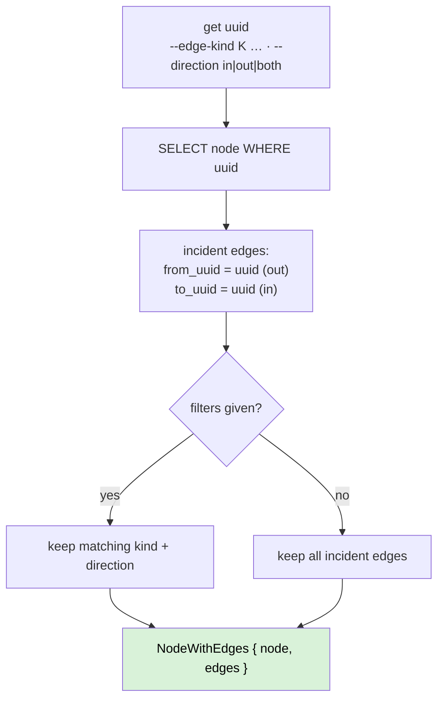
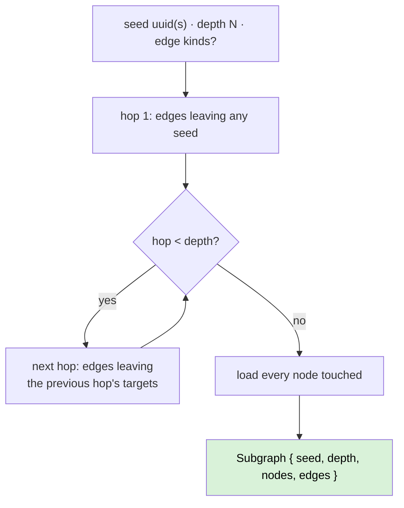
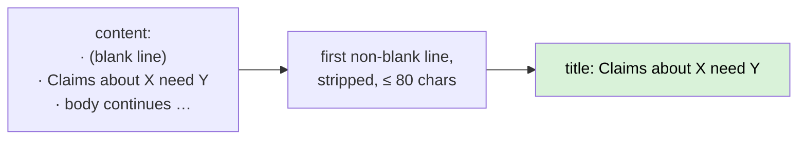
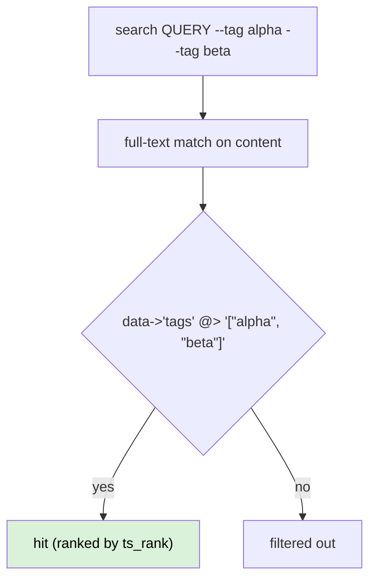

# Data model

This page is the diagram companion to [Concepts](concepts.md): the same model, drawn. Every diagram
below is generated from what `schema.sql`, `nodum.metamodel`, and `nodum.service` actually do.

## Big picture — one spine, three adapters, one database

All logic lives in the **service layer**. The CLI, the HTTP API, and the React SPA are thin adapters
that hold no logic of their own; the SPA talks only to the API. Every adapter serialises the same
pydantic models, so identical data yields byte-identical JSON on the CLI and the API.

The service is the only place that talks to the database: it resolves kinds from the catalog, runs
the write-time validation, and executes every query. Clients self-orient by reading the live schema
first (`nodum schema` / `GET /schema`).

## The tables — two instance tables, one kind catalog

There is **no table per kind**. Every instance lives in the one `nodes` table or the one `edges`
table; typing is a `kind` column whose foreign key points into the runtime-editable catalog.

What the database enforces (the *cheap-hard* invariants — everything richer is validated in the
service):

- the `kind` foreign keys into the catalog tables,
- `content NOT NULL` on every node,
- both endpoint foreign keys, with `ON DELETE CASCADE` — deleting a node removes its edges,
- `CHECK (from_uuid <> to_uuid)` — no self-edges.

The `spec` JSONB on each kind row carries the kind's own definition: for a node kind its `group`,
`content_label`, and `fields` schema; for an edge kind its `from → to` signature. That is what makes
the schema **data** — editable at runtime through kind CRUD, never a code change. (A fifth,
single-row `auth_secret` table holds the password hash and signing key; it is unrelated to the
graph.)

## The seeded kind catalog

Seven seeded node kinds in three groups, and twelve edge kinds whose signatures constrain their
endpoints. The default catalog as a graph — each arrow is one edge kind, drawn from a *from* node
kind to a *to* node kind:

Colours follow the three groups: blue = **entity**, yellow = **literature**, green = **note**.

| Group | Kind | `content` is | Typed fields (in `data`) |
|---|---|---|---|
| entity | `Person` | name | `aliases`, `born` |
| entity | `Organization` | name | `aliases` |
| entity | `Topic` | label | `aliases` |
| entity | `Entity` | label | `entity_type`, `aliases` |
| literature | `Reference` | citation | `citekey`, `authors`, `year`, `venue`, `doi`, `url`, `ref_type` |
| literature | `Literature` | summary | `key_points` |
| note | `Note` | text | `role` (enum), `confidence` |

Signatures are checked **in the service at write time** — the SQL only enforces that both endpoints
exist. The catalog is seeded into an empty database by `init-db` and evolves at runtime thereafter;
the tables above are the defaults, not a fixed set. The full signature table is on
[Concepts](concepts.md#edge-kinds-and-their-signatures); read the live version with `nodum schema`.

## Walking the graph — `get` and `expand`

Two retrieval primitives read the graph, both over the same two uniform tables.

**`get`** returns a node plus its incident edges, optionally filtered by edge kind and direction:

**`expand`** walks *directed* edges outward from a seed set, up to `depth` hops, via a single
recursive CTE — optionally restricted to given edge kinds — then loads every node touched:

The one-table invariant is what keeps this uniform: `expand` never joins a per-kind schema, so it
walks any mix of kinds with the same query. The serialised `Subgraph` is the context payload a
client — or an agent — reads back. `search` is the third primitive: Postgres full-text over
`content`, ranked by `ts_rank`, with optional `kind` and `tags` filters.

## Conventions on top of the schema

Two agent-facing conveniences sit *above* the schema — neither is a stored column or a kind.

**Derived `title`.** Every serialised node carries a `title` — the first non-blank line of its
`content`, stripped, capped at 80 characters. It is a pydantic computed field on `NodeOut`, computed
at read time and never stored, so it tracks edits for free and lands identically on every surface.

**Tags.** Any node may carry `"tags": ["…"]` in its `data` payload — a convention, not a schema
feature. `search --tag T` (repeatable) filters by JSONB containment with **AND** semantics: a hit's
`data.tags` array must contain *every* given tag. The GIN index on `data` serves the check.

Because both conventions are additive and read-time, payloads that predate them are unchanged except
for the extra `title` key — and a node without a `tags` array simply never matches a `--tag` filter.

## What is not in the model

- **No per-kind tables or model classes** — one `nodes` table, one `edges` table, typing via the
  catalog.
- **No edges-on-edges** — to qualify a relationship, reify it as a `Note` and link to it.
- **No embeddings** — no vector column; `content` is stored ready for them (a deferred design
  target).
- **No multi-user accounts** — a single main password gates the network surfaces (see
  [Authentication](install.md#authentication)).
